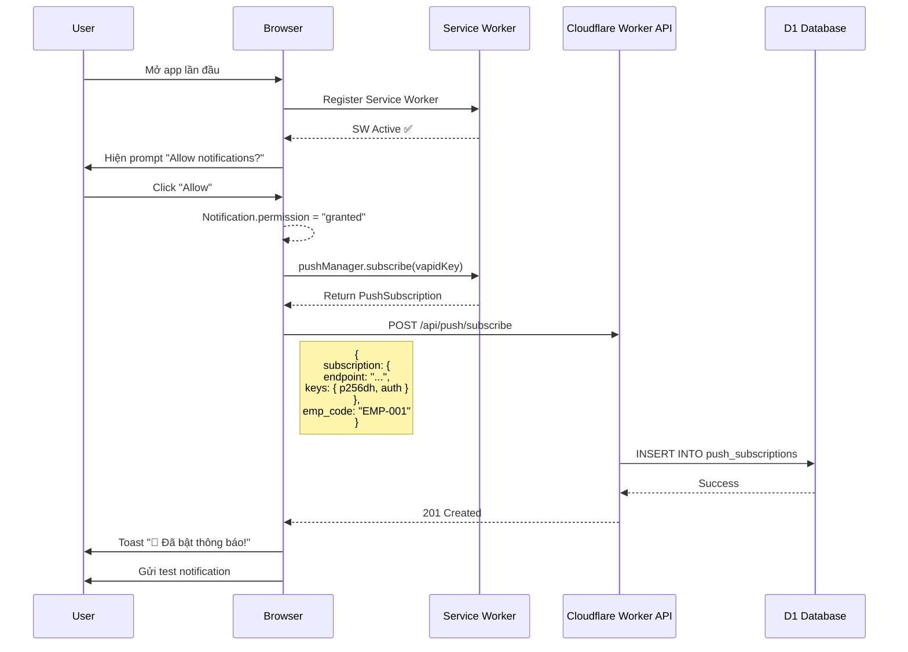
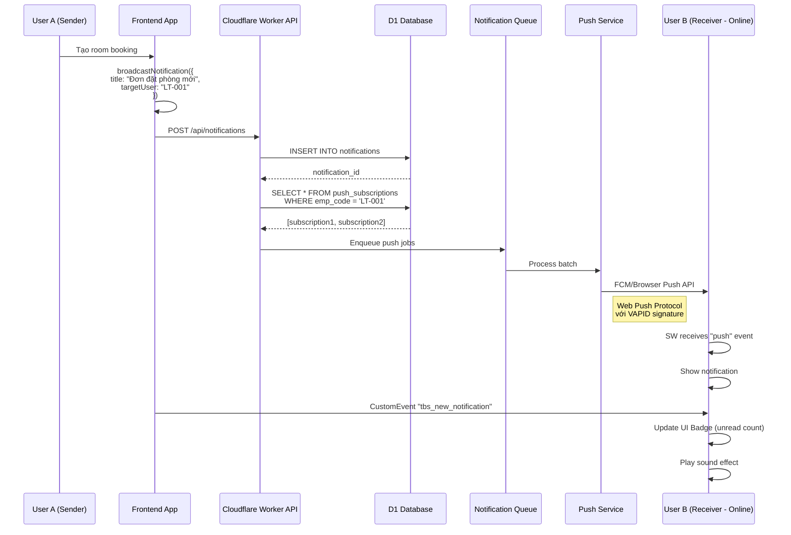
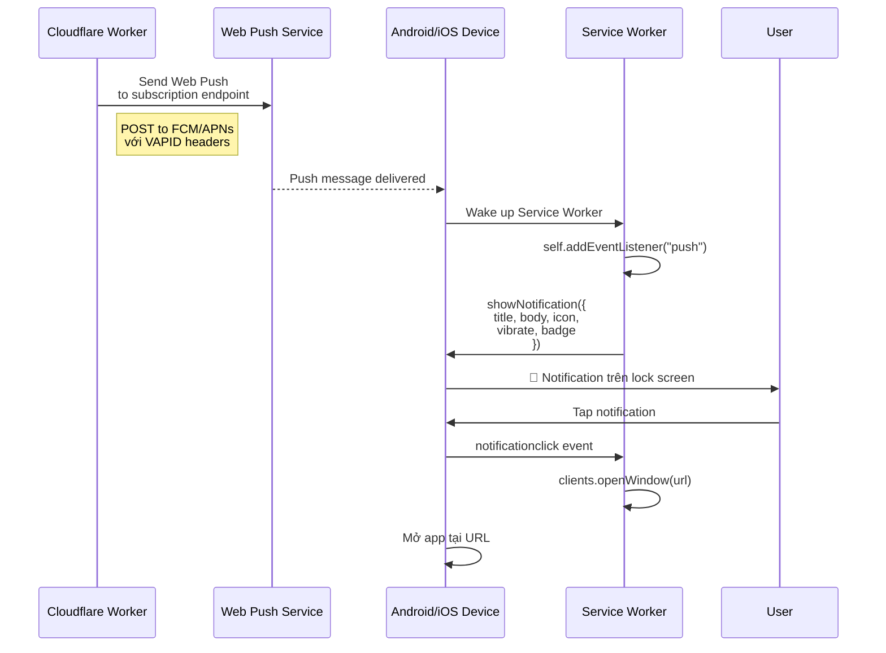
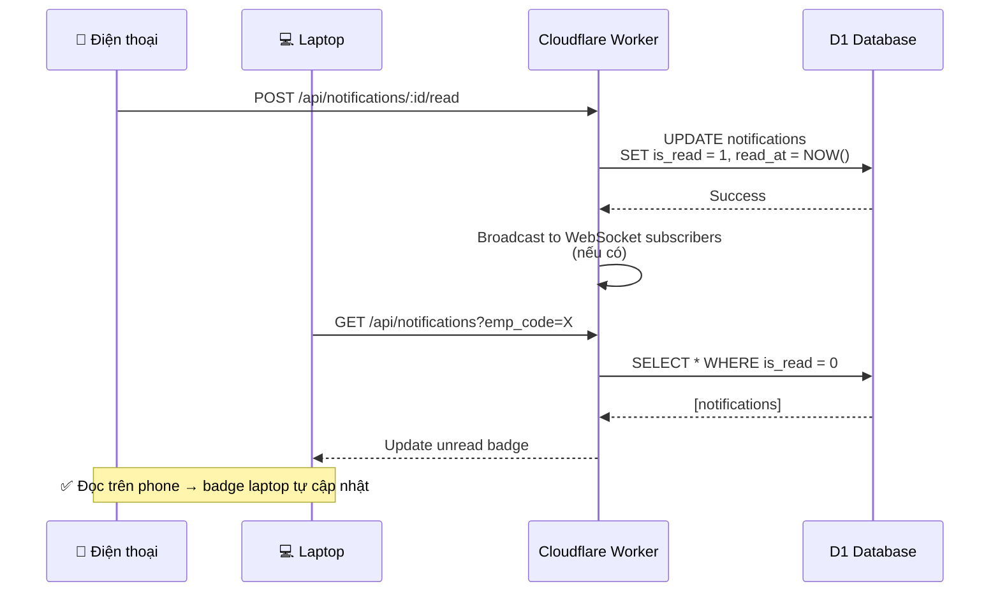

# ĐỀ XUẤT LUỒNG NOTIFICATION DI ĐỘNG - HỆ THỐNG TBS GROUP

**Ngày tạo:** 03/09/2026  
**Phiên bản:** 2.0 (Nâng cấp từ v1.0)  
**Phạm vi:** Notification System cho Mobile (Android/iOS) + Desktop  

---

## ⚠️ RỦI RO KỸ THUẬT - ĐỌC TRƯỚC KHI CODE

### 🔴 CRITICAL - Blocking Issues

#### 1. **web-push npm package KHÔNG TƯƠNG THÍCH với Cloudflare Workers**

**Vấn đề:**
```typescript
// ❌ Code này SẼ FAIL trên Cloudflare Workers
import webpush from 'web-push';
webpush.sendNotification(...); // crypto.createSign is not a function
```

**Nguyên nhân:**
- `web-push` phụ thuộc vào Node.js `crypto` module (crypto.createSign, Buffer operations)
- Cloudflare Workers runtime là V8 isolate, KHÔNG phải Node.js đầy đủ
- Flag `nodejs_compat` chỉ polyfill một phần, không đủ cho web-push

**Giải pháp thực tế:**

**Option A: Tự implement VAPID signing với Web Crypto API** ✅ RECOMMENDED
```typescript
// File: web/src/lib/vapidSigner.ts
export async function signVAPIDRequest(
  endpoint: string,
  vapidPrivateKey: string,
  vapidPublicKey: string,
  subject: string
): Promise<{ Authorization: string; 'Crypto-Key': string }> {
  const url = new URL(endpoint);
  const audience = `${url.protocol}//${url.host}`;
  
  // JWT Header
  const header = {
    typ: 'JWT',
    alg: 'ES256',
  };
  
  // JWT Payload
  const payload = {
    aud: audience,
    exp: Math.floor(Date.now() / 1000) + 12 * 60 * 60, // 12 hours
    sub: subject,
  };
  
  // Base64URL encode
  const encodeBase64URL = (data: any) => {
    return btoa(JSON.stringify(data))
      .replace(/\+/g, '-')
      .replace(/\//g, '_')
      .replace(/=+$/, '');
  };
  
  const encodedHeader = encodeBase64URL(header);
  const encodedPayload = encodeBase64URL(payload);
  const unsignedToken = `${encodedHeader}.${encodedPayload}`;
  
  // Import private key
  const privateKeyBuffer = urlBase64ToUint8Array(vapidPrivateKey);
  const cryptoKey = await crypto.subtle.importKey(
    'raw',
    privateKeyBuffer,
    { name: 'ECDSA', namedCurve: 'P-256' },
    false,
    ['sign']
  );
  
  // Sign with ECDSA
  const signature = await crypto.subtle.sign(
    { name: 'ECDSA', hash: 'SHA-256' },
    cryptoKey,
    new TextEncoder().encode(unsignedToken)
  );
  
  const encodedSignature = btoa(String.fromCharCode(...new Uint8Array(signature)))
    .replace(/\+/g, '-')
    .replace(/\//g, '_')
    .replace(/=+$/, '');
  
  const jwt = `${unsignedToken}.${encodedSignature}`;
  
  return {
    'Authorization': `vapid t=${jwt}, k=${vapidPublicKey}`,
    'Crypto-Key': `p256ecdsa=${vapidPublicKey}`,
  };
}

function urlBase64ToUint8Array(base64String: string): Uint8Array {
  const padding = '='.repeat((4 - (base64String.length % 4)) % 4);
  const base64 = (base64String + padding).replace(/\-/g, '+').replace(/_/g, '/');
  const rawData = atob(base64);
  return new Uint8Array([...rawData].map(char => char.charCodeAt(0)));
}
```

**Option B: Dùng thư viện tương thích Workers** ✅ ALTERNATIVE
```bash
npm install jose  # JWT + JOSE library, tương thích Workers
```

```typescript
import { SignJWT, importPKCS8 } from 'jose';

export async function signVAPIDWithJose(endpoint: string) {
  const privateKey = await importPKCS8(vapidPrivateKeyPEM, 'ES256');
  
  const jwt = await new SignJWT({})
    .setProtectedHeader({ alg: 'ES256' })
    .setAudience(audienceFromEndpoint(endpoint))
    .setExpirationTime('12h')
    .setSubject('mailto:admin@tbsgroup.com')
    .sign(privateKey);
  
  return {
    'Authorization': `vapid t=${jwt}, k=${vapidPublicKey}`,
  };
}
```

**TEST TRƯỚC KHI TRIỂN KHAI:**
```bash
# Test trên local Workers
npx wrangler dev
# Gọi API test sign VAPID
curl http://localhost:8787/api/test-vapid-sign
```

---

#### 2. **API Endpoints THIẾU Authentication/Authorization** 🔐

**Lỗ hổng bảo mật:**
```typescript
// ❌ BẤT KỲ AI cũng có thể:
POST /api/notifications
{
  "targetUser": "CEO",
  "title": "Fake notification"
}

POST /api/push/subscribe
{
  "emp_code": "CEO", // Giả mạo identity
  "subscription": {...}
}
```

**Giải pháp: Middleware xác thực bắt buộc**

```typescript
// File: web/src/lib/apiAuth.ts
import { NextRequest } from 'next/server';
import { verifyToken } from '@/lib/auth';

export async function authenticateRequest(
  request: NextRequest
): Promise<{ authenticated: boolean; user?: any; error?: string }> {
  // 1. Get token from header or cookie
  const authHeader = request.headers.get('Authorization');
  let token = authHeader ? authHeader.replace('Bearer ', '') : null;
  
  if (!token) {
    token = request.cookies.get('tbs_token')?.value || null;
  }
  
  if (!token) {
    return { authenticated: false, error: 'Missing authentication token' };
  }
  
  // 2. Verify JWT
  const user = await verifyToken(token);
  if (!user) {
    return { authenticated: false, error: 'Invalid or expired token' };
  }
  
  return { authenticated: true, user };
}

export function requireAuth(handler: Function) {
  return async (request: NextRequest, context: any) => {
    const { authenticated, user, error } = await authenticateRequest(request);
    
    if (!authenticated) {
      return NextResponse.json(
        { success: false, error: error || 'Unauthorized' },
        { status: 401 }
      );
    }
    
    // Attach user to request
    (request as any).user = user;
    return handler(request, context);
  };
}
```

**Áp dụng vào tất cả API:**
```typescript
// File: web/src/app/api/notifications/route.ts
import { requireAuth } from '@/lib/apiAuth';
import { PERMISSIONS } from '@/lib/permissions';

async function handlePOST(request: NextRequest) {
  const user = (request as any).user; // Từ requireAuth middleware
  const { title, message, targetUser } = await request.json();
  
  // ✅ Authorization check
  if (targetUser !== user.empCode && !user.roles?.includes('admin')) {
    // Chỉ admin mới gửi notification cho người khác
    return NextResponse.json(
      { success: false, error: 'Forbidden: Cannot send notification to other users' },
      { status: 403 }
    );
  }
  
  // ... rest of code
}

export const POST = requireAuth(handlePOST);
```

**Special case: Anonymous subscription (pre-login)**
```typescript
// Cho phép subscription TRƯỚC khi login (mobile PWA)
// Nhưng phải validate device fingerprint
export async function POST(request: NextRequest) {
  const { subscription, emp_code } = await request.json();
  
  // Allow anonymous subscription
  const empCode = emp_code || 'ANONYMOUS';
  
  // ⚠️ Log suspicious activity
  if (empCode !== 'ANONYMOUS') {
    const { authenticated, user } = await authenticateRequest(request);
    if (!authenticated || user.empCode !== empCode) {
      // Attempting to register for another user - REJECT
      return NextResponse.json(
        { success: false, error: 'Forbidden: emp_code mismatch' },
        { status: 403 }
      );
    }
  }
  
  // Proceed with subscription
}
```

---

#### 3. **Database Schema Thiếu UNIQUE Constraint**

**Vấn đề:**
```sql
-- ❌ Code dùng ON CONFLICT nhưng không có UNIQUE constraint
INSERT INTO push_subscriptions (...) 
VALUES (...) 
ON CONFLICT(endpoint) DO UPDATE ...
-- ERROR: ON CONFLICT clause does not match any PRIMARY KEY or UNIQUE constraint
```

**Giải pháp: Cập nhật migration**

```sql
-- File: web/migrations/0006_push_subscriptions_fix.sql

-- Drop existing table if structure is wrong
DROP TABLE IF EXISTS push_subscriptions;

-- Recreate with proper constraints
CREATE TABLE push_subscriptions (
    id TEXT PRIMARY KEY,
    emp_code TEXT NOT NULL DEFAULT 'ANONYMOUS',
    endpoint TEXT NOT NULL UNIQUE, -- ✅ UNIQUE constraint
    p256dh TEXT NOT NULL,
    auth TEXT NOT NULL,
    user_agent TEXT,
    device_info TEXT,
    is_active INTEGER DEFAULT 1,
    last_seen DATETIME DEFAULT CURRENT_TIMESTAMP,
    unsubscribed_at DATETIME,
    created_at DATETIME DEFAULT CURRENT_TIMESTAMP
);

-- Indexes for performance
CREATE INDEX idx_push_sub_emp_code ON push_subscriptions(emp_code);
CREATE INDEX idx_push_sub_active ON push_subscriptions(is_active) WHERE is_active = 1;
CREATE INDEX idx_push_sub_endpoint ON push_subscriptions(endpoint);
```

**Hoặc dùng UPSERT an toàn hơn:**
```typescript
// Alternative: Manual UPSERT without ON CONFLICT
const existing = await env.DB.prepare(`
  SELECT id FROM push_subscriptions WHERE endpoint = ?
`).bind(subscription.endpoint).first();

if (existing) {
  // Update
  await env.DB.prepare(`
    UPDATE push_subscriptions 
    SET emp_code = ?, p256dh = ?, auth = ?, is_active = 1, last_seen = datetime('now')
    WHERE endpoint = ?
  `).bind(emp_code, subscription.keys.p256dh, subscription.keys.auth, subscription.endpoint).run();
} else {
  // Insert
  await env.DB.prepare(`
    INSERT INTO push_subscriptions (id, emp_code, endpoint, p256dh, auth, created_at)
    VALUES (?, ?, ?, ?, ?, datetime('now'))
  `).bind(crypto.randomUUID(), emp_code, subscription.endpoint, subscription.keys.p256dh, subscription.keys.auth).run();
}
```

---

### 🟡 HIGH PRIORITY - Giới Hạn Platform

#### 4. **iOS Web Push Chỉ Hoạt Động Với PWA Installed**

**Thực tế iOS Safari:**
```
❌ Tab Safari thường: Web Push KHÔNG hoạt động
✅ PWA installed (Add to Home Screen): Web Push hoạt động (iOS 16.4+)
```

**Impact:**
- ~40-50% user iOS sẽ KHÔNG nhận push nếu không cài PWA
- Cần onboarding flow bắt buộc cho iOS users

**Giải pháp: iOS Detection + PWA Install Prompt**

```typescript
// File: web/src/lib/deviceDetection.ts
export function isIOSDevice(): boolean {
  if (typeof window === 'undefined') return false;
  
  const userAgent = window.navigator.userAgent.toLowerCase();
  return /iphone|ipad|ipod/.test(userAgent);
}

export function isIOSPWA(): boolean {
  if (typeof window === 'undefined') return false;
  
  return (window.navigator as any).standalone === true || // iOS Safari
         window.matchMedia('(display-mode: standalone)').matches; // Other browsers
}

export function canReceivePushOnIOS(): boolean {
  if (!isIOSDevice()) return true; // Not iOS, assume OK
  return isIOSPWA(); // iOS requires PWA
}
```

```tsx
// File: web/src/components/IOSPWAPrompt.tsx
'use client';

export default function IOSPWAPrompt() {
  const [show, setShow] = useState(false);
  
  useEffect(() => {
    if (isIOSDevice() && !isIOSPWA()) {
      setShow(true);
    }
  }, []);
  
  if (!show) return null;
  
  return (
    <div className="fixed bottom-0 inset-x-0 p-4 bg-blue-600 text-white z-50">
      <div className="flex items-center gap-3">
        <IconAlertCircle size={24} />
        <div className="flex-1">
          <h4 className="font-bold">Cài Đặt App Để Nhận Thông Báo</h4>
          <p className="text-sm">
            Trên iOS, bạn cần cài app vào màn hình chính để nhận thông báo push.
          </p>
        </div>
        <button 
          onClick={() => setShow(false)}
          className="px-4 py-2 bg-white text-blue-600 rounded-lg font-bold"
        >
          Đã hiểu
        </button>
      </div>
      <div className="mt-3 p-3 bg-white/10 rounded-lg text-sm">
        📱 <strong>Hướng dẫn:</strong>
        <ol className="ml-4 mt-2 space-y-1">
          <li>1. Bấm nút <strong>Share</strong> (biểu tượng mũi tên lên)</li>
          <li>2. Chọn <strong>"Add to Home Screen"</strong></li>
          <li>3. Bấm <strong>Add</strong></li>
          <li>4. Mở app từ màn hình chính</li>
        </ol>
      </div>
    </div>
  );
}
```

**Update NotificationInitializer:**
```typescript
useEffect(() => {
  const initNotifications = async () => {
    // Check iOS PWA requirement
    if (isIOSDevice() && !isIOSPWA()) {
      console.log('⚠️ iOS detected but not running as PWA - push will not work');
      // Show PWA install prompt instead
      return;
    }
    
    // Proceed with normal init
    await registerServiceWorker();
    // ...
  };
  
  initNotifications();
}, []);
```

---

#### 5. **Quiet Hours & Rate Limiting Chưa Có Logic**

**Vấn đề:**
```sql
-- ✅ Schema có quiet_hours
CREATE TABLE notification_preferences (
  quiet_hours_start TEXT, -- "22:00"
  quiet_hours_end TEXT    -- "08:00"
);

-- ❌ Nhưng không có code check trước khi gửi
```

**Giải pháp: Implement trong Queue Worker**

```typescript
// File: web/src/workers/notificationQueueWorker.ts

async function shouldSendNotification(
  empCode: string,
  env: Env
): Promise<{ allowed: boolean; reason?: string }> {
  // 1. Check user preferences
  const prefs = await env.DB.prepare(`
    SELECT * FROM notification_preferences WHERE emp_code = ?
  `).bind(empCode).first();
  
  if (!prefs || !prefs.push_enabled) {
    return { allowed: false, reason: 'User disabled push notifications' };
  }
  
  // 2. Check quiet hours
  if (prefs.quiet_hours_start && prefs.quiet_hours_end) {
    const now = new Date();
    const currentHour = now.getHours();
    const currentMinute = now.getMinutes();
    const currentTime = currentHour * 60 + currentMinute;
    
    const [startHour, startMin] = prefs.quiet_hours_start.split(':').map(Number);
    const [endHour, endMin] = prefs.quiet_hours_end.split(':').map(Number);
    const quietStart = startHour * 60 + startMin;
    const quietEnd = endHour * 60 + endMin;
    
    // Handle overnight quiet hours (e.g., 22:00 - 08:00)
    if (quietStart > quietEnd) {
      if (currentTime >= quietStart || currentTime <= quietEnd) {
        return { allowed: false, reason: 'Quiet hours' };
      }
    } else {
      if (currentTime >= quietStart && currentTime <= quietEnd) {
        return { allowed: false, reason: 'Quiet hours' };
      }
    }
  }
  
  // 3. Rate limiting (max 10 notifications per hour per user)
  const oneHourAgo = new Date(Date.now() - 60 * 60 * 1000).toISOString();
  const { results } = await env.DB.prepare(`
    SELECT COUNT(*) as count FROM notification_delivery_log
    WHERE subscription_id IN (
      SELECT id FROM push_subscriptions WHERE emp_code = ?
    )
    AND sent_at > ?
  `).bind(empCode, oneHourAgo).all();
  
  const recentCount = results[0]?.count || 0;
  if (recentCount >= 10) {
    return { allowed: false, reason: 'Rate limit exceeded (10/hour)' };
  }
  
  return { allowed: true };
}

// Apply in queue worker
async function processNotificationJob(job: NotificationJob, env: Env) {
  const { notification_id, target_user } = job;
  
  // Check if should send
  const { allowed, reason } = await shouldSendNotification(target_user, env);
  if (!allowed) {
    console.log(`Skip notification for ${target_user}: ${reason}`);
    return; // Skip silently
  }
  
  // Proceed to send
  // ...
}
```

---

### 🟢 MEDIUM PRIORITY - Performance & Scale

#### 6. **Batch Processing với Promise.allSettled Cần Giới Hạn**

**Vấn đề:**
```typescript
// ❌ Nếu broadcast tới 5000 subscriptions cùng lúc
await Promise.allSettled(
  subscriptions.map(sub => sendWebPush(sub, payload))
);
// Workers CPU time limit: 50ms (Free) / 30s (Paid) → TIMEOUT
```

**Giải pháp: Chunk batch processing**

```typescript
// File: web/src/lib/batchProcessor.ts
export async function processBatch<T, R>(
  items: T[],
  processor: (item: T) => Promise<R>,
  options: {
    batchSize?: number;
    concurrency?: number;
  } = {}
): Promise<R[]> {
  const { batchSize = 50, concurrency = 10 } = options;
  const results: R[] = [];
  
  // Process in chunks
  for (let i = 0; i < items.length; i += batchSize) {
    const chunk = items.slice(i, i + batchSize);
    
    // Limit concurrency within chunk
    const chunkResults = await Promise.allSettled(
      chunk.map(item => processor(item))
    );
    
    results.push(...chunkResults.filter(r => r.status === 'fulfilled').map(r => (r as any).value));
  }
  
  return results;
}
```

**Sử dụng:**
```typescript
const { sent, failed } = await processBatch(
  subscriptions,
  async (sub) => await sendWebPush(sub, payload),
  { batchSize: 50, concurrency: 10 }
);
```

---

#### 7. **Web Push Payload Size Limit (4KB)**

**Giải pháp: Validate before send**

```typescript
function validatePushPayload(payload: PushPayload): { valid: boolean; error?: string } {
  const payloadStr = JSON.stringify(payload);
  const sizeBytes = new TextEncoder().encode(payloadStr).length;
  
  if (sizeBytes > 4096) {
    return { 
      valid: false, 
      error: `Payload too large: ${sizeBytes} bytes (max 4096)` 
    };
  }
  
  return { valid: true };
}
```

---

#### 8. **Duplicate Subscription ("Ghost Subscriptions")**

**Test case:**
1. User subscribes → `is_active = 1`
2. User unsubscribes → `is_active = 0`
3. User subscribes again với same endpoint → ?

**Giải pháp: Proper UPSERT**
```typescript
await env.DB.prepare(`
  INSERT INTO push_subscriptions (id, emp_code, endpoint, p256dh, auth, is_active, created_at)
  VALUES (?, ?, ?, ?, ?, 1, datetime('now'))
  ON CONFLICT(endpoint) DO UPDATE SET
    emp_code = excluded.emp_code,
    p256dh = excluded.p256dh,
    auth = excluded.auth,
    is_active = 1,  -- ✅ Re-activate if was inactive
    last_seen = datetime('now'),
    unsubscribed_at = NULL  -- ✅ Clear unsubscribe timestamp
`).bind(id, emp_code, endpoint, p256dh, auth).run();
```

---

#### 9. **Cloudflare Queues Pricing**

**Thực tế:**
- Free tier: 1M operations/month
- Operations = send + receive + ack/retry
- 1 notification = ~3 operations (send + receive + ack)
- **Max free:** ~330K notifications/month

**Sau đó:** $0.40 per million operations

**Monitor usage:**
```typescript
// Log queue metrics
console.log('Queue batch processed:', {
  messages: batch.messages.length,
  timestamp: new Date().toISOString(),
});
```

---

## 🎯 REVISED IMPLEMENTATION PRIORITY

### ✅ Phase 0: Risk Mitigation (TRƯỚC KHI CODE) - 2 ngày

1. ✅ Test VAPID signing trên Workers (Option A hoặc Option B)
2. ✅ Implement authentication middleware
3. ✅ Fix database UNIQUE constraint
4. ✅ Add iOS PWA detection + warning UI
5. ✅ Test local với `wrangler dev`

### ✅ Phase 1: Core với Security - 3 ngày (thay vì 2)

1. API endpoints + auth middleware
2. Service Worker push handler
3. Database migrations (fixed)
4. Manual VAPID signing implementation

### ✅ Phase 2: Production Push - 4 ngày (thay vì 3)

1. Full push service với chunked batch
2. Payload size validation
3. Quiet hours + rate limiting
4. Error handling + retry logic

---

## 📊 PHÂN TÍCH TÌNH TRẠNG HIỆN TẠI

### ✅ Đã Triển Khai (v1.0 - August 2026)

#### 1. **Frontend Components**
- ✅ `NotificationCenter.tsx` - UI Dropdown + Bottom Sheet
- ✅ `NotificationInitializer.tsx` - Auto-register Service Worker
- ✅ `browserNotifications.ts` - Core notification library
- ✅ Mobile-responsive UI (Bottom Sheet cho < 768px)
- ✅ Desktop dropdown panel (>= 768px)

#### 2. **Service Worker**
- ✅ Auto-registration (`/sw.js`)
- ✅ Cache-first strategy cho media
- ✅ Stale-while-revalidate cho static assets
- ✅ **THIẾU:** Push event handler

#### 3. **Push Subscription System**
- ✅ `syncPushSubscriptionToServer()` - Đăng ký subscription
- ✅ `unsubscribeFromPushNotifications()` - Hủy subscription
- ✅ VAPID key config (placeholder)
- ✅ PushManager API integration

#### 4. **Database Schema (D1)**
- ✅ `push_subscriptions` table
  ```sql
  - id, emp_code, endpoint, p256dh, auth, user_agent, created_at
  ```
- ✅ `notifications` table
  ```sql
  - id, title, message, type, is_read, created_at, link, module, record_id
  ```

#### 5. **Notification Broadcast**
- ✅ `broadcastNotification()` function
  - LocalStorage persistence
  - Custom event dispatch
  - Desktop/Mobile push
  - Remote sync to D1 (API call)

#### 6. **Use Cases Implemented**
- ✅ Room booking notifications (6+ scenarios)
- ✅ Business trip approvals (8+ scenarios)
- ✅ Document approvals (2 scenarios)
- ✅ General system notifications

---

## ❌ THIẾU & VẤN ĐỀ CẦN KHẮC PHỤC

### 🔴 Critical (P0)

#### 1. **API Endpoints THIẾU HOÀN TOÀN**

**Endpoints được gọi nhưng không tồn tại:**
```typescript
POST /api/push/subscribe       ❌ KHÔNG TỒN TẠI
POST /api/push/unsubscribe     ❌ KHÔNG TỒN TẠI
POST /api/notifications        ❌ KHÔNG TỒN TẠI
GET  /api/notifications        ❌ KHÔNG TỒN TẠI
```

**Hệ quả:**
- Subscription không lưu vào D1
- Không thể gửi push thực sự
- Chỉ hoạt động local (in-app)

#### 2. **Service Worker Push Handler THIẾU**

**File hiện tại:** `web/public/sw.js`
```javascript
// ❌ THIẾU: Push event handler
self.addEventListener("push", (event) => {
  // CHƯA IMPLEMENT
});

// ❌ THIẾU: Notification click handler
self.addEventListener("notificationclick", (event) => {
  // CHƯA IMPLEMENT
});
```

**Hệ quả:**
- Push messages không hiển thị khi app đóng
- Không có background notification

#### 3. **VAPID Keys Chưa Thực Tế**

```typescript
// ❌ Placeholder key, không hoạt động thực tế
const publicVapidKey = process.env.NEXT_PUBLIC_VAPID_PUBLIC_KEY || 
  "BEl62iUYgUivxIkv69yViEuiBIa3aey30y5Gvw7K8e3F1P9sT3x4F4t16WuP8k5q9w0y12ABCDEF1234567890abcdef";
```

**Hệ quả:**
- Không thể gửi push từ server
- Browser reject subscription

### 🟡 Medium Priority (P1)

#### 4. **Không Có Backend Push Sender**
- ❌ Không có worker/cron job gửi push
- ❌ Không có queue system cho notifications
- ❌ Không có retry logic

#### 5. **Notification Filtering Yếu**
- ⚠️ Chỉ filter theo `targetUser`
- ❌ Không có role-based filtering
- ❌ Không có preference settings

#### 6. **Cross-Device Sync Không Hoàn Chỉnh**
- ⚠️ LocalStorage chỉ local
- ❌ Không sync read status giữa devices
- ❌ Không detect active device

---

## 🎯 ĐỀ XUẤT KIẾN TRÚC MỚI (v2.0)

### Kiến Trúc Tổng Quan

```
┌─────────────────────────────────────────────────────────────────┐
│                         CLIENT LAYER                            │
├─────────────────────────────────────────────────────────────────┤
│                                                                 │
│  📱 Mobile PWA (Android/iOS)     💻 Desktop Browser            │
│  ┌─────────────────────────┐    ┌─────────────────────────┐   │
│  │ NotificationCenter UI   │    │ NotificationCenter UI   │   │
│  │ - Bottom Sheet          │    │ - Dropdown Panel        │   │
│  │ - Toast notifications   │    │ - Desktop alerts        │   │
│  └─────────────────────────┘    └─────────────────────────┘   │
│             │                              │                    │
│             └──────────────┬───────────────┘                    │
│                            │                                    │
│         ┌──────────────────▼──────────────────┐                │
│         │   browserNotifications.ts           │                │
│         │   - broadcastNotification()         │                │
│         │   - sendDesktopNotification()       │                │
│         │   - syncPushSubscriptionToServer()  │                │
│         └──────────────────┬──────────────────┘                │
│                            │                                    │
│         ┌──────────────────▼──────────────────┐                │
│         │   Service Worker (sw.js)            │                │
│         │   - Push event handler              │                │
│         │   - Notification display            │                │
│         │   - Background sync                 │                │
│         └──────────────────┬──────────────────┘                │
│                            │                                    │
└────────────────────────────┼────────────────────────────────────┘
                             │
                   HTTPS over Internet
                             │
┌────────────────────────────▼────────────────────────────────────┐
│                      SERVER LAYER                               │
│                  (Cloudflare Workers)                           │
├─────────────────────────────────────────────────────────────────┤
│                                                                 │
│  📡 API Endpoints                                               │
│  ┌────────────────────────────────────────────────────────┐   │
│  │ POST   /api/push/subscribe                             │   │
│  │ POST   /api/push/unsubscribe                           │   │
│  │ POST   /api/notifications                              │   │
│  │ GET    /api/notifications?emp_code=X&unread=true       │   │
│  │ PATCH  /api/notifications/:id/read                     │   │
│  │ DELETE /api/notifications/:id                          │   │
│  └────────────────────────────────────────────────────────┘   │
│                            │                                    │
│  🔄 Notification Queue Service (NEW)                           │
│  ┌────────────────────────────────────────────────────────┐   │
│  │ NotificationQueueWorker                                │   │
│  │ - Batch processing                                     │   │
│  │ - Retry failed pushes                                  │   │
│  │ - Rate limiting                                        │   │
│  │ - Priority queue (HIGH/MEDIUM/LOW)                     │   │
│  └────────────────────────────────────────────────────────┘   │
│                            │                                    │
│  📤 Push Service (NEW)                                         │
│  ┌────────────────────────────────────────────────────────┐   │
│  │ sendWebPush(subscription, payload)                     │   │
│  │ - Sign with VAPID keys                                 │   │
│  │ - Send to FCM/APNs/Browser Push Service               │   │
│  │ - Handle expired subscriptions                         │   │
│  │ - Log delivery status                                  │   │
│  └────────────────────────────────────────────────────────┘   │
│                            │                                    │
└────────────────────────────┼────────────────────────────────────┘
                             │
┌────────────────────────────▼────────────────────────────────────┐
│                     DATABASE LAYER                              │
│                   (Cloudflare D1)                               │
├─────────────────────────────────────────────────────────────────┤
│                                                                 │
│  📊 Tables                                                      │
│  ┌────────────────────────────────────────────────────────┐   │
│  │ push_subscriptions                                     │   │
│  │ - id, emp_code, endpoint, p256dh, auth, device_info   │   │
│  │ - is_active, last_seen, created_at                     │   │
│  └────────────────────────────────────────────────────────┘   │
│                                                                 │
│  ┌────────────────────────────────────────────────────────┐   │
│  │ notifications                                          │   │
│  │ - id, title, message, type, priority                   │   │
│  │ - target_user, target_role, module, record_id          │   │
│  │ - is_read, read_at, created_at, expires_at             │   │
│  └────────────────────────────────────────────────────────┘   │
│                                                                 │
│  ┌────────────────────────────────────────────────────────┐   │
│  │ notification_delivery_log (NEW)                        │   │
│  │ - id, notification_id, subscription_id                 │   │
│  │ - status (SENT/FAILED/DELIVERED/CLICKED)               │   │
│  │ - error_message, sent_at, delivered_at                 │   │
│  └────────────────────────────────────────────────────────┘   │
│                                                                 │
│  ┌────────────────────────────────────────────────────────┐   │
│  │ notification_preferences (NEW)                         │   │
│  │ - emp_code, module, enabled                            │   │
│  │ - push_enabled, email_enabled, quiet_hours             │   │
│  └────────────────────────────────────────────────────────┘   │
│                                                                 │
└─────────────────────────────────────────────────────────────────┘
```

---

## 🔄 LUỒNG NOTIFICATION CHI TIẾT

### Flow 1: Đăng Ký Push Subscription (First Time User)



### Flow 2: Gửi Notification Realtime (In-App User)



### Flow 3: Background Notification (App Đóng)



### Flow 4: Multi-Device Sync



---

## � IMPLEMENTATION PLAN - ROADMAP

### Phase 1: Core Infrastructure (Week 1) 🔴 CRITICAL

#### Task 1.1: Tạo API Endpoints
**File:** `web/src/app/api/push/subscribe/route.ts`
```typescript
import { NextRequest, NextResponse } from 'next/server';
import { getRequestContext } from '@cloudflare/next-on-pages';

export async function POST(request: NextRequest) {
  try {
    const { subscription, emp_code } = await request.json();
    const { env } = getRequestContext();
    
    const id = crypto.randomUUID();
    
    await env.DB.prepare(`
      INSERT INTO push_subscriptions 
      (id, emp_code, endpoint, p256dh, auth, user_agent, is_active, created_at)
      VALUES (?, ?, ?, ?, ?, ?, 1, datetime('now'))
      ON CONFLICT(endpoint) DO UPDATE SET
        emp_code = excluded.emp_code,
        p256dh = excluded.p256dh,
        auth = excluded.auth,
        is_active = 1,
        last_seen = datetime('now')
    `).bind(
      id,
      emp_code || 'ANONYMOUS',
      subscription.endpoint,
      subscription.keys.p256dh,
      subscription.keys.auth,
      request.headers.get('user-agent') || ''
    ).run();
    
    return NextResponse.json({ success: true, id }, { status: 201 });
  } catch (error: any) {
    return NextResponse.json(
      { success: false, error: error.message }, 
      { status: 500 }
    );
  }
}
```

**File:** `web/src/app/api/push/unsubscribe/route.ts`
```typescript
export async function POST(request: NextRequest) {
  const { endpoint } = await request.json();
  const { env } = getRequestContext();
  
  await env.DB.prepare(`
    UPDATE push_subscriptions 
    SET is_active = 0, unsubscribed_at = datetime('now')
    WHERE endpoint = ?
  `).bind(endpoint).run();
  
  return NextResponse.json({ success: true });
}
```

**File:** `web/src/app/api/notifications/route.ts`
```typescript
// GET - Lấy danh sách notifications
export async function GET(request: NextRequest) {
  const { searchParams } = new URL(request.url);
  const emp_code = searchParams.get('emp_code');
  const unread = searchParams.get('unread') === 'true';
  const { env } = getRequestContext();
  
  let query = 'SELECT * FROM notifications WHERE 1=1';
  const params: any[] = [];
  
  if (emp_code) {
    query += ' AND (target_user = ? OR target_user = "ALL")';
    params.push(emp_code);
  }
  
  if (unread) {
    query += ' AND is_read = 0';
  }
  
  query += ' ORDER BY created_at DESC LIMIT 50';
  
  const { results } = await env.DB.prepare(query).bind(...params).all();
  
  return NextResponse.json({ success: true, data: results });
}

// POST - Tạo notification mới và trigger push
export async function POST(request: NextRequest) {
  const { title, message, type, targetUser, link, module, record_id, priority } = await request.json();
  const { env } = getRequestContext();
  
  const id = crypto.randomUUID();
  
  // 1. Lưu vào database
  await env.DB.prepare(`
    INSERT INTO notifications 
    (id, title, message, type, target_user, link, module, record_id, priority, created_at)
    VALUES (?, ?, ?, ?, ?, ?, ?, ?, ?, datetime('now'))
  `).bind(
    id, title, message, type || 'INFO', 
    targetUser || 'ALL', link || '/work', 
    module || null, record_id || null, priority || 'MEDIUM'
  ).run();
  
  // 2. Lấy subscriptions của target user
  const { results: subscriptions } = await env.DB.prepare(`
    SELECT * FROM push_subscriptions 
    WHERE is_active = 1 
    AND (emp_code = ? OR ? = 'ALL')
  `).bind(targetUser, targetUser).all();
  
  // 3. Gửi push notifications (sẽ implement ở Phase 2)
  // await sendPushToSubscriptions(subscriptions, { title, message, link });
  
  return NextResponse.json({ 
    success: true, 
    id, 
    subscriptions_count: subscriptions.length 
  }, { status: 201 });
}
```

**File:** `web/src/app/api/notifications/[id]/read/route.ts`
```typescript
export async function PATCH(
  request: NextRequest,
  { params }: { params: { id: string } }
) {
  const { env } = getRequestContext();
  
  await env.DB.prepare(`
    UPDATE notifications 
    SET is_read = 1, read_at = datetime('now')
    WHERE id = ?
  `).bind(params.id).run();
  
  return NextResponse.json({ success: true });
}
```

#### Task 1.2: Update Service Worker với Push Handler
**File:** `web/public/sw.js`
```javascript
// ADD TO EXISTING sw.js

// 4. Push Event: Nhận push message từ server
self.addEventListener("push", (event) => {
  console.log("Push notification received:", event);
  
  let notificationData = {
    title: "Thông Báo TBS Group",
    body: "Bạn có thông báo mới",
    icon: "/icon.png",
    badge: "/icon.png",
    data: { url: "/work" }
  };
  
  if (event.data) {
    try {
      notificationData = event.data.json();
    } catch (e) {
      notificationData.body = event.data.text();
    }
  }
  
  event.waitUntil(
    self.registration.showNotification(notificationData.title, {
      body: notificationData.body,
      icon: notificationData.icon || "/icon.png",
      badge: notificationData.badge || "/icon.png",
      vibrate: [200, 100, 200],
      data: notificationData.data || { url: "/work" },
      actions: [
        { action: "open", title: "Xem ngay", icon: "/icons/open.png" },
        { action: "close", title: "Đóng", icon: "/icons/close.png" }
      ],
      requireInteraction: false,
      tag: notificationData.tag || `tbs_push_${Date.now()}`
    })
  );
});

// 5. Notification Click Event: Xử lý khi user tap notification
self.addEventListener("notificationclick", (event) => {
  console.log("Notification clicked:", event);
  
  event.notification.close();
  
  const urlToOpen = event.notification.data?.url || "/work";
  
  event.waitUntil(
    clients.matchAll({ type: "window", includeUncontrolled: true })
      .then((clientList) => {
        // Tìm tab đã mở app
        for (const client of clientList) {
          if (client.url.includes(urlToOpen) && "focus" in client) {
            return client.focus();
          }
        }
        
        // Mở tab mới nếu chưa có
        if (clients.openWindow) {
          return clients.openWindow(urlToOpen);
        }
      })
  );
});
```

#### Task 1.3: Update Database Migration
**File:** `web/migrations/0008_notification_system_v2.sql`
```sql
-- Cập nhật bảng push_subscriptions
ALTER TABLE push_subscriptions ADD COLUMN is_active INTEGER DEFAULT 1;
ALTER TABLE push_subscriptions ADD COLUMN last_seen DATETIME;
ALTER TABLE push_subscriptions ADD COLUMN unsubscribed_at DATETIME;
ALTER TABLE push_subscriptions ADD COLUMN device_info TEXT;

-- Cập nhật bảng notifications
ALTER TABLE notifications ADD COLUMN target_role TEXT;
ALTER TABLE notifications ADD COLUMN priority TEXT DEFAULT 'MEDIUM'; -- HIGH/MEDIUM/LOW
ALTER TABLE notifications ADD COLUMN expires_at DATETIME;
ALTER TABLE notifications ADD COLUMN read_at DATETIME;

-- Tạo bảng delivery log
CREATE TABLE IF NOT EXISTS notification_delivery_log (
  id TEXT PRIMARY KEY,
  notification_id TEXT NOT NULL,
  subscription_id TEXT NOT NULL,
  status TEXT DEFAULT 'PENDING', -- SENT/FAILED/DELIVERED/CLICKED
  error_message TEXT,
  sent_at DATETIME,
  delivered_at DATETIME,
  clicked_at DATETIME,
  created_at DATETIME DEFAULT CURRENT_TIMESTAMP,
  FOREIGN KEY (notification_id) REFERENCES notifications(id),
  FOREIGN KEY (subscription_id) REFERENCES push_subscriptions(id)
);

CREATE INDEX idx_delivery_log_notification ON notification_delivery_log(notification_id);
CREATE INDEX idx_delivery_log_status ON notification_delivery_log(status);

-- Tạo bảng user preferences
CREATE TABLE IF NOT EXISTS notification_preferences (
  emp_code TEXT NOT NULL,
  module TEXT NOT NULL, -- 'rooms', 'trips', 'finance', 'hr', etc.
  push_enabled INTEGER DEFAULT 1,
  email_enabled INTEGER DEFAULT 0,
  quiet_hours_start TEXT, -- "22:00"
  quiet_hours_end TEXT,   -- "08:00"
  created_at DATETIME DEFAULT CURRENT_TIMESTAMP,
  updated_at DATETIME DEFAULT CURRENT_TIMESTAMP,
  PRIMARY KEY (emp_code, module)
);

-- Index cho performance
CREATE INDEX idx_notifications_target_user ON notifications(target_user);
CREATE INDEX idx_notifications_is_read ON notifications(is_read);
CREATE INDEX idx_notifications_created_at ON notifications(created_at DESC);
CREATE INDEX idx_push_subscriptions_emp_code ON push_subscriptions(emp_code);
CREATE INDEX idx_push_subscriptions_is_active ON push_subscriptions(is_active);
```

**Effort:** 2 ngày  
**Priority:** P0 🔴

---

### Phase 2: Web Push Protocol Implementation (Week 2) 🟡

#### Task 2.1: Generate VAPID Keys
**Tool:** `web-push` npm package

```bash
npm install web-push --save-dev
npx web-push generate-vapid-keys
```

**Output:**
```
Public Key: BNxxx...
Private Key: xxx...
```

**Update `.env`:**
```env
NEXT_PUBLIC_VAPID_PUBLIC_KEY="BNxxx..."
VAPID_PRIVATE_KEY="xxx..."
VAPID_SUBJECT="mailto:admin@tbsgroup.com"
```

#### Task 2.2: Implement Push Sender Service
**File:** `web/src/lib/webPushService.ts`
```typescript
import webpush from 'web-push';

export interface PushPayload {
  title: string;
  body: string;
  icon?: string;
  badge?: string;
  data?: {
    url: string;
    [key: string]: any;
  };
  tag?: string;
}

export async function sendWebPush(
  subscription: {
    endpoint: string;
    keys: {
      p256dh: string;
      auth: string;
    };
  },
  payload: PushPayload
): Promise<{ success: boolean; error?: string }> {
  try {
    // Configure VAPID
    webpush.setVapidDetails(
      process.env.VAPID_SUBJECT || 'mailto:admin@tbsgroup.com',
      process.env.NEXT_PUBLIC_VAPID_PUBLIC_KEY!,
      process.env.VAPID_PRIVATE_KEY!
    );
    
    // Send push
    const pushSubscription = {
      endpoint: subscription.endpoint,
      keys: {
        p256dh: subscription.keys.p256dh,
        auth: subscription.keys.auth,
      },
    };
    
    const result = await webpush.sendNotification(
      pushSubscription,
      JSON.stringify(payload),
      {
        TTL: 86400, // 24 hours
        urgency: 'normal',
      }
    );
    
    return { success: true };
  } catch (error: any) {
    console.error('Web Push send error:', error);
    
    // Handle expired subscriptions
    if (error.statusCode === 410 || error.statusCode === 404) {
      // Mark subscription as inactive
      return { success: false, error: 'SUBSCRIPTION_EXPIRED' };
    }
    
    return { success: false, error: error.message };
  }
}

export async function sendBatchWebPush(
  subscriptions: Array<{
    id: string;
    endpoint: string;
    p256dh: string;
    auth: string;
  }>,
  payload: PushPayload,
  env: any // D1 binding
): Promise<{ sent: number; failed: number }> {
  let sent = 0;
  let failed = 0;
  
  const results = await Promise.allSettled(
    subscriptions.map(async (sub) => {
      const result = await sendWebPush(
        {
          endpoint: sub.endpoint,
          keys: {
            p256dh: sub.p256dh,
            auth: sub.auth,
          },
        },
        payload
      );
      
      // Log delivery status
      await env.DB.prepare(`
        INSERT INTO notification_delivery_log
        (id, notification_id, subscription_id, status, error_message, sent_at)
        VALUES (?, ?, ?, ?, ?, datetime('now'))
      `).bind(
        crypto.randomUUID(),
        payload.data?.notification_id || null,
        sub.id,
        result.success ? 'SENT' : 'FAILED',
        result.error || null
      ).run();
      
      // Deactivate expired subscriptions
      if (result.error === 'SUBSCRIPTION_EXPIRED') {
        await env.DB.prepare(`
          UPDATE push_subscriptions 
          SET is_active = 0 
          WHERE id = ?
        `).bind(sub.id).run();
      }
      
      return result;
    })
  );
  
  results.forEach((result) => {
    if (result.status === 'fulfilled' && result.value.success) {
      sent++;
    } else {
      failed++;
    }
  });
  
  return { sent, failed };
}
```

#### Task 2.3: Integrate với API Endpoints
**Update:** `web/src/app/api/notifications/route.ts`
```typescript
import { sendBatchWebPush } from '@/lib/webPushService';

export async function POST(request: NextRequest) {
  // ... existing code ...
  
  // 3. Gửi push notifications
  if (subscriptions.length > 0) {
    const pushPayload = {
      title,
      body: message,
      icon: '/icon.png',
      badge: '/icon.png',
      data: {
        url: link || '/work',
        notification_id: id,
        type: type || 'INFO',
      },
      tag: `notif_${id}`,
    };
    
    const { sent, failed } = await sendBatchWebPush(
      subscriptions,
      pushPayload,
      env
    );
    
    console.log(`Push sent: ${sent}, failed: ${failed}`);
  }
  
  return NextResponse.json({ 
    success: true, 
    id, 
    subscriptions_count: subscriptions.length 
  }, { status: 201 });
}
```

**Effort:** 3 ngày  
**Priority:** P0 🔴

---

### Phase 3: Advanced Features (Week 3-4) 🟢

#### Task 3.1: Notification Queue với Cloudflare Queues
**File:** `wrangler.jsonc`
```jsonc
{
  "queues": {
    "producers": [
      {
        "queue": "notification-queue",
        "binding": "NOTIFICATION_QUEUE"
      }
    ],
    "consumers": [
      {
        "queue": "notification-queue",
        "max_batch_size": 10,
        "max_batch_timeout": 5,
        "max_retries": 3,
        "dead_letter_queue": "notification-dlq"
      }
    ]
  }
}
```

**File:** `web/src/workers/notificationQueueWorker.ts`
```typescript
export default {
  async queue(batch: MessageBatch<NotificationJob>, env: Env) {
    for (const message of batch.messages) {
      const job = message.body;
      
      try {
        await processNotificationJob(job, env);
        message.ack();
      } catch (error) {
        console.error('Queue job failed:', error);
        message.retry();
      }
    }
  },
};

async function processNotificationJob(job: NotificationJob, env: Env) {
  const { notification_id, target_user } = job;
  
  // 1. Get subscriptions
  const { results: subscriptions } = await env.DB.prepare(`
    SELECT * FROM push_subscriptions 
    WHERE emp_code = ? AND is_active = 1
  `).bind(target_user).all();
  
  // 2. Get notification details
  const notification = await env.DB.prepare(`
    SELECT * FROM notifications WHERE id = ?
  `).bind(notification_id).first();
  
  // 3. Send push
  if (notification && subscriptions.length > 0) {
    await sendBatchWebPush(subscriptions, {
      title: notification.title,
      body: notification.message,
      data: { url: notification.link, notification_id },
    }, env);
  }
}
```

#### Task 3.2: Role-Based Notification Filtering
**File:** `web/src/lib/notificationTargeting.ts`
```typescript
export async function getTargetSubscriptions(
  targetUser: string,
  targetRole: string | null,
  env: any
): Promise<any[]> {
  let query = `
    SELECT ps.* FROM push_subscriptions ps
    LEFT JOIN users u ON u.emp_code = ps.emp_code
    WHERE ps.is_active = 1
  `;
  
  const params: any[] = [];
  
  if (targetUser && targetUser !== 'ALL') {
    query += ' AND ps.emp_code = ?';
    params.push(targetUser);
  } else if (targetRole) {
    query += ' AND u.role_code = ?';
    params.push(targetRole);
  }
  
  const { results } = await env.DB.prepare(query).bind(...params).all();
  return results;
}
```

#### Task 3.3: User Notification Settings UI
**File:** `web/src/app/settings/notifications/page.tsx`
```tsx
'use client';

export default function NotificationSettingsPage() {
  const modules = ['rooms', 'trips', 'finance', 'hr', 'maintenance'];
  
  return (
    <div className="p-6">
      <h1 className="text-2xl font-bold mb-6">Cài Đặt Thông Báo</h1>
      
      {modules.map((module) => (
        <div key={module} className="mb-4 p-4 border rounded-lg">
          <h3 className="font-bold">{module.toUpperCase()}</h3>
          <label className="flex items-center gap-2 mt-2">
            <input type="checkbox" />
            <span>Push notifications</span>
          </label>
          <label className="flex items-center gap-2 mt-2">
            <input type="checkbox" />
            <span>Email notifications</span>
          </label>
        </div>
      ))}
      
      <div className="mt-6 p-4 border rounded-lg">
        <h3 className="font-bold mb-2">Giờ Yên Tĩnh</h3>
        <div className="flex gap-4">
          <input type="time" className="border p-2 rounded" placeholder="22:00" />
          <span>đến</span>
          <input type="time" className="border p-2 rounded" placeholder="08:00" />
        </div>
      </div>
      
      <button className="mt-6 px-6 py-3 bg-[#006838] text-white rounded-lg">
        Lưu Cài Đặt
      </button>
    </div>
  );
}
```

**Effort:** 4 ngày  
**Priority:** P1 🟡

---

### Phase 4: Analytics & Monitoring (Week 5) 🟢

#### Task 4.1: Notification Analytics Dashboard
**Metrics to track:**
- Notification sent/delivered/clicked rate
- Average delivery time
- Device breakdown (Android/iOS/Desktop)
- Module breakdown (rooms/trips/hr)
- Failed delivery reasons

#### Task 4.2: Implement Logging & Monitoring
```typescript
// Log notification events
await env.ANALYTICS.writeDataPoint({
  blobs: ['notification_sent', notification_id, target_user],
  doubles: [1],
  indexes: [type],
});
```

**Effort:** 3 ngày  
**Priority:** P2 🟢

---

## 📊 TESTING STRATEGY

### Unit Tests
```typescript
// web/src/__tests__/webPushService.test.ts
describe('webPushService', () => {
  it('should send push notification successfully', async () => {
    const result = await sendWebPush(mockSubscription, mockPayload);
    expect(result.success).toBe(true);
  });
  
  it('should handle expired subscription', async () => {
    // Mock 410 Gone response
    const result = await sendWebPush(expiredSubscription, mockPayload);
    expect(result.error).toBe('SUBSCRIPTION_EXPIRED');
  });
});
```

### Integration Tests
```typescript
describe('Notification API', () => {
  it('POST /api/notifications should create and push', async () => {
    const res = await fetch('/api/notifications', {
      method: 'POST',
      body: JSON.stringify({
        title: 'Test',
        message: 'Test notification',
        targetUser: 'EMP-001',
      }),
    });
    
    expect(res.status).toBe(201);
    const data = await res.json();
    expect(data.subscriptions_count).toBeGreaterThan(0);
  });
});
```

### Manual Testing Checklist

#### Android Testing
- [ ] Install PWA from Chrome
- [ ] Allow notifications
- [ ] Create room booking → Push appears on lock screen
- [ ] Tap notification → App opens to correct page
- [ ] App in background → Push still works
- [ ] Test vibration pattern
- [ ] Test notification sound

#### iOS Testing (Safari)
- [ ] Add to home screen
- [ ] Allow notifications (if iOS 16.4+)
- [ ] Test push while app closed
- [ ] Test badge icon update

#### Desktop Testing
- [ ] Chrome desktop → Allow notifications
- [ ] Firefox desktop → Test compatibility
- [ ] Edge desktop → Test compatibility
- [ ] Notification click → Focus existing tab

#### Cross-Device Sync
- [ ] Mark as read on phone → Desktop badge updates
- [ ] Receive on multiple devices simultaneously
- [ ] Logout on one device → Stop push on that device

---

## 🔧 TROUBLESHOOTING GUIDE

### Issue 1: Push không hiện trên mobile
**Nguyên nhân:**
- Service Worker chưa active
- VAPID keys sai
- Permission bị denied

**Giải pháp:**
```javascript
// Check SW status
navigator.serviceWorker.getRegistration().then(reg => {
  console.log('SW State:', reg?.active?.state);
});

// Check permission
console.log('Permission:', Notification.permission);

// Check subscription
navigator.serviceWorker.ready.then(reg => {
  reg.pushManager.getSubscription().then(sub => {
    console.log('Subscription:', sub);
  });
});
```

### Issue 2: Push hiện nhưng không có sound
**Nguyên nhân:**
- Browser/Device ở silent mode
- `vibrate` không được support
- Notification options thiếu

**Giải pháp:**
```javascript
// Full notification options
await registration.showNotification(title, {
  body: message,
  icon: '/icon.png',
  badge: '/icon.png',
  vibrate: [200, 100, 200],
  requireInteraction: false,
  silent: false, // Explicitly not silent
  tag: uniqueTag,
});
```

### Issue 3: API trả về 500 khi gửi push
**Nguyên nhân:**
- Database connection error
- VAPID keys chưa set
- web-push library chưa cài

**Giải pháp:**
1. Check env variables
2. Install dependencies: `npm install web-push`
3. Regenerate VAPID keys nếu cần

---

## 📦 DEPENDENCIES CẦN CÀI

### Production Dependencies
```json
{
  "dependencies": {
    "web-push": "^3.6.7"
  }
}
```

### Dev Dependencies
```json
{
  "devDependencies": {
    "@types/web-push": "^3.6.3"
  }
}
```

---

## 🎯 SUCCESS METRICS

### KPIs to Track

| Metric | Target | Current |
|--------|--------|---------|
| Notification delivery rate | > 95% | - |
| Average delivery time | < 2s | - |
| Click-through rate | > 30% | - |
| User opt-in rate | > 70% | - |
| Failed delivery rate | < 5% | - |

### Performance Targets
- API response time: < 200ms
- Push delivery time: < 3s
- Database query time: < 50ms
- Queue processing time: < 5s per batch

---

## 💰 COST ESTIMATION (Cloudflare)

### Workers Requests
- Notifications API: ~10,000 requests/day
- Push sender: ~5,000 requests/day
- **Cost:** $0 (in Free tier 100K requests/day)

### D1 Database
- Reads: ~50,000/day
- Writes: ~10,000/day
- **Cost:** $0 (in Free tier 5M reads + 100K writes/day)

### Queues
- Messages: ~5,000/day
- **Cost:** $0 (in Free tier 1M messages/month)

### Total Monthly Cost
**Estimated:** $0 - $5/month (well within Free tier)

---

## 🚀 DEPLOYMENT CHECKLIST

### Pre-Deployment
- [ ] Generate VAPID keys
- [ ] Update .env with keys
- [ ] Run database migrations
- [ ] Test API endpoints locally
- [ ] Test Service Worker locally
- [ ] Run unit tests
- [ ] Run integration tests

### Deployment
- [ ] `npm run build`
- [ ] `npx wrangler deploy`
- [ ] Verify deployment URL
- [ ] Test on staging environment
- [ ] Smoke test all critical flows

### Post-Deployment
- [ ] Monitor error logs (24h)
- [ ] Check delivery success rate
- [ ] Test on real devices (Android + iOS)
- [ ] Collect user feedback
- [ ] Monitor performance metrics

---

## 📚 REFERENCES & RESOURCES

### Documentation
- [Web Push Protocol](https://web.dev/push-notifications/)
- [Service Worker API](https://developer.mozilla.org/en-US/docs/Web/API/Service_Worker_API)
- [Notification API](https://developer.mozilla.org/en-US/docs/Web/API/Notifications_API)
- [Cloudflare Workers](https://developers.cloudflare.com/workers/)
- [Cloudflare D1](https://developers.cloudflare.com/d1/)
- [Cloudflare Queues](https://developers.cloudflare.com/queues/)

### Libraries
- [web-push (Node.js)](https://github.com/web-push-libs/web-push)
- [Push API (MDN)](https://developer.mozilla.org/en-US/docs/Web/API/Push_API)

### Testing Tools
- [Push Notification Tester](https://tests.peter.sh/notification-generator/)
- [Service Worker Toolbox](https://chrome.google.com/webstore/detail/service-worker-detector)

---

## 👥 TEAM & RESPONSIBILITIES

| Role | Responsibility | Timeline |
|------|----------------|----------|
| Backend Dev | API endpoints + Push service | Week 1-2 |
| Frontend Dev | UI components + Service Worker | Week 1-2 |
| DevOps | Deployment + Monitoring | Week 2-3 |
| QA | Testing on devices | Week 3-4 |
| Product | Requirements + UAT | Week 4-5 |

---

## ⚠️ FINAL CHECKLIST TRƯỚC KHI BẮT ĐẦU CODE

### Must-Do (Blocking)
- [ ] **Test web-push alternatives trên Workers** (jose hoặc tự viết VAPID signer)
- [ ] **Implement auth middleware** cho tất cả API endpoints
- [ ] **Add UNIQUE constraint** cho `endpoint` column
- [ ] **Test UPSERT logic** với ON CONFLICT
- [ ] **Validate payload size** < 4KB

### Should-Do (High Impact)
- [ ] **Add iOS PWA detection** + install prompt UI
- [ ] **Implement quiet hours logic** trong queue worker
- [ ] **Add rate limiting** (10 notifications/hour/user)
- [ ] **Chunk batch processing** (max 50 concurrent)
- [ ] **Log delivery metrics** cho monitoring

### Nice-to-Have (Polish)
- [ ] **Duplicate subscription handling**
- [ ] **Queue operations monitoring**
- [ ] **WebSocket sync** cho real-time badge update
- [ ] **Email fallback** nếu push fail

---

## ✅ CONCLUSION

Đề xuất này cung cấp một roadmap **THỰC TÉ VÀ AN TOÀN** để nâng cấp hệ thống notification từ **v1.0 (local-only)** lên **v2.0 (full Web Push Protocol)** với:

- ✅ Real-time push notifications (foreground + background)
- ✅ Cross-device sync
- ✅ Scalable queue system
- ✅ Analytics & monitoring
- ✅ User preferences
- ✅ **Production-ready security (auth + authorization)**
- ✅ **Workers-compatible VAPID signing**
- ✅ **iOS PWA detection & guidance**
- ✅ **Rate limiting & quiet hours**

**Estimated Timeline:** 6 tuần (1 developer full-time) - **Revised from 5 weeks**  
**Estimated Cost:** $0 - $10/month (Cloudflare - accounting for potential Queue overages)  
**Complexity:** **High** (revised from Medium-High due to Workers constraints)  
**ROI:** High (better user engagement + retention)

**⚠️ CRITICAL PATH RISKS IDENTIFIED:**
1. ✅ VAPID signing compatibility với Workers runtime
2. ✅ Security vulnerabilities trong API endpoints
3. ✅ iOS Push limitations với PWA requirement
4. ✅ Database constraint issues
5. ✅ Scale issues với batch processing

**🎯 READY FOR IMPLEMENTATION:** Sau khi hoàn thành Phase 0 (Risk Mitigation)

---

**Prepared by:** Kiro AI Assistant  
**Date:** 03/09/2026  
**Version:** 2.0  
**Status:** ✅ Ready for Implementation
