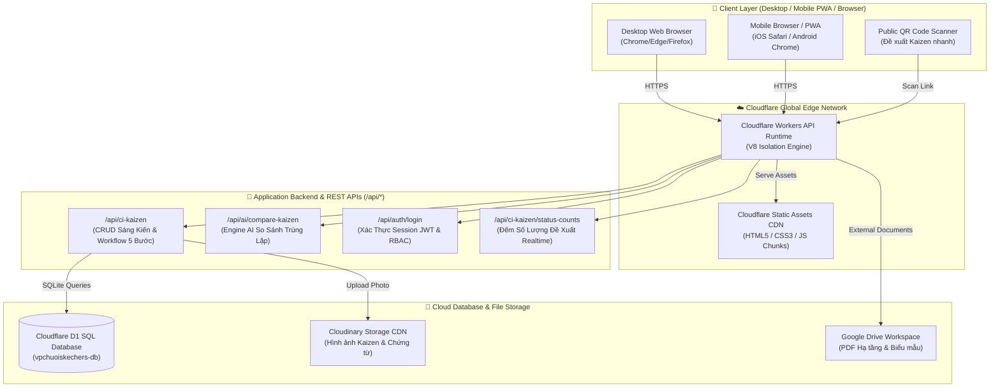
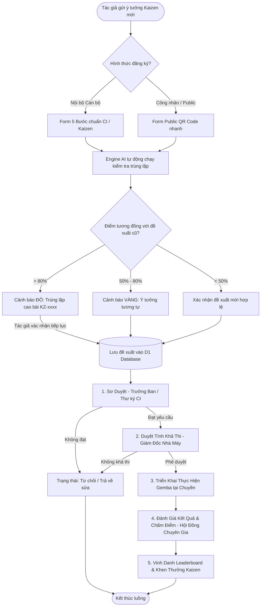
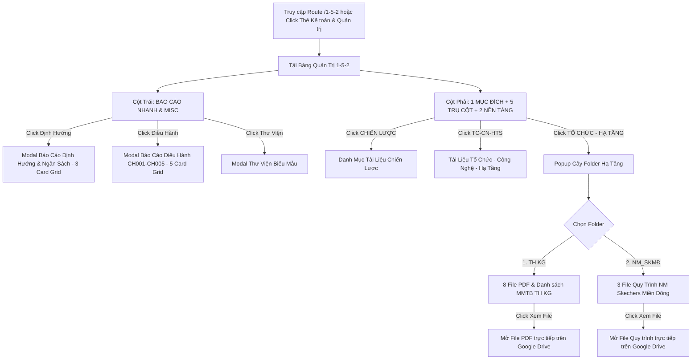
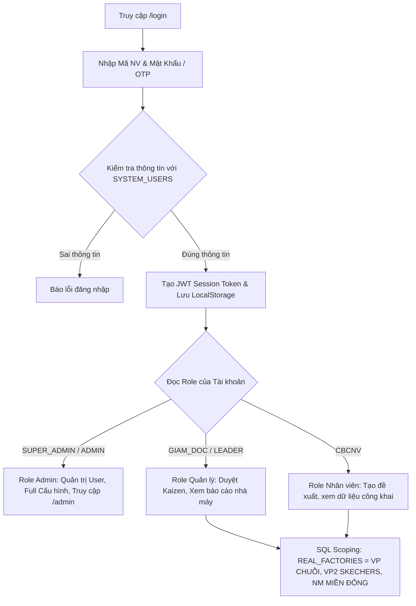
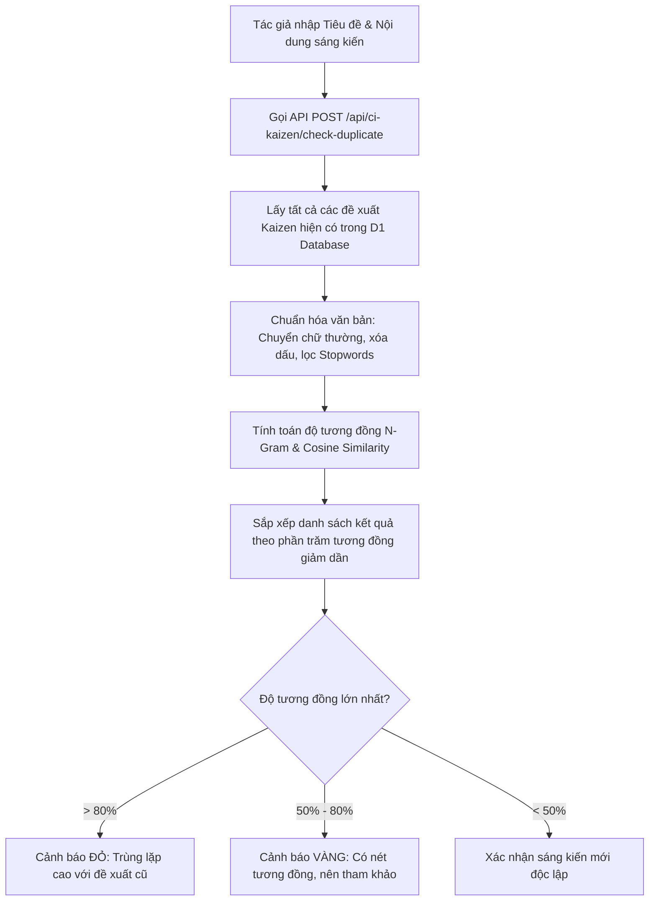
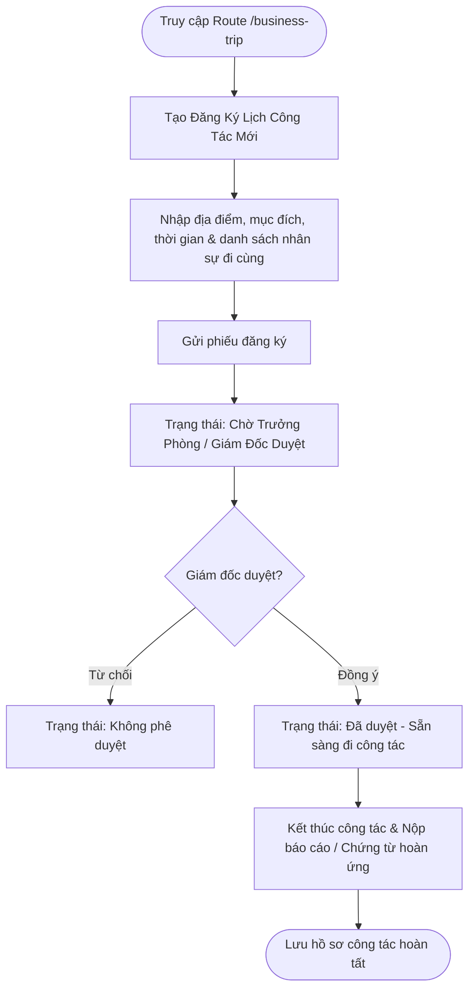
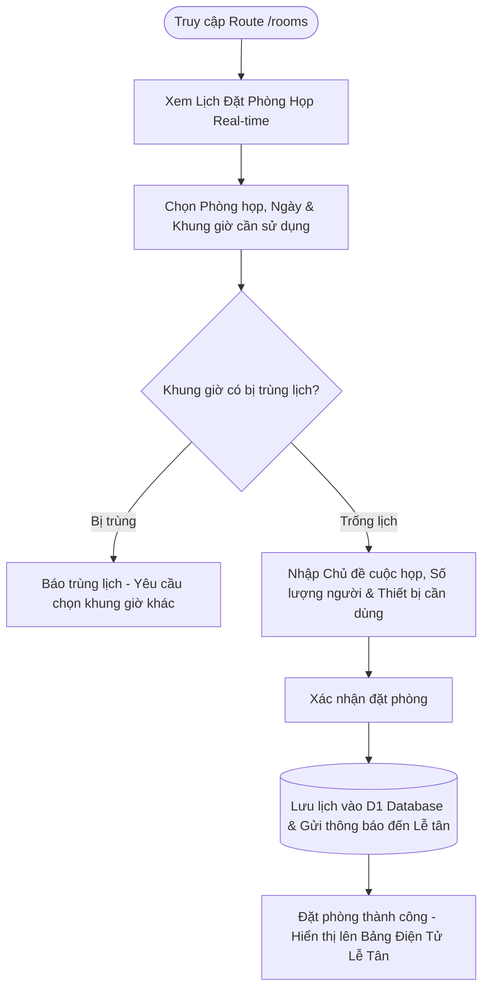

# 🏬 HỆ THỐNG QUẢN TRỊ VẬN HÀNH CHUỖI CUNG ỨNG & SẢN XUẤT SKECHERS — TBS GROUP

> **Văn Phòng Chuỗi SKECHERS - TBS Group (Zone II)**  
> 🏆 Cổng Điều Hành Vận Hành Tập Trung, Số Hóa Quy Trình Gemba Walk, Cải Tiến Liên Tục (CI/Kaizen 4.0), Quản Trị Chiến Lược 1-5-2, HR & Kế Toán Quản Trị  
> 🌐 **Production Domain**: [https://vpchuoiskechers.tbsgroup2026.workers.dev](https://vpchuoiskechers.tbsgroup2026.workers.dev)  
> 📦 **GitHub Repository**: [https://github.com/tbsgroup2026/vpchuoiskechers](https://github.com/tbsgroup2026/vpchuoiskechers)

---

## 📋 MỤC LỤC TỔNG QUAN
1. [Giới Thiệu Hệ Thống & Sứ Mệnh](#-1-giới-thiệu-hệ-thống--sứ-mệnh)
2. [Khung Quản Trị Chiến Lược 1-5-2 Chi Tiết](#-2-khung-quản-trị-chiến-lược-1-5-2-chi-tiết)
3. [Sơ Đồ Kiến Trúc Tổng Thể Hệ Thống (System Architecture)](#-3-sơ-đồ-kiến-trúc-tổng-thể-hệ-thống-system-architecture)
4. [Tổng Hợp Sơ Đồ Luồng Hoạt Động (Comprehensive Flowcharts)](#-4-tổng-hợp-sơ-đồ-luồng-hoạt-động-comprehensive-flowcharts)
   - [4.1. Luồng 5 Bước Đề Xuất & Phê Duyệt Sáng Kiến Kaizen (CI/Kaizen Engine)](#41-luồng-5-bước-đề-xuất--phê-duyệt-sáng-kiến-kaizen-cikaizen-engine)
   - [4.2. Luồng Bảng Điều Hành Quản Trị Chiến Lược 1-5-2 & Báo Cáo Nhanh](#42-luồng-bảng-điều-hành-quản-trị-chiến-lược-1-5-2--báo-cáo-nhanh)
   - [4.3. Luồng Xác Thực JWT, Phân Quyền RBAC & Scoping Dữ Liệu Nhà Máy](#43-luồng-xác-thực-jwt-phân-quyền-rbac--scoping-dữ-liệu-nhà-máy)
   - [4.4. Luồng Thuật Toán AI Kiểm Tra & So Sánh Trùng Lặp Sáng Kiến](#44-luồng-thuật-toán-ai-kiểm-tra--so-sánh-trùng-lặp-sáng-kiến)
   - [4.5. Luồng Nghiệp Vụ Đăng Ký & Phê Duyệt Công Tác (Business Trip)](#45-luồng-nghiệp-vụ-đăng-ký--phê-duyệt-công-tác-business-trip)
   - [4.6. Luồng Quản Lý & Đặt Phòng Họp Thông Minh (Room Booking)](#46-luồng-quản-lý--đặt-phòng-họp-thông-minh-room-booking)
5. [Cơ Sở Dữ Liệu Cloudflare D1 & Schema SQL](#-5-cơ-sở-dữ-liệu-cloudflare-d1--schema-sql)
6. [Danh Mục RESTful API Endpoints](#-6-danh-mục-restful-api-endpoints)
7. [Các Phân Hệ Chức Năng Chi Tiết](#-7-các-phân-hệ-chức-năng-chi-tiết)
8. [Công Nghệ & Kiến Trúc Kỹ Thuật (Tech Stack)](#-8-công-nghệ--kiến-trúc-kỹ-thuật-tech-stack)
9. [Cấu Trúc Thư Mục Dự Án Chi Tiết (Project Structure)](#-9-cấu-trúc-thư-mục-dự-án-chi-tiết-project-structure)
10. [Hướng Dẫn Cài Đặt, Phát Triển & Triển Khai (Setup & Deployment Guide)](#-10-hướng-dẫn-cài-đặt-phát-triển--triển-khai-setup--deployment-guide)

---

## 📌 1. GIỚI THIỆU HỆ THỐNG & SỨ MỆNH

**Hệ Thống Quản Trị Vận Hành Chuỗi Cung Ứng & Sản Xuất SKECHERS - TBS Group** được xây dựng nhằm phục vụ công tác chuyển đổi số toàn diện cho **Văn Phòng Chuỗi SKECHERS (Khu vực Zone II)** thuộc Tập đoàn Da Giày TBS (TBS Group).

### ✨ Các Mục Tiêu Cốt Lõi:
- **Số hóa Gemba Walk & Cải tiến CI/Kaizen 4.0**: Chuyển đổi toàn bộ quy trình đề xuất cải tiến từ thủ công/giấy sang hệ thống số hóa tự động với sự hỗ trợ của thuật toán AI so sánh trùng lặp.
- **Trực quan hóa Khung Quản trị 1-5-2**: Giúp Ban Giám Đốc và các Trưởng bộ phận theo dõi chỉ số mục đích xuyên suốt, 5 trụ cột vận hành và 2 nền tảng quản trị real-time.
- **Tối ưu hóa quản lý nguồn lực**: Tích hợp các phân hệ Đặt phòng họp, Đăng ký công tác, Quản trị nhân sự và Kế toán quản trị trong một không gian làm việc tập trung (App Hub).
- **Hạ tầng Edge Computing**: Triển khai trên mạng lưới toàn cầu của **Cloudflare Workers** giúp tốc độ phản hồi cực nhanh (< 20ms) và tính sẵn sàng cao 99.99%.

---

## 🎯 2. KHUNG QUẢN TRỊ CHIẾN LƯỢC 1-5-2 CHI TIẾT

Hệ thống điều hành theo khung quản trị chiến lược **1-5-2**:

```
                               ┌───────────────────────────────────────────────────────────┐
                               │                   1. MỤC ĐÍCH XUYÊN SUỐT                 │
                               │   Xây dựng TBS Group là một ĐỐI TÁC KHÔNG THỂ THAY THẾ   │
                               │   trong chuỗi giá trị toàn cầu, tự vận hành & bền vững   │
                               └─────────────────────────────┬─────────────────────────────┘
                                                             │
               ┌──────────────────┬──────────────────┬───────┴──────────┬──────────────────┐
               │                  │                  │                  │                  │
        ┌──────┴──────┐    ┌──────┴──────┐    ┌──────┴──────┐    ┌──────┴──────┐    ┌──────┴──────┐
        │1.CHIẾN LƯỢC │    │2. TC-CN-HTS │    │  3. KH & CC │    │ 4. TH & NM  │    │  5. VHDN    │
        └─────────────┘    └─────────────┘    └─────────────┘    └─────────────┘    └─────────────┘
               │                  │                  │                  │                  │
               └──────────────────┴──────────────────┼──────────────────┴──────────────────┘
                                                             │
                               ┌─────────────────────────────┴─────────────────────────────┐
                               │                   2. NỀN TẢNG QUẢN TRỊ                    │
                               ├─────────────────────────────┬─────────────────────────────┤
                               │    1. TỔ CHỨC - HẠ TẦNG     │   2. DỮ LIỆU SỐ (BI 24/7)   │
                               │   (1. TH KG & 2. NM_SKMĐ)   │  (Báo cáo điều hành số hóa) │
                               └─────────────────────────────┴─────────────────────────────┘
```

### 🔹 1. Mục Đích Xuyên Suốt:
> *"Xây dựng TBS Group là một **đối tác không thể thay thế** trong chuỗi giá trị gia tăng toàn cầu, có khả năng **tự vận hành, tự kiểm soát** và phát triển bền vững."*

### 🔹 5 Trụ Cột Vận Hành (5 Operational Pillars):
1. **CHIẾN LƯỢC**: Định hướng và kế hoạch chiến lược phát triển sản xuất dòng sản phẩm SKECHERS.
2. **TC-CN-HTS**: Tổ chức bộ máy - Công nghệ kỹ thuật - Hạ tầng số hóa quy trình.
3. **KH & CC**: Quản trị trải nghiệm Khách hàng (SKECHERS Global) & Chuỗi cung ứng (Supply Chain Management).
4. **TH & NM**: Thương hiệu sản xuất TBS & Hiệu quả vận hành các Nhà máy sản xuất (Factory Operational Excellence).
5. **VHDN**: Văn hóa doanh nghiệp, tiêu chuẩn Gemba, Kaizen 5S & Phát triển nguồn nhân lực chất lượng cao.

### 🔹 2 Nền Tảng Quản Trị (2 Governance Platforms):
1. **TỔ CHỨC - HẠ TẦNG**:
   - **1. TH KG**: Danh mục 8 tài liệu kiến trúc kỹ thuật & danh sách máy móc thiết bị nhà máy Kiên Giang.
   - **2. NM_SKMĐ**: Danh mục 3 tài liệu quy trình vận hành & tiêu chuẩn nhà máy Skechers Miền Đông.
2. **DỮ LIỆU SỐ**: Nền tảng điều hành số hóa 24/7 tích hợp hệ thống báo cáo BI, số liệu OEE và bảng tổng hợp chỉ số Kaizen real-time.

---

## 🏗️ 3. SƠ ĐỒ KIẾN TRÚC TỔNG THỂ HỆ THỐNG (SYSTEM ARCHITECTURE)



---

## 🔄 4. TỔNG HỢP SƠ ĐỒ LUỒNG HOẠT ĐỘNG (COMPREHENSIVE FLOWCHARTS)

### 4.1. Luồng 5 Bước Đề Xuất & Phê Duyệt Sáng Kiến Kaizen (CI/Kaizen Engine)



---

### 4.2. Luồng Bảng Điều Hành Quản Trị Chiến Lược 1-5-2 & Báo Cáo Nhanh



---

### 4.3. Luồng Xác Thực JWT, Phân Quyền RBAC & Scoping Dữ Liệu Nhà Máy



---

### 4.4. Luồng Thuật Toán AI Kiểm Tra & So Sánh Trùng Lặp Sáng Kiến



---

### 4.5. Luồng Nghiệp Vụ Đăng Ký & Phê Duyệt Công Tác (Business Trip)



---

### 4.6. Luồng Quản Lý & Đặt Phòng Họp Thông Minh (Room Booking)



---

## 📊 5. CƠ SỞ DỮ LIỆU CLOUDFLARE D1 & SCHEMA SQL

Hệ thống sử dụng cơ sở dữ liệu phân tán **Cloudflare D1 SQL Database** (`vpchuoiskechers-db`).

### 🗄️ Cấu trúc bảng chính (`ci_kaizen_proposals`):

```sql
CREATE TABLE IF NOT EXISTS ci_kaizen_proposals (
    id TEXT PRIMARY KEY,
    code TEXT UNIQUE NOT NULL,
    title TEXT NOT NULL,
    category TEXT DEFAULT 'Sản xuất',
    factory TEXT NOT NULL,
    region TEXT NOT NULL,
    proposer_name TEXT NOT NULL,
    proposer_code TEXT,
    department TEXT,
    current_state TEXT,
    solution TEXT,
    expected_benefit TEXT,
    image_before TEXT,
    image_after TEXT,
    status TEXT DEFAULT 'pending_preliminary',
    status_label TEXT DEFAULT 'Chờ sơ duyệt',
    preliminary_reviewer TEXT,
    preliminary_date TEXT,
    preliminary_note TEXT,
    feasibility_approver TEXT,
    feasibility_date TEXT,
    feasibility_note TEXT,
    evaluation_score REAL DEFAULT 0,
    created_at DATETIME DEFAULT CURRENT_TIMESTAMP,
    updated_at DATETIME DEFAULT CURRENT_TIMESTAMP
);
```

---

## 🔌 6. DANH MỤC RESTFUL API ENDPOINTS

| HTTP Method | API Endpoint | Mô Tả Chức Năng | Quyền Truy Cập (Auth) |
|---|---|---|---|
| `GET` | `/api/ci-kaizen` | Lấy danh sách đề xuất Kaizen (hỗ trợ filter theo factory, status, search) | Public / Authorized |
| `POST` | `/api/ci-kaizen` | Tạo đề xuất Kaizen mới (hỗ trợ Form 5 bước & Form Public QR) | Public / Authorized |
| `POST` | `/api/ci-kaizen/preliminary-review` | Cập nhật kết quả Sơ duyệt Kaizen (Đạt / Không đạt / Yêu cầu sửa) | Trưởng ban CI / Admin |
| `POST` | `/api/ci-kaizen/approve` | Duyệt Tính Khả Thi sáng kiến | Giám đốc Nhà máy / Admin |
| `POST` | `/api/ci-kaizen/expert-evaluations` | Nhập điểm chấm & đánh giá từ Hội đồng chuyên gia | Hội đồng Chuyên gia / Admin |
| `GET` | `/api/ci-kaizen/status-counts` | Đếm số lượng đề xuất theo từng trạng thái real-time | Public / Authorized |
| `POST` | `/api/ai/compare-kaizen` | Chạy thuật toán AI so sánh trùng lặp nội dung sáng kiến | Public / Authorized |
| `POST` | `/api/auth/login` | Xác thực đăng nhập MSNV, cấp JWT Session Token | Public |

---

## 🛠️ 7. CÁC PHÂN HỆ CHỨC NĂNG CHI TIẾT

```
                               ┌────────────────────────────────────────┐
                               │ VĂN PHÒNG CHUỖI SKECHERS - TBS GROUP  │
                               └──────────────────┬─────────────────────┘
                                                  │
         ┌──────────────────┬─────────────────────┼─────────────────────┬──────────────────┐
         │                  │                     │                     │                  │
  ┌──────┴──────┐    ┌──────┴──────┐       ┌──────┴──────┐       ┌──────┴──────┐    ┌──────┴──────┐
  │  1-5-2 DASH │    │   CN-CI     │       │BUSINESS TRIP│       │ROOM BOOKING │    │   FINANCE   │
  │ Quản Trị    │    │ Sáng Kiến   │       │ Đăng Ký     │       │ Đặt Phòng   │    │ Kế Toán     │
  │ Chiến Lược  │    │ Kaizen 4.0  │       │ Công Tác    │       │ Họp Thông   │    │ Quản Trị    │
  │             │    │             │       │             │       │ Minh        │    │             │
  └─────────────┘    └─────────────┘       └─────────────┘       └─────────────┘    └─────────────┘
```

---

## 💻 8. CÔNG NGHỆ & KIẾN TRÚC KỸ THUẬT (TECH STACK)

- **Frontend Core Framework**: Next.js 14 (App Router Architecture), React 18, TypeScript.
- **Static Export Mode**: Build ra file tĩnh chuẩn (`out/`) tương thích 100% với Cloudflare Assets.
- **CSS & UI Component Styling**: Vanilla CSS, TailwindCSS, Lucide Icons, Tabler Icons.
- **Serverless Edge Computing Engine**: Cloudflare Workers Runtime Engine (V8 Isolated Architecture).
- **Distributed Database**: Cloudflare D1 SQL (Distributed SQLite Database Engine at Global Edge).
- **Asset Storage & CDN**: Cloudinary Storage API (Hình ảnh Kaizen), Google Drive API Integration.
- **Deployment Tools**: Cloudflare Wrangler CLI v4.x.

---

## 📂 9. CẤU TRÚC THƯ MỤC DỰ ÁN CHI TIẾT (PROJECT STRUCTURE)

```
vpchuoiskechers/
├── README.md                                  # Tài liệu kiến trúc & hướng dẫn vận hành chi tiết
├── package.json                               # Khai báo Dependencies & Build Scripts
├── wrangler.jsonc                             # Cấu hình triển khai Cloudflare Workers & D1 Binding
├── web/                                       # Nguồn ứng dụng Next.js chính
│   ├── README.md                              # Tài liệu mô tả module Web
│   ├── package.json                           # Configuration gói NPM web
│   ├── next.config.mjs                        # Cấu hình Next.js (export mode, images loader)
│   ├── tailwind.config.js                     # Custom Tailwind Theme Tokens & Palette
│   ├── public/                                # Tài nguyên tĩnh (Logos, Icons, sw.js)
│   │   ├── sw.js                              # Service Worker PWA & Offline Cache Strategy
│   │   ├── compiled-tailwind.css              # Output CSS Tailwind đã biên dịch
│   │   └── images/                            # Logo TBS Group & Skechers
│   ├── migrations/                            # SQL Migration Scripts cho D1 Database
│   │   └── 0001_kaizen_init.sql               # Migration khởi tạo bảng ci_kaizen_proposals
│   └── src/
│       ├── app/                               # Next.js App Router Structure
│       │   ├── page.tsx                       # Trang chủ ứng dụng
│       │   ├── layout.tsx                     # Global Root Layout
│       │   ├── 1-5-2/                         # Trang Bảng điều khiển Quản trị 1-5-2
│       │   ├── work/                          # Trang Dashboard điều hành chung
│       │   │   ├── page.tsx                   # Main Work Dashboard Page
│       │   │   ├── kaizen/                    # Phân hệ Cải tiến liên tục Kaizen
│       │   │   │   ├── page.tsx               # Trang Dashboard Kaizen
│       │   │   │   └── register/              # Form đăng ký Kaizen Public
│       │   │   ├── gemba/                     # Route Theo dõi Gemba Walk
│       │   │   └── ci/                        # Route Trung tâm CI
│       │   ├── api/                           # Cloudflare Edge REST API Routes
│       │   │   └── ci-kaizen/                 # API Xử lý dữ liệu Kaizen & D1 Queries
│       │   ├── business-trip/                 # Module Quản lý Đăng ký Công tác
│       │   ├── rooms/                         # Module Đặt phòng họp thông minh
│       │   ├── finance/                       # Module Kế toán & Quản trị Tài chính
│       │   ├── hr/                            # Module Quản trị Nhân sự Tập đoàn
│       │   └── admin/                         # Cổng Quản trị Hệ thống (Admin Portal)
│       ├── components/                        # Shared React UI Components
│       │   ├── Header.tsx                     # Thanh Top Navigation Header & User Profile Menu
│       │   ├── UserAvatar.tsx                 # Avatar hiển thị tức thì bảo vệ chống lỗi
│       │   ├── SmartImage.tsx                 # Smart Image Loader tích hợp Cloudinary
│       │   ├── home/                          # StrategicManagementDashboard.tsx (Dashboard 1-5-2)
│       │   └── work/                          # OverviewDashboard.tsx (Overview 7 Thẻ Phòng Ban)
│       ├── modules/                           # Sub-system Domain Modules
│       │   └── ci/                            # CI Module: KaizenDashboard, Form Submit, Modals
│       └── lib/                               # Data Stores, User Profiles & Helper Utilities
│           ├── userProfiles.ts                # Khai báo User Profiles & RBAC Functions
│           ├── organizationTree.ts            # Cơ cấu tổ chức phòng ban nhà máy
│           ├── translations.ts                # Đa ngôn ngữ Việt / Anh (VN / EN)
│           └── security.ts                    # Xử lý mã hóa JWT Token & Security Check
```

---

## 🚀 10. HƯỚNG DẪN CÀI ĐẶT, PHÁT TRIỂN & TRIỂN KHAI (SETUP & DEPLOYMENT GUIDE)

### 10.1. Yêu Cầu Môi Trường (Prerequisites)
- **Node.js**: `>= 18.17.0` (Khuyên dùng Node 20 LTS)
- **npm**: `>= 9.0.0`
- **Wrangler CLI**: `npm install -g wrangler`

---

### 10.2. Chạy Ứng Dụng Cục Bộ (Local Development)

```bash
# 1. Di chuyển vào thư mục web
cd web

# 2. Cài đặt các thư viện phụ thuộc
npm install

# 3. Khởi chạy dev server cục bộ
npm run dev
```
Mở trình duyệt truy cập: `http://localhost:3000`

---

### 10.3. Thao Tác Với Cơ Sở Dữ Liệu Cloudflare D1 (Database Management)

```bash
# Kiểm tra số lượng bản ghi Kaizen trong Remote Database
npx wrangler d1 execute vpchuoiskechers-db --remote --command="SELECT COUNT(*) FROM ci_kaizen_proposals;"

# Xem 5 đề xuất Kaizen mới nhất
npx wrangler d1 execute vpchuoiskechers-db --remote --command="SELECT id, code, title, proposer_name, status_label, created_at FROM ci_kaizen_proposals ORDER BY created_at DESC LIMIT 5;"

# Chạy Migration SQL file lên Remote D1 Database
npx wrangler d1 execute vpchuoiskechers-db --remote --file="./migrations/0001_kaizen_init.sql"
```

---

### 10.4. Quy Trình Build & Deploy Sản Phẩm (Production Deployment)

```bash
# 1. Di chuyển vào thư mục ứng dụng web
cd web

# 2. Biên dịch Tailwind CSS & Next.js Static Bundle
npm run build

# 3. Triển khai lên Cloudflare Workers Global Edge Network
npx wrangler deploy
```

Trang web sẽ tự động cập nhật bản mới nhất tại domain chính thức:  
👉 **[https://vpchuoiskechers.tbsgroup2026.workers.dev](https://vpchuoiskechers.tbsgroup2026.workers.dev)**

---

### 📜 Bản Quyền & Phát Triển (Copyright & Credits)
**Văn Phòng Chuỗi SKECHERS — TBS Group © 2026**. All Rights Reserved.  
Được thiết kế, phát triển và vận hành bởi **Team Chuyển Đổi Số (IT Digital Transformation) - TBS Group**.
