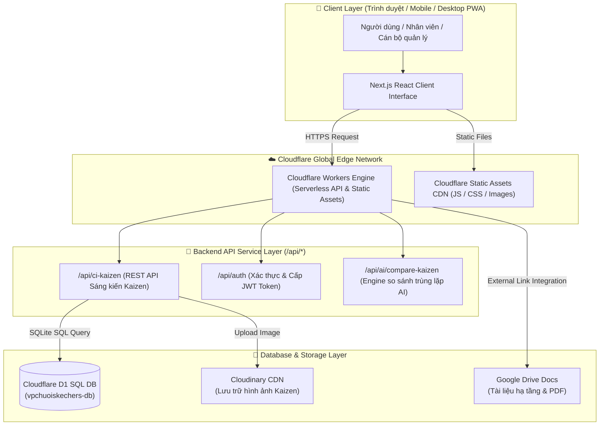
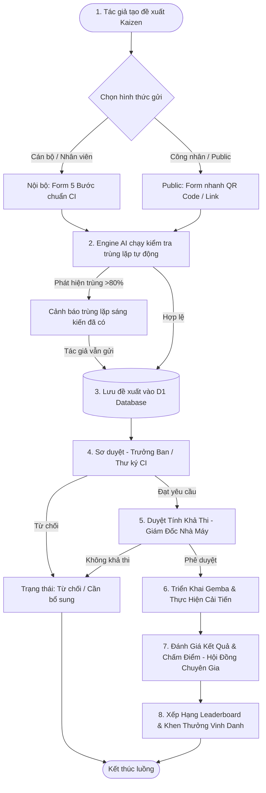
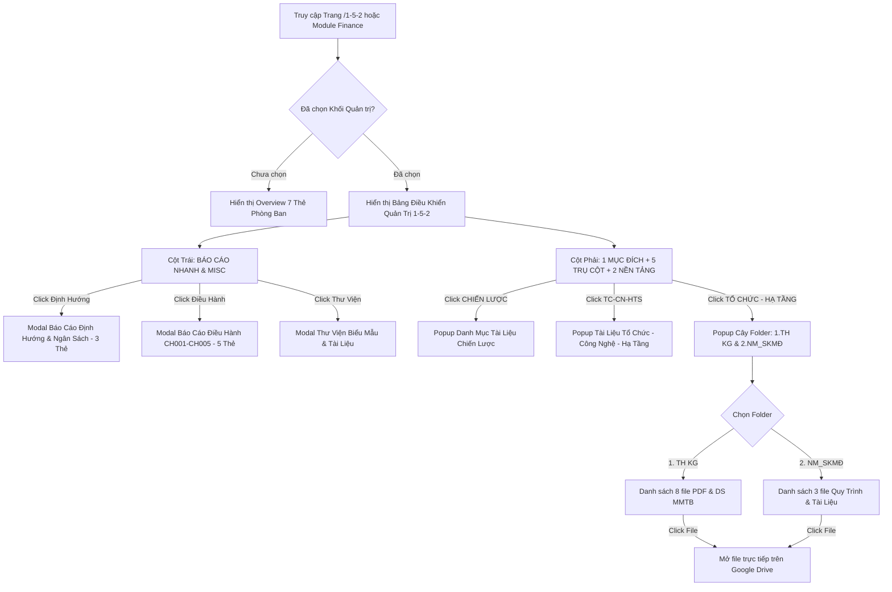
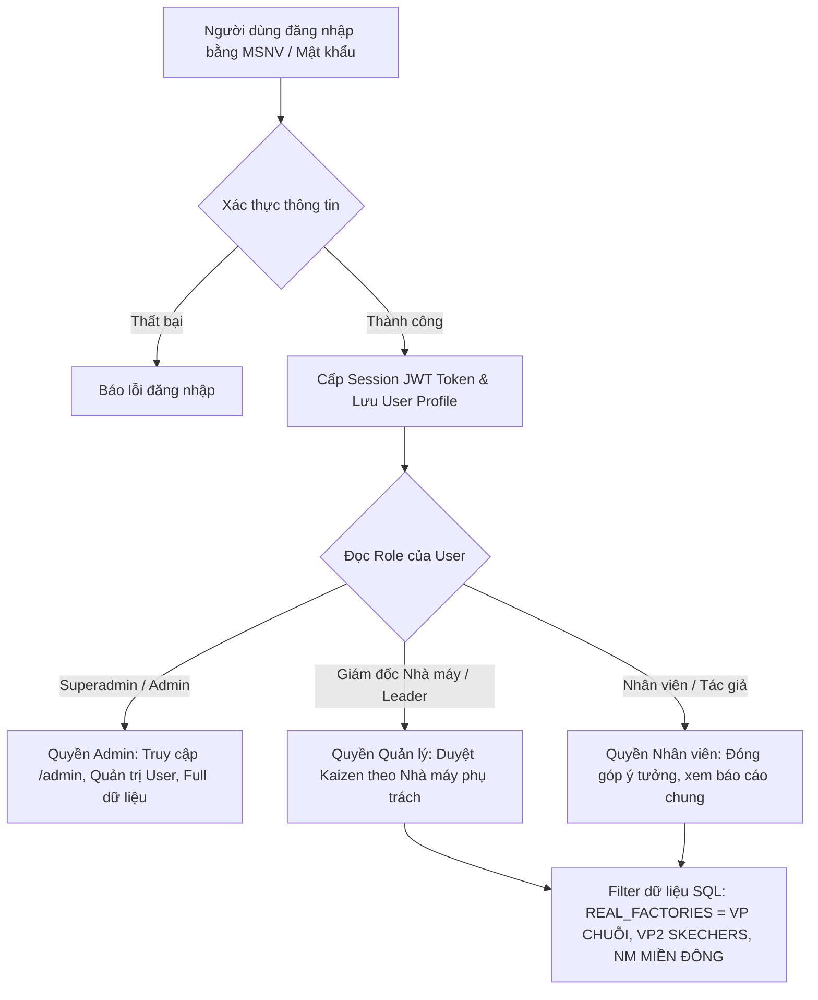
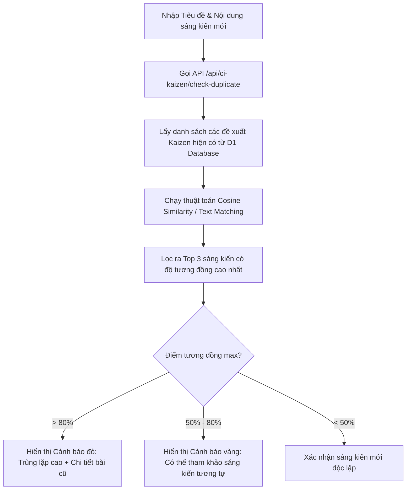

# 🏬 HỆ THỐNG QUẢN TRỊ VẬN HÀNH CHUỖI CUNG ỨNG & SẢN XUẤT SKECHERS — TBS GROUP

> **Văn Phòng Chuỗi SKECHERS - TBS Group**  
> Cổng Điều Hành Vận Hành, Số Hóa Quy Trình, Quản Trị Chiến Lược 1-5-2 & Cải Tiến Liên Tục (CI/Kaizen 4.0)  
> 🌐 **Production Deployment**: [https://vpchuoiskechers.tbsgroup2026.workers.dev](https://vpchuoiskechers.tbsgroup2026.workers.dev)

---

## 📋 MỤC LỤC
1. [Giới Thiệu Tổng Quan](#-1-giới-thiệu-tổng-quan)
2. [Khung Quản Trị Chiến Lược 1-5-2](#-2-khung-quản-trị-chiến-lược-1-5-2)
3. [Sơ Đồ Kiến Trúc Hệ Thống (System Architecture)](#-3-sơ-đồ-kiến-trúc-hệ-thống-system-architecture)
4. [Sơ Đồ Luồng Hoạt Động Chi Tiết (Detailed Flowcharts)](#-4-sơ-đồ-luồng-hoạt-động-chi-tiết-detailed-flowcharts)
   - [4.1. Luồng Đề Xuất & Phê Duyệt Sáng Kiến Kaizen (5 Bước)](#41-luồng-đề-xuất--phê-duyệt-sáng-kiến-kaizen-5-bước)
   - [4.2. Luồng Điều Hành Hệ Thống Quản Trị Chiến Lược 1-5-2](#42-luồng-điều-hành-hệ-thống-quản-trị-chiến-lược-1-5-2)
   - [4.3. Luồng Xác Thực, Phân Quyền (RBAC) & Scoping Nhà Máy](#43-luồng-xác-thực-phân-quyền-rbac--scoping-nhà-máy)
   - [4.4. Luồng Kiểm Tra & So Sánh Trùng Lặp Sáng Kiến Bằng AI](#44-luồng-kiểm-tra--so-sánh-trùng-lặp-sáng-kiến-bằng-ai)
5. [Các Phân Hệ Chức Năng Chính](#-5-các-phân-hệ-chức-năng-chính)
6. [Công Nghệ Sử Dụng (Tech Stack)](#-6-công-nghệ-sử-dụng-tech-stack)
7. [Cấu Trúc Thư Mục Dự Án (Project Structure)](#-7-cấu-trúc-thư-mục-dự-án-project-structure)
8. [Hướng Dẫn Phát Triển & Triển Khai (Development & Deployment)](#-8-hướng-dẫn-phát-triển--triển-khai-development--deployment)

---

## 📌 1. GIỚI THIỆU TỔNG QUAN

**Hệ Thống Quản Trị Vận Hành Chuỗi Cung Ứng & Sản Xuất SKECHERS - TBS Group** là nền tảng điều hành tập trung phục vụ toàn bộ hoạt động vận hành, sản xuất, kiểm soát chất lượng, cải tiến liên tục và quản trị chiến lược tại **Văn Phòng Chuỗi SKECHERS (Zone II)** của Tập đoàn TBS.

Hệ thống được thiết kế hướng đến sự tinh gọn, hiện đại, đảm bảo tính bảo mật, linh hoạt cao trên hạ tầng **Cloudflare Serverless Edge Computing** kết hợp cơ sở dữ liệu phân tán **Cloudflare D1**.

---

## 🎯 2. KHUNG QUẢN TRỊ CHIẾN LƯỢC 1-5-2

Hệ thống vận hành theo mô hình quản trị chiến lược **1-5-2**:

```
                       ┌───────────────────────────────────────────────────────────┐
                       │                   1. MỤC ĐÍCH XUYÊN SUỐT                 │
                       │   Đối tác không thể thay thế trong chuỗi giá trị toàn cầu │
                       └─────────────────────────────┬─────────────────────────────┘
                                                     │
       ┌──────────────────┬──────────────────┬───────┴──────────┬──────────────────┐
       │                  │                  │                  │                  │
┌──────┴──────┐    ┌──────┴──────┐    ┌──────┴──────┐    ┌──────┴──────┐    ┌──────┴──────┐
│1.CHIẾN LƯỢC │    │2. TC-CN-HTS │    │  3. KH & CC │    │ 4. TH & NM  │    │  5. VHDN    │
└─────────────┘    └─────────────┘    └─────────────┘    └─────────────┘    └─────────────┘
       │                  │                  │                  │                  │
       └──────────────────┴──────────────────┼──────────────────┴──────────────────┘
                                                     │
                       ┌─────────────────────────────┴─────────────────────────────┐
                       │                   2. NỀN TẢNG QUẢN TRỊ                    │
                       │     1. TỔ CHỨC - HẠ TẦNG  │  2. DỮ LIỆU SỐ (BI 24/7)      │
                       └───────────────────────────────────────────────────────────┘
```

- **1 Mục đích xuyên suốt**: Xây dựng TBS Group là một **đối tác không thể thay thế** trong chuỗi giá trị gia tăng toàn cầu, có khả năng tự vận hành, tự kiểm soát và phát triển bền vững.
- **5 Trụ cột vận hành**:
  1. **CHIẾN LƯỢC**: Định hướng và mục tiêu chiến lược dài hạn.
  2. **TC-CN-HTS**: Tổ chức - Công nghệ - Hạ tầng số.
  3. **KH & CC**: Khách hàng (SKECHERS) & Chuỗi cung ứng (Supply Chain).
  4. **TH & NM**: Thương hiệu & Quản trị Nhà máy sản xuất.
  5. **VHDN**: Văn hóa doanh nghiệp & Phát triển nguồn nhân lực.
- **2 Nền tảng quản trị**:
  1. **TỔ CHỨC - HẠ TẦNG**: Quản lý danh mục tài liệu hạ tầng kiến trúc kỹ thuật (1.TH KG, 2.NM_SKMĐ).
  2. **DỮ LIỆU SỐ**: Nền tảng báo cáo phân tích số liệu điều hành real-time 24/7.

---

## 🏗️ 3. SƠ ĐỒ KIẾN TRÚC HỆ THỐNG (SYSTEM ARCHITECTURE)

Hệ thống áp dụng kiến trúc **JAMstack / Edge First** hiện đại:



---

## 🔄 4. SƠ ĐỒ LUỒNG HOẠT ĐỘNG CHI TIẾT (DETAILED FLOWCHARTS)

### 4.1. Luồng Đề Xuất & Phê Duyệt Sáng Kiến Kaizen (5 Bước)

Luồng nghiệp vụ xử lý ý tưởng cải tiến CI/Kaizen từ lúc khởi tạo đến khi vinh danh khen thưởng:



---

### 4.2. Luồng Điều Hành Hệ Thống Quản Trị Chiến Lược 1-5-2



---

### 4.3. Luồng Xác Thực, Phân Quyền (RBAC) & Scoping Nhà Máy



---

### 4.4. Luồng Kiểm Tra & So Sánh Trùng Lặp Sáng Kiến Bằng AI



---

## 🛠️ 5. CÁC PHÂN HỆ CHỨC NĂNG CHÍNH

| STT | Phân Hệ Chức Năng | Mô Tả Nghiệp Vụ | Đường Dẫn (Route) |
|---|---|---|---|
| **1** | **Hệ Thống Quản Trị 1-5-2** | Bảng điều khiển chiến lược 1 mục đích, 5 trụ cột, 2 nền tảng & báo cáo định hướng | `/1-5-2` |
| **2** | **Cải Tiến Liên Tục (CN-CI)** | Quản lý đề xuất Kaizen 5 bước, sơ duyệt, duyệt tính khả thi, chấm điểm, vinh danh | `/work/kaizen` |
| **3** | **Đăng Ký Kaizen Public** | Form gửi sáng kiến nhanh cho công nhân / bên ngoài qua mã QR | `/work/kaizen/register` |
| **4** | **Đăng Ký Công Tác (Business Trip)** | Quản lý lịch trình, lập kế hoạch công tác & phê duyệt chi phí | `/business-trip` |
| **5** | **Đặt Phòng Họp (Room Booking)** | Đặt lịch phòng họp thông minh, quản lý thiết bị & máy chiếu | `/rooms` |
| **6** | **Quản Trị Nhân Sự (HR Shell)** | Sơ đồ tổ chức, định biên nhân sự, hồ sơ cán bộ | `/hr` |
| **7** | **Kế Toán & Quản Trị (Finance)** | Theo dõi ngân sách, thu chi, công nợ, đối soát hóa đơn | `/finance` |
| **8** | **Cổng Quản Trị Hệ Thống (Admin)** | Phân quyền vai trò, quản lý người dùng, nhà máy, dòng sản phẩm | `/admin` |

---

## 💻 6. CÔNG NGHỆ SỬ DỤNG (TECH STACK)

- **Frontend Core**: Next.js 14 (App Router, Static HTML Export Mode), React 18, TypeScript.
- **Styling & UI**: TailwindCSS, Vanilla Custom CSS, Lucide React Icons, Tabler Icons.
- **Serverless Runtime**: Cloudflare Workers, Cloudflare Assets Page Rules.
- **Edge Database**: Cloudflare D1 Database (SQLite Engine tại Edge).
- **Asset Storage**: Cloudinary Storage API (Hình ảnh Kaizen), Google Drive API (File PDF & Biểu mẫu).
- **Automation & Build**: Node.js, Wrangler CLI, Next Export.

---

## 📂 7. CẤU TRÚC THƯ MỤC DỰ ÁN (PROJECT STRUCTURE)

```
vpchuoiskechers/
├── web/
│   ├── src/
│   │   ├── app/                               # Next.js App Router Pages & API Routes
│   │   │   ├── 1-5-2/                         # Route Hệ thống quản trị 1-5-2
│   │   │   ├── work/                          # Route Dashboard điều hành chính
│   │   │   │   ├── kaizen/                    # Route Cải tiến liên tục Kaizen
│   │   │   │   │   └── register/              # Form đăng ký Kaizen Public
│   │   │   ├── api/                           # Serverless Edge API endpoints
│   │   │   │   └── ci-kaizen/                 # API Xử lý dữ liệu Kaizen & DB SQL
│   │   │   ├── business-trip/                 # Module Công tác
│   │   │   ├── rooms/                         # Module Đặt phòng họp
│   │   │   ├── finance/                       # Module Kế toán & Quản trị
│   │   │   ├── hr/                            # Module Quản trị nhân sự
│   │   │   └── admin/                         # Cổng quản trị hệ thống Admin
│   │   ├── components/                        # React UI Components
│   │   │   ├── home/                          # StrategicManagementDashboard.tsx
│   │   │   └── work/                          # OverviewDashboard.tsx
│   │   ├── modules/                           # Domain Specific Modules
│   │   │   └── ci/                            # CIModule, KaizenDashboard, Form Submit...
│   │   └── lib/                               # Data Store, Profiles & Utilities
│   │       ├── userProfiles.ts                # Hồ sơ người dùng & Phân quyền
│   │       ├── organizationTree.ts            # Cơ cấu tổ chức phòng ban
│   │       └── translations.ts                # Đa ngôn ngữ VN / EN
│   ├── public/                                # Static Assets (Logos, Icons, Compiled CSS)
│   ├── migrations/                            # D1 Database Schema Migrations SQL
│   ├── wrangler.jsonc                         # Cloudflare Workers Deployment Config
│   ├── package.json                           # Dependencies & Build Scripts
│   └── tailwind.config.js                     # Custom Tailwind Palette & Design Tokens
└── README.md                                  # Tài liệu hệ thống chi tiết
```

---

## 🚀 8. HƯỚNG DẪN PHÁT TRIỂN & TRIỂN KHAI (DEVELOPMENT & DEPLOYMENT)

### 8.1. Yêu Cầu Môi Trường (Prerequisites)
- **Node.js**: `>= 18.17.0`
- **npm**: `>= 9.0.0`
- **Cloudflare Wrangler CLI**: `npm install -g wrangler`

---

### 8.2. Cài Đặt Khởi Chạy Cục Bộ (Local Setup)

```bash
# 1. Di chuyển vào thư mục ứng dụng web
cd web

# 2. Cài đặt các gói phụ thuộc (Dependencies)
npm install

# 3. Chạy Server phát triển cục bộ (Development Server)
npm run dev
```

Mở trình duyệt truy cập tại địa chỉ: `http://localhost:3000`

---

### 8.3. Thao Tác Với Cơ Sở Dữ Liệu Cloudflare D1 (Database Execution)

```bash
# Truy vấn thử bảng Kaizen từ D1 Remote Database
npx wrangler d1 execute vpchuoiskechers-db --remote --command="SELECT COUNT(*) FROM ci_kaizen_proposals;"

# Thêm cột hoặc chạy migration vào Remote Database
npx wrangler d1 execute vpchuoiskechers-db --remote --file="./migrations/0001_kaizen_init.sql"
```

---

### 8.4. Biên Dịch & Triển Khai Lên Cloudflare Workers (Production Deployment)

```bash
# 1. Di chuyển vào thư mục web
cd web

# 2. Biên dịch Tailwind CSS & Next.js Static Export Bundle
npm run build

# 3. Triển khai ứng dụng hoàn chỉnh lên Cloudflare Workers
npx wrangler deploy
```

Trang web sẽ tự động được cập nhật tại domain chính thức:  
👉 **[https://vpchuoiskechers.tbsgroup2026.workers.dev](https://vpchuoiskechers.tbsgroup2026.workers.dev)**

---

### 📜 Bản Quyền & Phát Triển
**Văn Phòng Chuỗi SKECHERS — TBS Group © 2026**. All Rights Reserved.  
Được phát triển & duy trì bởi **Team Chuyển Đổi Số (IT Digital Transformation) - TBS Group**.
