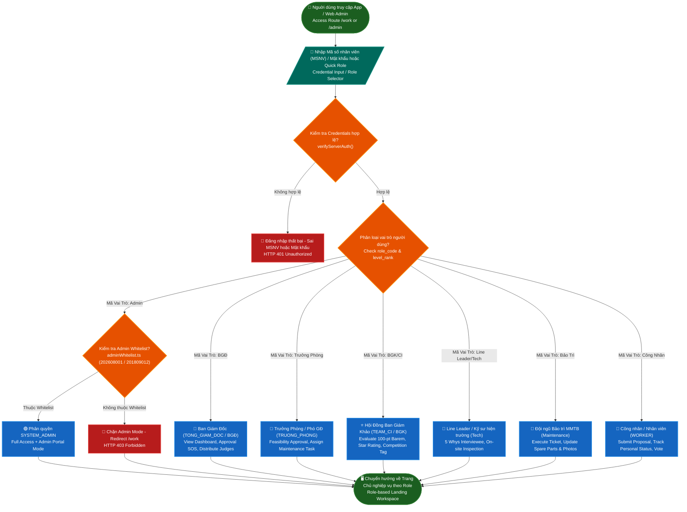
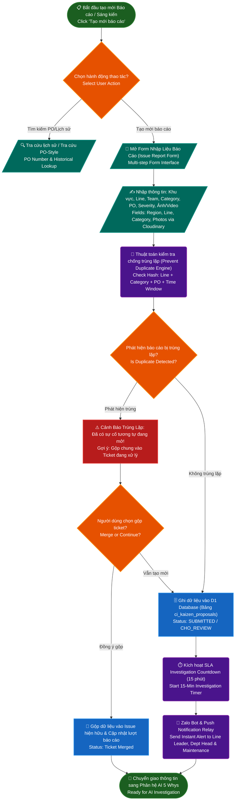
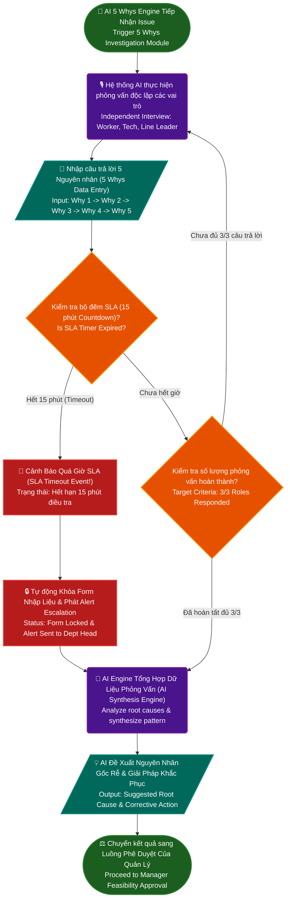
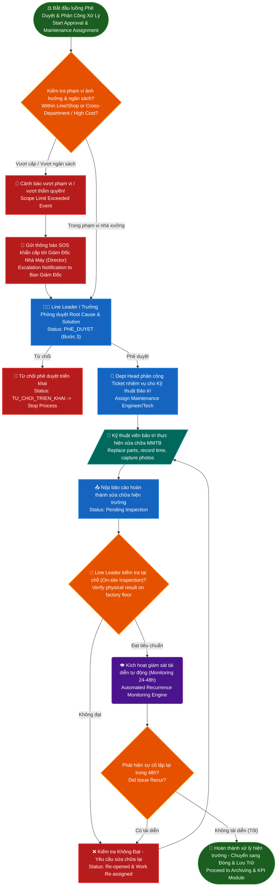
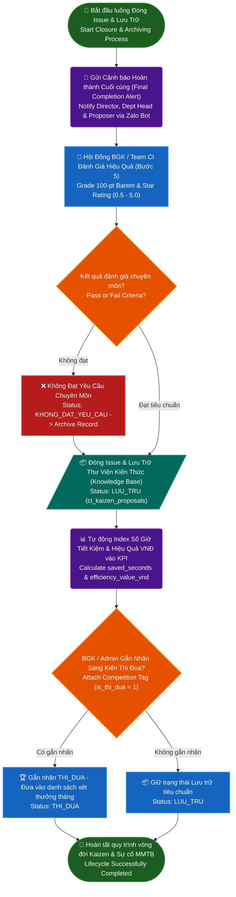
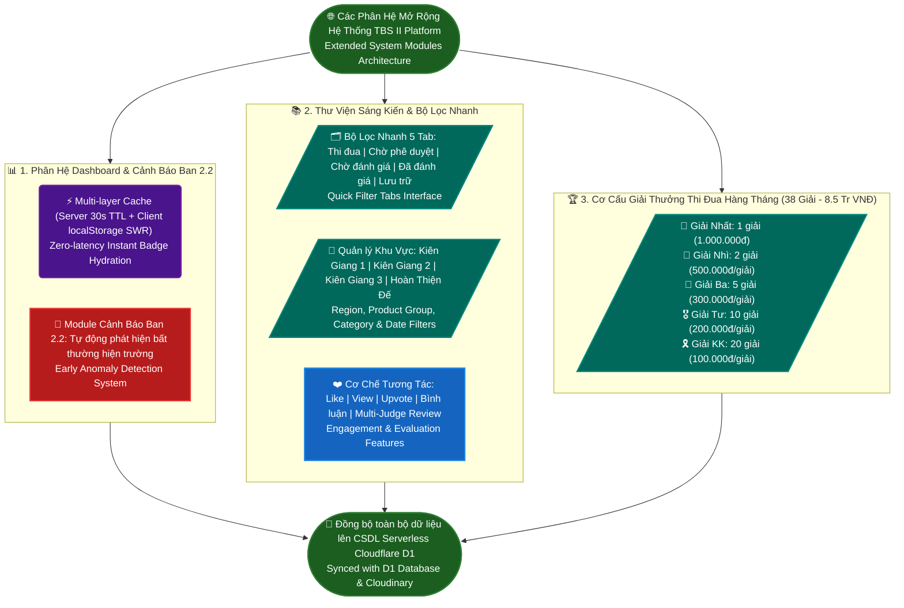
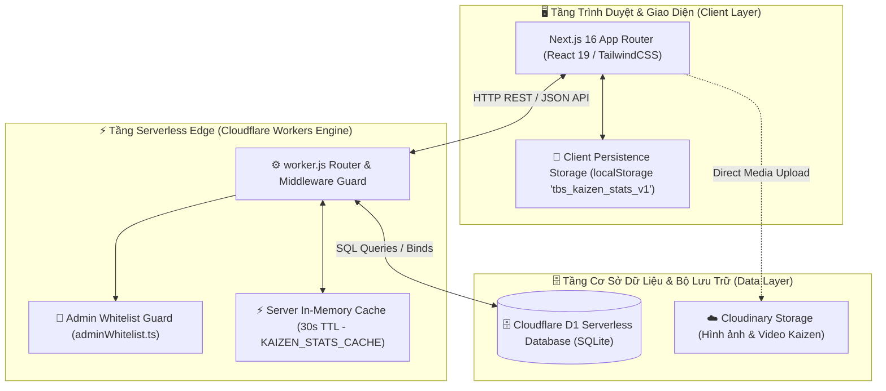
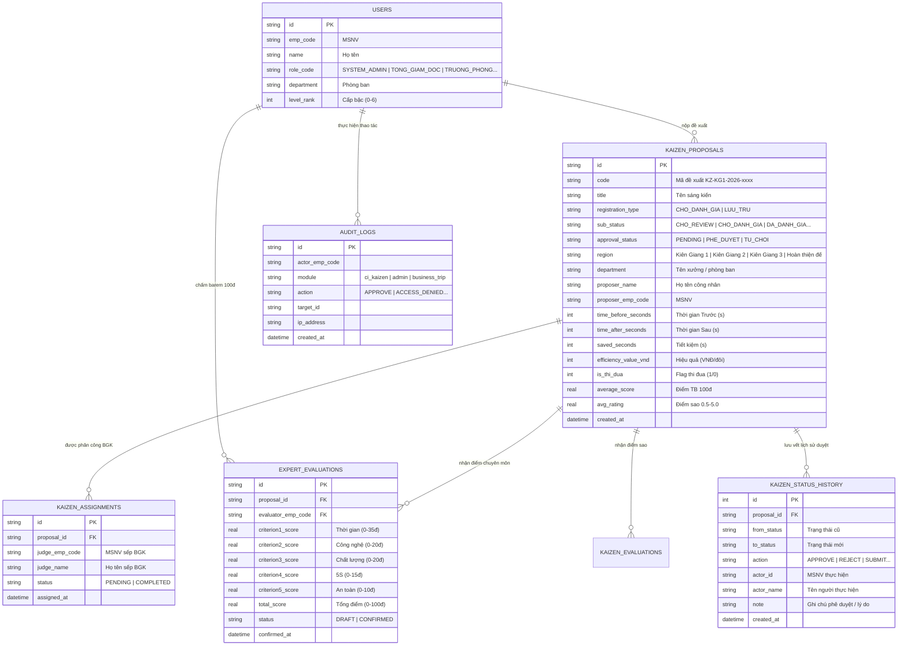
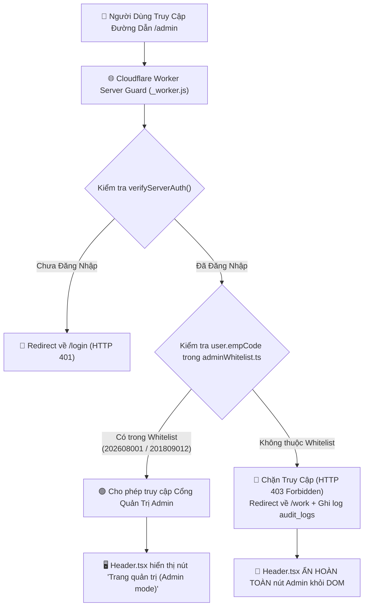

# 🏢 TBS II PLATFORM — HỆ THỐNG SỐ HÓA & QUẢN TRỊ VẬN HÀNH SẢN XUẤT TỔ HỢP KIÊN GIANG

> **Tài liệu Kỹ thuật & Kiến trúc Tổng thể Hệ thống (Master Architecture Documentation)**  
> **Đơn vị phát triển**: Ban Công Nghệ & Kaizen — Tập đoàn TBS Group  
> **Hạ tầng chính**: Cloudflare Workers (Serverless Engine) + Cloudflare D1 (SQLite Database) + Next.js 16 (Static Export)  
> **Phạm vi tác nghiệp**: Tổ hợp Nhà máy Kiên Giang (KG 1, KG 2, Hoàn thiện đế) & VP Chuỗi  

---

## 📋 1. GIỚI THIỆU HỆ THỐNG (SYSTEM OVERVIEW)

### 1.1 Mục Đích & Chức Năng Chính
**TBS II Platform** là hệ thống phần mềm quản trị sản xuất số hóa tập trung được thiết kế dành riêng cho đội ngũ cán bộ quản lý, kỹ sư CI/QC, bảo trì, ban giám khảo và công nhân trực tiếp sản xuất tại các nhà máy thuộc Tập đoàn TBS Group.

Hệ thống cung cấp các bộ công cụ toàn diện:
- **Phân hệ CN-CI (Kaizen 5 Bước & Gemba Walk)**: Quản lý toàn bộ vòng đời sáng kiến cải tiến từ đăng ký ý tưởng, sơ duyệt, phê duyệt triển khai (Bước 3), thực thi (Bước 4), đến đánh giá chuyên môn barem 100đ / chấm sao (Bước 5) và tôn vinh thi đua.
- **Bảng Điều Khiển Vận Hành (Dashboard & Cảnh báo Ban 2.2)**: Thống kê chỉ số Kaizen toàn nhà máy và cảnh báo sớm các vấn đề hiện trường.
- **Phân hệ Quản Lý Bảo Trì MMTB**: Tiếp nhận ticket sự cố máy móc và quản lý danh mục thiết bị sản xuất.
- **Phân hệ Kế Toán - Tài Chính & Hành Chính Nhân Sự**: Theo dõi hồ sơ cán bộ công nhân viên, thu chi, công nợ, ngân sách và lịch công tác.
- **Cổng Quản Trị Hệ Thống (Admin Portal)**: Phân quyền vai trò, quản lý đối tác thương hiệu và kiểm soát an ninh truy cập nghiêm ngặt.

---

## 🗺️ Master Flowchart: End-to-End System Workflow

Mô tả chi tiết toàn bộ quy trình nghiệp vụ, luồng xử lý AI, phân quyền an ninh, phê duyệt hiện trường, quản lý sự cố MMTB và cơ cấu thi đua của hệ thống **TBS II Platform (Tổ hợp Kiên Giang)**.

---

### 📌 Quy Ước Hình Khối & Màu Sắc (Flowchart Legend)

Bảng quy chuẩn ký hiệu trực quan được áp dụng đồng bộ cho tất cả các sơ đồ luồng hệ thống:

| Hình Khối | Cú Pháp Mermaid | Loại Node & Ý Nghĩa Nghiệp Vụ | Quy Định Màu Sắc (`classDef`) |
| :---: | :---: | :--- | :--- |
| 🟢 **Oval bo tròn** | `([Text])` | Điểm Bắt đầu / Kết thúc thành công (Start / End) | Xanh lá đậm (`#1b5e20`) |
| 🔵 **Chữ nhật** | `[Text]` | Thao tác / Xử lý nghiệp vụ chính (Action / Process) | Xanh dương (`#1565c0`) |
| 🟠 **Hình thoi** | `{Text}` | Phân nhánh & Kiểm tra điều kiện (Decision / Branching) | Cam (`#e65100`) |
| 🩵 **Hình bình hành** | `[/Text/]` | Dữ liệu Nhập/Xuất & Giao diện Form (Input / Output) | Xanh ngọc (`#00695c`) |
| 🟣 **Bo góc** | `(Text)` | Tự động hóa & AI Engine (AI / Auto Engine) | Tím (`#4a148c`) |
| 🔴 **Đỏ (Chữ nhật/Oval)** | `[Text]` / `([Text])` | Cảnh báo / Từ chối / Kết thúc lỗi (Alert / Reject / Error End) | Đỏ (`#b71c1c`) |

---

### 📑 Mục Lục Điều Hướng Flowchart (Table of Contents)

1. [Sơ Đồ Tổng Quan Các Phân Hệ (Master System Overview)](#1-sơ-đồ-tổng-quan-các-phân-hệ-master-system-overview)
2. [Luồng A: Đăng Nhập & Phân Quyền RBAC (Auth & Permissions)](#2-luồng-a-đăng-nhập--phân-quyền-rbac-auth--permissions)
3. [Luồng B: Tiếp Nhận Báo Cáo & Chống Trùng Lặp (Issue Reporting & Duplicate Guard)](#3-luồng-b-tiếp-nhận-báo-cáo--chống-trùng-lặp-issue-reporting--duplicate-guard)
4. [Luồng C: Xử Lý AI 5 Whys & Quản Lý SLA (AI Engine & SLA Control)](#4-luồng-c-xử-lý-ai-5-whys--quản-lý-sla-ai-engine--sla-control)
5. [Luồng D: Phê Duyệt, Bảo Trì & Giám Sát Tái Diễn (Approval & Execution)](#5-luồng-d-phê-duyệt-bảo-trì--giám-sát-tái-diễn-approval--execution)
6. [Luồng E: Kết Thúc, Đóng Issue & Lưu Trữ KPI (Archiving & Indexing)](#6-luồng-e-kết-thúc-đóng-issue--lưu-trữ-kpi-archiving--indexing)
7. [Luồng F: Các Phân Hệ Mở Rộng (Dashboard, Cảnh Báo Ban, Thư Viện & Thi Đua)](#7-luồng-f-các-phân-hệ-mở-rộng-dashboard-cảnh-báo-ban-thư-viện--thi-đua)

---

### 1. Sơ Đồ Tổng Quan Các Phân Hệ (Master System Overview)

Sơ đồ tổng thể kết nối toàn bộ các phân hệ từ Đăng nhập, Báo cáo sự cố, Xử lý AI, Phê duyệt, Bảo trì đến Lưu trữ KPI:

```mermaid
flowchart TD
    classDef startEnd fill:#1b5e20,stroke:#2e7d32,color:#ffffff,stroke-width:2px;
    classDef process fill:#1565c0,stroke:#1e88e5,color:#ffffff,stroke-width:2px;
    classDef decision fill:#e65100,stroke:#fb8c00,color:#ffffff,stroke-width:2px;
    classDef inputOutput fill:#00695c,stroke:#00897b,color:#ffffff,stroke-width:2px;
    classDef aiEngine fill:#4a148c,stroke:#7b1fa2,color:#ffffff,stroke-width:2px;
    classDef alertError fill:#b71c1c,stroke:#e53935,color:#ffffff,stroke-width:2px;

    M_START(["🚀 Bắt đầu phiên truy cập hệ thống<br/>User Access Platform"])
    M_AUTH["🔒 [Module Auth] Đăng nhập & Xác thực RBAC Guard<br/>Role-Based Access Control"]
    M_ROLE{"Chọn vai trò tác nghiệp?<br/>Role Selection"}
    
    M_REP[/"📝 [Module Report] Tạo báo cáo Kaizen / Sự cố MMTB<br/>Input Form & Media Upload"/]
    M_DUP{"Kiểm tra trùng lặp báo cáo?<br/>Prevent Duplicate Engine"}
    M_DUP_ERR["⚠️ Cảnh báo trùng lặp - Đề xuất gộp issue<br/>Status: Duplicate Blocked"]
    
    M_AI("🤖 [Module AI Engine] Phỏng vấn 5 Whys & Đếm SLA<br/>Multi-Role Interview & Auto Root Cause")
    M_SLA{"Kiểm tra thời gian SLA (15 phút)?<br/>SLA Timer Check"}
    M_TIMEOUT["🚨 SLA Timeout - Khóa Form & Phát SOS Alert<br/>Status: SLA Expired"]
    
    M_APPROVE["⚖️ [Module Approval] Phê duyệt giải pháp & Phân công<br/>Feasibility Approval & Task Assignment"]
    M_SCOPE{"Kiểm tra phạm vi & ngân sách?<br/>Scope & Budget Check"}
    M_SOS["📢 Escalation: Gửi thông báo khẩn tới Giám đốc nhà máy<br/>Status: SOS Escalated"]
    
    M_MAINT["🔧 [Module Maintenance] Thực thi sửa chữa MMTB hiện trường<br/>Parts Replacement & Photos Proof"]
    M_INSPECT{"Kiểm tra tại chỗ (On-site Inspection)?<br/>Passed / Failed"}
    M_MONITOR["👁️ [Module Monitoring] Giám sát tái diễn (24-48h)<br/>Recurrence Monitoring"]
    M_RECUR{"Phát hiện sự cố tái diễn?<br/>Has Recurrence?"}
    
    M_KPI[/"📊 [Module Archiving & KPI] Lưu trữ Thư viện & Tính KPI<br/>Knowledge Base & Reward Indexing"/]
    M_END(["🏆 Hoàn tất quy trình - Tôn vinh Thi đua<br/>Status: Closed & Awarded"])

    M_START --> M_AUTH --> M_ROLE
    M_ROLE -->|Công nhân / Cán bộ| M_REP
    M_ROLE -->|Ban Giám Đốc / Admin| M_KPI
    
    M_REP --> M_DUP
    M_DUP -- Có trùng lặp --> M_DUP_ERR
    M_DUP -- Hợp lệ --> M_AI
    
    M_AI --> M_SLA
    M_SLA -- Hết giờ (Timeout) --> M_TIMEOUT
    M_SLA -- Đạt SLA (3/3 hoàn thành) --> M_APPROVE
    
    M_APPROVE --> M_SCOPE
    M_SCOPE -- Vượt cấp / Vượt ngân sách --> M_SOS
    M_SCOPE -- Trong thẩm quyền --> M_MAINT
    M_SOS --> M_MAINT
    
    M_MAINT --> M_INSPECT
    M_INSPECT -- Không đạt --> M_MAINT
    M_INSPECT -- Đạt --> M_MONITOR
    
    M_MONITOR --> M_RECUR
    M_RECUR -- Có tái diễn --> M_AI
    M_RECUR -- Không tái diễn --> M_KPI --> M_END

    class M_START,M_END startEnd;
    class M_AUTH,M_APPROVE,M_MAINT,M_MONITOR process;
    class M_ROLE,M_DUP,M_SLA,M_SCOPE,M_INSPECT,M_RECUR decision;
    class M_REP,M_KPI inputOutput;
    class M_AI aiEngine;
    class M_DUP_ERR,M_TIMEOUT,M_SOS alertError;
```



---

### 2. Luồng A: Đăng Nhập & Phân Quyền RBAC (Auth & Permissions)

Quy trình xác thực người dùng, phân loại vai trò và kiểm soát an ninh 2 lớp (Server Guard & Whitelist Guard):



---

### 3. Luồng B: Tiếp Nhận Báo Cáo & Chống Trùng Lặp (Issue Reporting & Duplicate Guard)

Quy trình nhập liệu báo cáo sự cố / sáng kiến, đối soát chống trùng lặp tự động và kích hoạt đếm ngược SLA:



---

### 4. Luồng C: Xử Lý AI 5 Whys & Quản Lý SLA (AI Engine & SLA Control)

Quy trình phỏng vấn độc lập nhiều vai trò bằng AI 5 Whys, kiểm soát thời gian SLA 15 phút và tự động đề xuất giải pháp:



---

### 5. Luồng D: Phê Duyệt, Bảo Trì & Giám Sát Tái Diễn (Approval & Execution)

Quy trình phê duyệt giải pháp (Bước 3), phân công bảo trì, nghiệm thu tại chỗ và giám sát lặp lại sự cố (24-48h):



---

### 6. Luồng E: Kết Thúc, Đóng Issue & Lưu Trữ KPI (Archiving & Indexing)

Quy trình đánh giá chuyên môn (Bước 5), đóng ticket, index dữ liệu tiết kiệm thời gian/VNĐ vào KPI và gắn nhãn thi đua:



---

### 7. Luồng F: Các Phân Hệ Mở Rộng (Dashboard, Cảnh Báo Ban, Thư Viện & Thi Đua)

Cấu trúc các module phụ trợ gồm Dashboard chỉ số hiện trường, Cảnh báo Ban 2.2, Thư viện tra cứu nhanh và Cơ cấu giải thưởng:



---

## 🏗️ 2. KIẾN TRÚC TỔNG THỂ (HIGH-LEVEL ARCHITECTURE)

Sơ đồ Mermaid dưới đây mô tả kiến trúc phân lớp thực tế của hệ thống TBS II Platform:



---

## 📐 3. SƠ ĐỒ THỰC THỂ QUAN HỆ CSDL (D1 DATABASE ERD)

Toàn bộ dữ liệu sản xuất được lưu trữ trong CSDL Cloudflare D1 (`vpchuoiskechers`). Sơ đồ Mermaid ERD mô tả các bảng chính và mối quan hệ:



---

## 🔐 4. PHÂN QUYỀN HỆ THỐNG & ADMIN WHITELIST GUARD

### 4.1 Danh Sách Quyền Hạn (Role-Based Access Control - RBAC)

| Vai Trò (Role Code) | Mô Tả | Quyền Hạn Chi Tiết |
| :--- | :--- | :--- |
| **`SYSTEM_ADMIN`** | Quản trị viên hệ thống | Quản trị toàn quyền, phân công BGK, duyệt nhãn Thi đua, truy cập Admin Portal (`/admin`). |
| **`TONG_GIAM_DOC` / `BGĐ`** | Ban Giám Đốc / TGĐ | Xem toàn bộ báo cáo Dashboard, phân công BGK, phê duyệt cấp cao. |
| **`TRUONG_PHONG` / `P.GĐ`** | Trưởng phòng / Phó GĐ nhà máy | Phê duyệt triển khai Bước 3 (`PHE_DUYET`/`TU_CHOI`), nhập số liệu thời gian Trước/Sau. |
| **`TEAM_CI` / `BGK`** | Hội đồng Ban Giám Khảo Kaizen | Đánh giá hiệu quả Bước 5 (Đạt / Không đạt), chấm điểm barem 100đ / chấm sao, gắn nhãn Thi đua. |
| **`WORKER` / `EMPLOYEE`** | Công nhân / Nhân viên | Nộp đề xuất sáng kiến mới, theo dõi trạng thái đề xuất cá nhân, bình chọn bài viết. |

---

### 4.2 Sơ Đồ Kiểm Soát An Ninh Trang Admin (`/admin`)

Hệ thống bảo mật 2 lớp (Lớp Giao diện & Lớp Server Guard):



> **Whitelist Cố Định Hiện Tại** (`web/src/lib/adminWhitelist.ts`):
> 1. **Phạm Nguyễn Anh Huy** (MSNV: `202608001` — Vai trò: Admin)
> 2. **Kiều Thanh Vũ** (MSNV: `201809012` — Vai trò: Phó Giám Đốc)

---

## 📑 5. BẢN ĐỒ THƯ MỤC VÀ TÀI LIỆU CHI TIẾT (DOCUMENTATION INDEX)

Để tránh quá tải nội dung trong một file duy nhất, bộ tài liệu được chia thành các tài liệu chuyên biệt:

| Tên Tài Liệu | Vị Trí Tệp | Nội Dung Trọng Tâm |
| :--- | :--- | :--- |
| 🔄 **Vòng Đời & State Machine Kaizen** | [`docs/MODULE_KAIZEN_STATE_MACHINE.md`](file:///d:/Work/KG-KAIZEN/docs/MODULE_KAIZEN_STATE_MACHINE.md) | Sơ đồ chuyển đổi trạng thái 5 bước (`stateDiagram-v2`), Sequence Diagram phê duyệt, chấm điểm barem 100đ & SWR hydration F5. |
| ⚙️ **API Reference & Database Schema** | [`docs/SYSTEM_ARCHITECTURE_API_REFERENCE.md`](file:///d:/Work/KG-KAIZEN/docs/SYSTEM_ARCHITECTURE_API_REFERENCE.md) | Bảng tra cứu toàn bộ 17 API endpoints trong `_worker.js`, cấu trúc CSDL D1 và mô tả kiến trúc Cache đa tầng. |
| ⚡ **Sidebar Badge Stats & Cache Architecture** | [`web/src/modules/ci/README.md`](file:///d:/Work/KG-KAIZEN/web/src/modules/ci/README.md) | Chi tiết tối ưu tốc độ badge Sidebar, Server Cache 30s + Invalidate theo sự kiện & Client `localStorage` SWR. |

---

## 🚀 6. HƯỚNG DẪN CÀI ĐẶT & CHẠY DỰ ÁN (GETTING STARTED)

### 6.1 Yêu Cầu Môi Trường
- **Node.js**: Phiên bản `>= 20.0.0` (Khuyên dùng Node.js v22 LTS).
- **Package Manager**: `npm` v10+.
- **Wrangler CLI**: `wrangler` v4 (`npm install -g wrangler`).

### 6.2 Các Bước Thực Hiện
```bash
# 1. Clone kho lưu trữ
git clone https://github.com/tbsgroup2026/thkiengiangshoes.git
cd thkiengiangshoes

# 2. Cài đặt Dependencies cho phân hệ Web
cd web
npm install

# 3. Chạy môi trường Local Development Server
npm run dev
# Mở trình duyệt tại: http://localhost:3000

# 4. Kiểm tra lỗi TypeScript trước khi deploy
npx tsc --noEmit

# 5. Build ứng dụng tĩnh và deploy lên Cloudflare Workers
npm run build
npx wrangler deploy --name thkiengiangshoes
```

---

## 🚀 8. BẢN CẬP NHẬT MỚI NHẤT (RELEASE NOTES - 04/09/2026)

### 8.1 Nâng Cấp Hệ Thống Bộ Lọc Đa Tiêu Chí (Library & Dashboard Multi-Filter)
- **Kết hợp bộ lọc đồng thời (Multi-Filtering)**: Loại bỏ cơ chế xóa bộ lọc khi chọn 1 tiêu chí mới. Cho phép lọc kết hợp 6 tiêu chí cùng lúc: *Tháng/Năm*, *Xưởng Sản Xuất*, *Danh Mục*, *Khu Vực*, *Loại Đăng Ký* và *Tìm Kiếm Từ Khóa*.
- **Tối ưu trải nghiệm bấm (Click Suppression Fix)**: Thay thế các thẻ `<label>` hủy sự kiện bằng `<button type="button">` chuẩn trong `CascadingOrgFilter.tsx`, đảm bảo menu sổ xuống phản hồi tức thì trên mọi thiết bị.
- **Thuật toán Khớp Từ Khóa Mờ (Fuzzy Org Matching)**: Tự động đối soát linh hoạt tên các xưởng/phòng ban (`KG1`, `KG2`, `KG3`, `HTĐ`, `May`, `Gò`, `CN-CI`, `PPC`, `QA/QC`, `HR`) thay vì kiểm tra chuỗi cứng.
- **Thanh hiển thị Filter Active & Reset 1-Click**: Tự động hiển thị danh sách các filter đang chọn và nút Reset xóa nhanh toàn bộ bộ lọc chỉ trong 1 cú click.

### 8.2 Tự Động Tra Cứu & Điền Thông Tin Đăng Ký Bằng MSNV
- Tích hợp API tra cứu dữ liệu nhân sự tự động (`/api/employees/lookup`). Khi điền Mã số nhân viên (MSNV), hệ thống tự động điền các trường: *Họ và tên*, *Xưởng / Phòng ban*, *Khu vực nhà máy* và *Chức danh*.

### 8.3 Chuẩn Hóa Luồng Phê Duyệt & Form Theo Danh Mục Sáng Kiến
- **Giữ nguyên danh mục sau duyệt**: Khắc phục dứt điểm sự cố đề xuất thuộc mục *1. Tiết kiệm vật tư* sau khi duyệt bị đẩy sang mục *3. Tăng năng suất* hoặc bị mất số tiền tiết kiệm.
- **Form duyệt động theo danh mục**: Khi duyệt đề xuất mục *Tiết kiệm vật tư*, hệ thống mở đúng Form tính toán hiệu quả VNĐ thực tế và lưu vết chính xác vào CSDL D1.
- **Chuẩn hóa Ngày phê duyệt (`approved_at`)**: Đồng bộ thời gian phê duyệt chính xác theo ngày duyệt thực tế thay vì lấy ngày nộp ban đầu.

### 8.4 Chuẩn Hóa Badge Trạng Thái Thẻ (Status Badges Sync)
- Loại bỏ hoàn toàn thẻ nhãn màu vàng "Chờ duyệt" thừa trên các bài đã phê duyệt. Các đề xuất đã duyệt chỉ hiển thị duy nhất nhãn xanh lá **✅ Đã duyệt**.

### 8.5 Nâng Cấp Hệ Thống & Persistence Dữ Liệu Kaizen (RELEASE NOTES - 05/09/2026)
- **Persistence Dữ Liệu Phê Duyệt Triển Khai (Bước 3)**: Đã sửa lỗi không lưu xuống database D1. Khi duyệt đề xuất, hệ thống lưu chính xác các trường: `pair_quantity` (Số lượng giày), `efficiency_value_vnd` (Hiệu quả VNĐ), `total_savings_vnd` (Tổng tiền tiết kiệm VNĐ), `cost_before` (Chi phí trước) và `cost_after` (Chi phí sau).
- **Duy Trì Công Thức Tự Động Khi Chỉnh Sửa (Inline Edit)**: Khi mở chế độ "Sửa" trên thẻ Kaizen, hệ thống bảo lưu và tính toán tự động theo thời gian thực:
  - `Hiệu quả` = `Số giây tiết kiệm × 12.5 đ/giây`
  - `Tổng tiết kiệm` = `Hiệu quả × Số lượng giày` (hoặc bằng `Hiệu quả` nếu số lượng giày = 0).
- **Form Chỉnh Sửa Động Theo Phân Loại**: Khi bấm "Sửa" và thay đổi phân loại sáng kiến (Tiết kiệm vật tư, Giảm thời gian, 5S/An toàn), giao diện và công thức tính toán tự động chuyển đổi phù hợp với loại đề xuất tương ứng.
- **Giải Quyết Xác Thực JWT & Phân Quyền Full Admin/PGĐ**: Cập nhật `verifyServerAuth` giải mã JWT token tiêu chuẩn, cấp đầy đủ quyền thao tác và duyệt cho tài khoản PGĐ Kiều Thanh Vũ (`201809012` / `PGĐ-005`).
- **Quản Lý Đính Kèm Đa Phương Tiện (Images & Videos JSON)**: Chuẩn hóa đính kèm video và ảnh trước/sau cải tiến lưu trữ dưới dạng JSON array trong CSDL D1 (`attachments_json`).

---

> **Tài liệu Kỹ thuật Tổng thể Ban Hành Ngày**: `05/09/2026` (Phiên bản v2.6)  
> **Tác giả**: Ban Công Nghệ & Kaizen TBS Group — AI Agent Pair Programming

