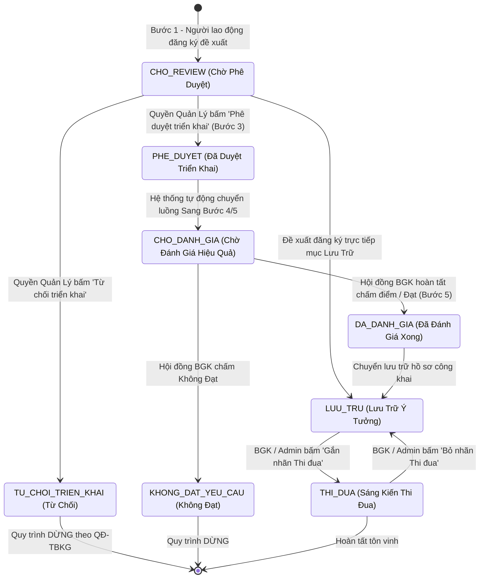
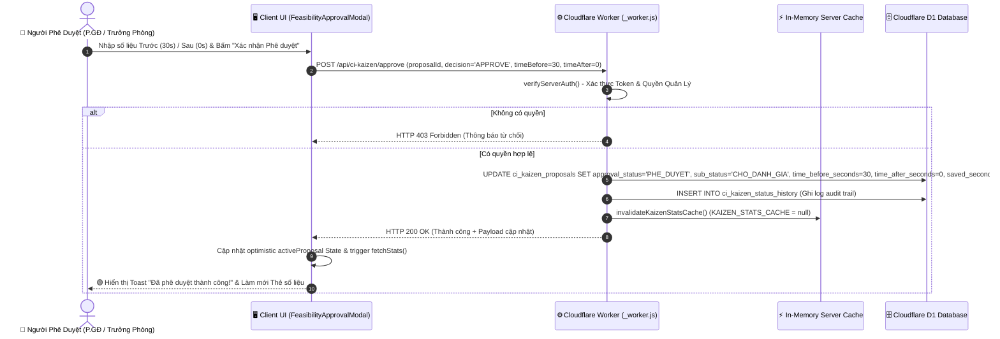
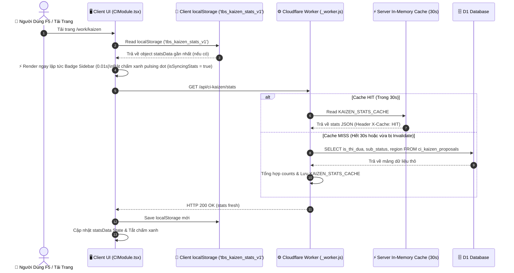
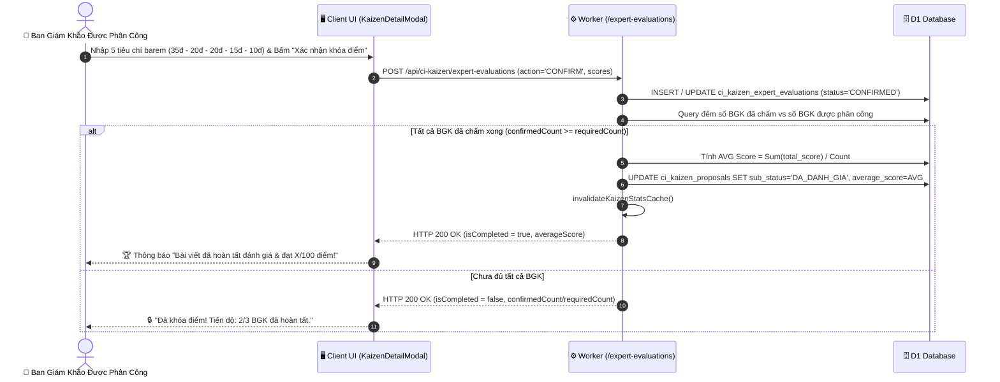

# 🔄 TÀI LIỆU STATE MACHINE & VÒNG ĐỜI ĐỀ XUẤT KAIZEN (QĐ-TBKG/2026)

> **Phân hệ**: CN-CI (Cải Tiến Liên Tục) — Module Kaizen 5 Bước  
> **Dự án**: TBS II Platform (Tổ hợp Kiên Giang — TBS Group)  
> **Áp dụng**: Nhà máy KG 1, KG 2, Hoàn thiện đế, VP Chuỗi  

---

## 📋 1. TỔNG QUAN LUỒNG NGHIỆP VỤ 5 BƯỚC

Theo Quy định **QĐ-TBKG/2026** của Tập đoàn TBS Group, một ý tưởng / đề xuất cải tiến Kaizen trải qua quy trình 5 bước nghiêm ngặt:

```
[Bước 1: Đăng ký ý tưởng] ──> [Bước 2: Sơ duyệt & Phân công] ──> [Bước 3: Phê duyệt triển khai] ──> [Bước 4: Thực thi & Nộp báo cáo] ──> [Bước 5: Đánh giá hiệu quả & Lưu trữ]
```

---

## 📊 2. SƠ ĐỒ TRẠNG THÁI (STATE DIAGRAM-V2)

Sơ đồ Mermaid dưới đây mô tả chính xác chuyển đổi trạng thái của 1 đề xuất trong CSDL D1 (`ci_kaizen_proposals`):



---

## ⏱️ 3. SƠ ĐỒ TRÌNH TỰ (SEQUENCE DIAGRAMS)

### 3.1 Sequence Diagram 1: Luồng Phê Duyệt Triển Khai (Feasibility Approval)

Sơ đồ trình tự tương tác khi Người quản lý bấm nút **"Phê Duyệt Triển Khai"** trên giao diện popup modal:



---

### 3.2 Sequence Diagram 2: Luồng Nạp Dữ Liệu Tức Thời Khi F5 (Stale-While-Revalidate Hydration)



---

### 3.3 Sequence Diagram 3: Luồng Đánh Giá Chuyên Môn Barem 100Đ & Tự Động Tổng Hợp Điểm



---

## 🔐 4. MA TRẬN PHÂN QUYỀN TRẠNG THÁI

| Trạng Thái Đề Xuất | Công Nhân / Người Tạo | Trưởng Phòng / Quản Lý | Team CI / BGK | Admin / BGĐ |
| :--- | :---: | :---: | :---: | :---: |
| **`SUBMITTED`** (Mới nộp) | ✏️ Xem / Chỉnh sửa bài của mình | 🟢 Phê duyệt / Từ chối (Bước 3) | 👁️ Xem danh sách | 🔑 Phân công BGK |
| **`PHE_DUYET`** (Đã duyệt) | 👁️ Xem tiến độ | 👁️ Theo dõi | 🟢 Đánh giá hiệu quả (Bước 5) | 🔑 Quản trị |
| **`CHO_DANH_GIA`** | 👁️ Xem tiến độ | 👁️ Xem tiến độ | 👑 Chấm barem 100đ / Chấm sao | 🔑 Khóa / Miễn nhiệm BGK |
| **`DA_DANH_GIA`** | 🏆 Xem điểm số | 🏆 Xem điểm số | 👁️ Xem kết quả | 🔑 Gắn nhãn Thi đua |
| **`LUU_TRU`** | 📦 Tra cứu thư viện | 📦 Tra cứu | 📦 Gắn / Bỏ nhãn Thi đua | 🔑 Quản trị |

---

## 🏆 5. CƠ CẤU GIẢI THƯỞNG "MỘT SỐ CẢI TIẾN ĐƯỢC KHEN THƯỞNG"

Bảng cơ cấu khen thưởng hàng tháng dành cho các sáng kiến Kaizen đạt thành tích xuất sắc:

| Hạng Giải | Số Lượng Giải | Mức Thưởng (VNĐ / Giải) | Thành Tiền (VNĐ) |
| :--- | :---: | :---: | :---: |
| 🥇 **Giải Nhất** | 01 giải | 1.000.000 VNĐ | 1.000.000 VNĐ |
| 🥈 **Giải Nhì** | 02 giải | 500.000 VNĐ / giải | 1.000.000 VNĐ |
| 🥉 **Giải Ba** | 05 giải | 300.000 VNĐ / giải | 1.500.000 VNĐ |
| 🎖️ **Giải Tư** | 10 giải | 200.000 VNĐ / giải | 2.000.000 VNĐ |
| 🎗️ **Giải Khuyến Khích (Giải 5)** | 20 giải | 100.000 VNĐ / giải | 2.000.000 VNĐ |
| 💰 **TỔNG NGHĨA VỤ KHEN THƯỞNG** | **38 giải** | — | **8.500.000 VNĐ** |

*Công thức tổng ngân sách khen thưởng hàng tháng*:  
$$\text{Tổng tiền} = 1.000.000 + (2 \times 500.000) + (5 \times 300.000) + (10 \times 200.000) + (20 \times 100.000) = 8.500.000 \text{ VNĐ}$$

---

> **Tài liệu ban hành**: Ban Công Nghệ & Kaizen TBS Group — 2026
