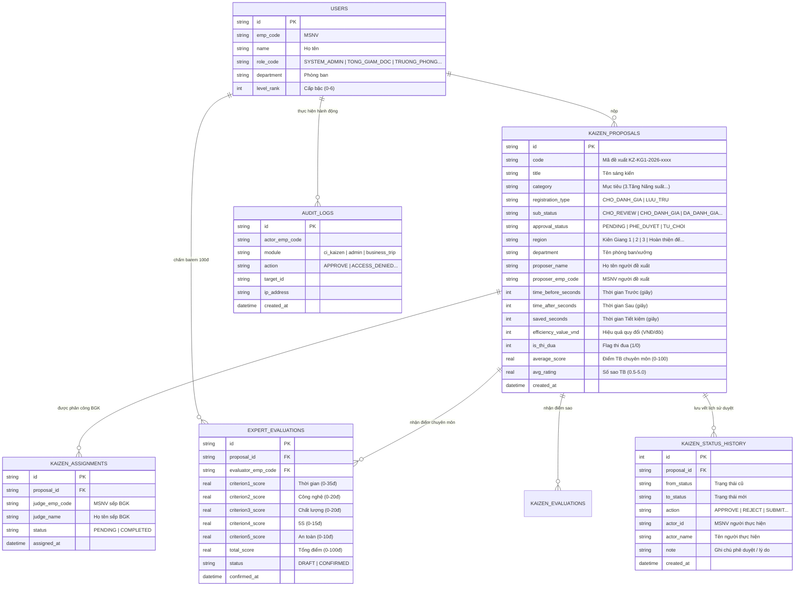

# ⚙️ TÀI LIỆU API REFERENCE & KIẾN TRÚC DỮ LIỆU D1 DATABASE

> **Dự án**: TBS II Platform — Hệ thống Quản trị Số hóa Tổ hợp Kiên Giang  
> **Serverless Engine**: `web/public/_worker.js` (Cloudflare Workers + D1 SQLite)  
> **Phiên bản API**: `v1.4.2026`  

---

## 🗄️ 1. CẤU TRÚC DỮ LIỆU D1 DATABASE & ERD

### 1.1 Sơ Đồ Thực Thể Quan Hệ (Mermaid ERD)



---

## ⚡ 2. CÁC TẦNG CACHE (CACHE LAYERS ARCHITECTURE)

Hệ thống áp dụng kiến trúc Cache đa tầng (Multi-tier Caching) để đạt hiệu năng tối ưu:

| Tầng Cache | Công Nghệ / Vị Trí | Phạm Vi & TTL | Mục Đích Sử Dụng | Cơ Chế Invalidate (Xóa Cache) |
| :--- | :--- | :--- | :--- | :--- |
| **Edge Server Cache** | In-memory Object trong Cloudflare Worker (`_worker.js`) | TTL: 30 giây | Cache kết quả API `/api/ci-kaizen/stats` trả về số đếm badge | Xóa lập tức khi nộp bài, phê duyệt, chấm điểm (`invalidateKaizenStatsCache()`) |
| **Client Storage Cache** | Web Storage `localStorage` (`tbs_kaizen_stats_v1`) | Vĩnh viễn (Persisted) | Giúp Client F5 hiển thị badge tức thì (0.01s) theo pattern SWR | Ghi đè tự động khi API `/stats` mới trả về kết quả |
| **Static Assets CDN** | Cloudflare Global CDN / Assets (`web/out`) | TTL: Edge Cache 1 năm | Cache các file tĩnh HTML, CSS, JS, hình ảnh logo | Tự động làm mới khi chạy `wrangler deploy` |

---

## 📑 3. BẢNG TRA CỨU DANH SÁCH ENDPOINTS API (`_worker.js`)

| STT | Method | Endpoint Path | Chức Năng Chính | Quyền Truy Cập (Auth/Role) | Cache Strategy |
| :---: | :---: | :--- | :--- | :--- | :--- |
| **1** | `GET` | `/api/ci-kaizen/stats` | Thống kê số lượng badge cho Sidebar "LỌC NHANH" | Công Khai / All Authenticated | ⚡ Server In-Memory (30s) + Client SWR |
| **2** | `GET` | `/api/ci-kaizen` | Lấy danh sách đề xuất Kaizen (có Filter & Trang) | Công Khai / All Authenticated | 🚫 Direct D1 Query |
| **3** | `POST` | `/api/ci-kaizen` | Đăng ký đề xuất Kaizen mới | Tất cả người dùng | 💥 Invalidate Stats Cache |
| **4** | `POST` | `/api/ci-kaizen/approve` | Phê duyệt / Từ chối triển khai sáng kiến (Bước 3) | 🔑 Quản Lý (Level Rank >= 2, P.GĐ, TP) | 💥 Invalidate Stats Cache |
| **5** | `POST` | `/api/ci-kaizen/evaluate` | Đánh giá hiệu quả sản xuất (Bước 5: Đạt / Không đạt) | 🔑 Team CI / BGK / BGĐ / Admin | 💥 Invalidate Stats Cache |
| **6** | `GET` | `/api/ci-kaizen/expert-evaluations` | Lấy danh sách bài chấm barem 100đ chuyên môn | Ban Giám Khảo được phân công | 🚫 Direct D1 Query |
| **7** | `POST` | `/api/ci-kaizen/expert-evaluations` | Chấm / Khóa điểm barem 5-tiêu chí (100đ) | 👑 BGK được phân công (assignedJudges) | 💥 Invalidate Stats Cache |
| **8** | `GET` | `/api/ci-kaizen/assignments` | Lấy danh sách BGK được phân công của 1 bài | All Authenticated | 🚫 Direct D1 Query |
| **9** | `POST` | `/api/ci-kaizen/assignments` | TGĐ / Admin phân công sếp BGK chấm bài | 🔑 TGĐ / System Admin | 🚫 Direct D1 Query |
| **10** | `DELETE`| `/api/ci-kaizen/assignments` | Hủy phân công sếp BGK | 🔑 TGĐ / System Admin | 🚫 Direct D1 Query |
| **11** | `POST` | `/api/ci-kaizen/rate` | Đánh giá chấm sao (0.5 – 5.0 ⭐) | 🔑 Sếp có thẩm quyền theo danh sách | 💥 Invalidate Stats Cache |
| **12** | `POST` | `/api/ci-kaizen/mark-thi-dua` | Gắn hoặc tháo nhãn "Thi đua" cho bài viết | 👑 Ban Giám Khảo / System Admin | 💥 Invalidate Stats Cache |
| **13** | `GET` | `/api/ci-kaizen/history` | Xem lịch sử vĩnh viễn chuyển trạng thái bài viết | All Authenticated | 🚫 Direct D1 Query |
| **14** | `POST` | `/api/ci-kaizen/view` | Tăng lượt xem bài viết (`view_count + 1`) | Công Khai | 🚫 Direct D1 Query |
| **15** | `POST` | `/api/auth/login` | Đăng nhập tài khoản MSNV & Cấp JWT Session | Công Khai | 🚫 Direct Response |
| **16** | `GET` | `/api/employees/lookup` | Tra cứu hồ sơ cán bộ công nhân viên | All Authenticated | 🚫 Direct D1 Query |
| **17** | `ALL` | `/admin`, `/admin/*`, `/api/admin/*` | Server Guard kiểm soát trang quản trị Admin | ⛔ Whitelist: Phạm Nguyễn Anh Huy & Kiều Thanh Vũ | 🔒 Strict 403 Audit Guard |

---

## 📝 4. MÔ TẢ CHI TIẾT REQUEST & RESPONSE MẪU

### 4.1 `GET /api/ci-kaizen/stats`
- **Response Headers**: `X-Cache: HIT` hoặc `MISS`
- **Response Body**:
```json
{
  "success": true,
  "stats": {
    "thiDua": 12,
    "choReview": 5,
    "choDanhGia": 8,
    "daDanhGia": 20,
    "luuTru": 15,
    "regions": {
      "Kiên Giang 1": 14,
      "Kiên Giang 2": 10,
      "Kiên Giang 3": 8,
      "Hoàn thiện đế": 6,
      "Phòng kế hoạch": 4,
      "Phòng CN-CI": 3,
      "Phòng chất lượng": 3,
      "Phòng nhân sự": 2
    },
    "totalProposals": 50
  },
  "cachedAt": "2026-08-28T08:15:00.000Z"
}
```

---

### 4.2 `POST /api/ci-kaizen/approve`
- **Request Body**:
```json
{
  "proposalId": "ci_1787812054695",
  "decision": "APPROVE",
  "note": "Đồng ý phê duyệt triển khai thử nghiệm tại Chuyền 1",
  "timeBeforeSeconds": 30,
  "timeAfterSeconds": 0,
  "savedSeconds": 30
}
```
- **Response Body**:
```json
{
  "success": true,
  "message": "🎉 Đã Phê duyệt triển khai sáng kiến thành công! Sáng kiến chuyển sang Bước 4 (Chờ đánh giá hiệu quả).",
  "proposalId": "ci_1787812054695",
  "approval_status": "PHE_DUYET",
  "sub_status": "CHO_DANH_GIA",
  "status": "APPROVED",
  "time_before_seconds": 30,
  "time_after_seconds": 0,
  "saved_seconds": 30
}
```

---

> **Tài liệu Kỹ thuật**: TBS II Platform Serverless API Documentation (2026)
