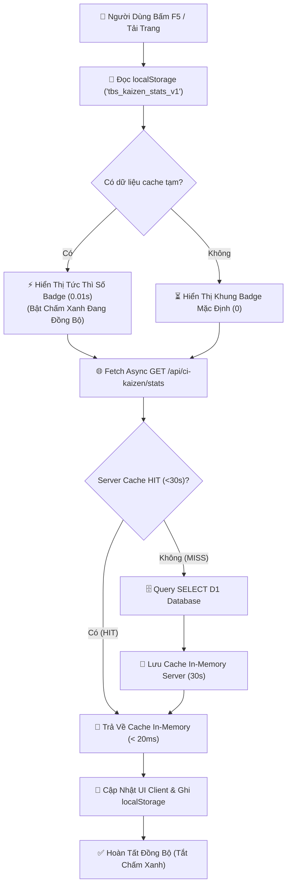
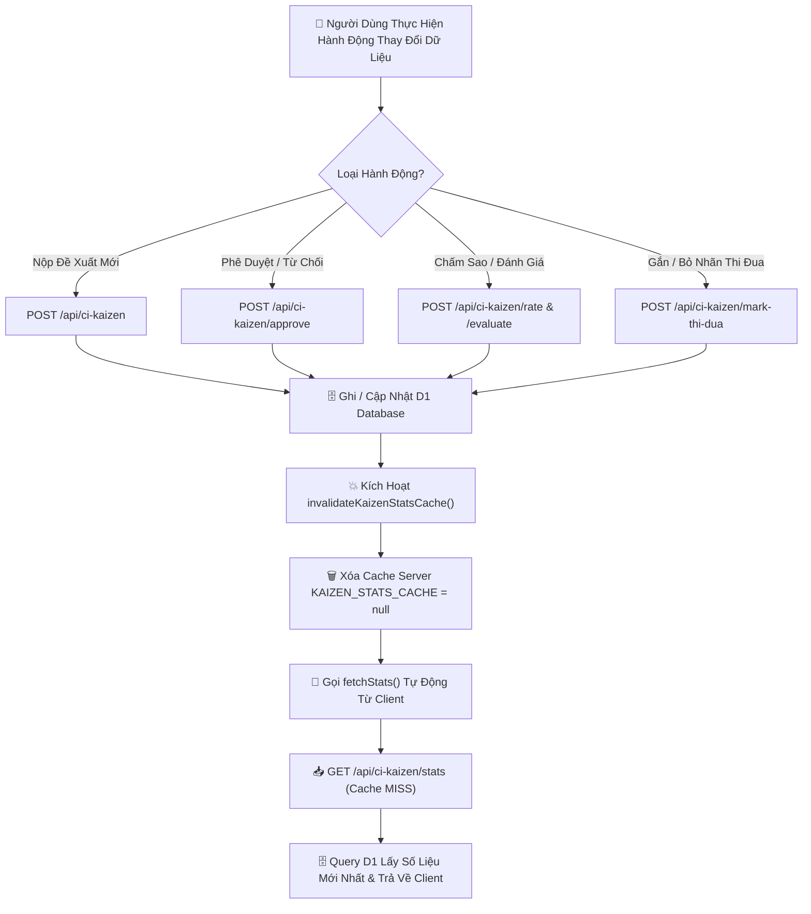
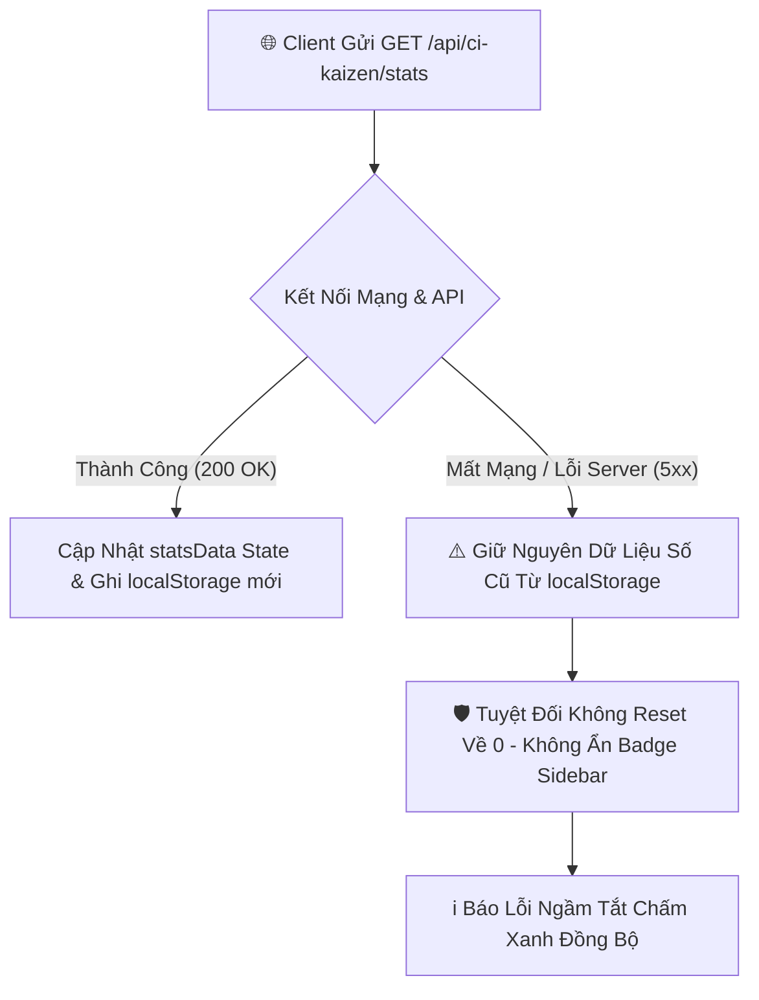

# ⚡ HỆ THỐNG THỐNG KÊ BADGE SIDEBAR & BỘ ĐỆM CACHE DỮ LIỆU KAIZEN

> **Tài liệu Kỹ thuật & Hướng dẫn Bảo trì Module Sidebar Badge Counters**  
> **Dự án**: Cổng Quản Lý Sáng Kiến Cải Tiến Kaizen — TBS Group  
> **Vị trí Module**: `web/src/modules/ci/`  
> **Backend Edge**: `web/public/_worker.js` (Cloudflare Workers)

---

## 📋 1. TỔNG QUAN (OVERVIEW)

### 1.1 Mục Đích Module
Module thống kê badge số lượng chịu trách nhiệm hiển thị các con số đếm trực quan trên danh mục menu **"LỌC NHANH"** nằm ở Sidebar bên trái giao diện Kaizen (`/work/kaizen`). Các con số badge này bao gồm:
- **Loại đăng ký & Trạng thái quy trình**: 🏆 *Thi đua*, 👤 *Chờ phê duyệt*, ⏱️ *Chờ đánh giá*, ✉️ *Đã đánh giá*, 📦 *Lưu trữ*.
- **Phân vùng Khu vực & Phòng ban**: *Kiên Giang 1/2/3*, *Hoàn thiện đế*, *Phòng kế hoạch*, *Phòng CN-CI*, *Phòng chất lượng*, *Phòng nhân sự*, *VP Chuỗi (R&D)*...

### 1.2 Vấn Đề Trước Đây & Giải Pháp Khắc Phục

| Vấn đề trước đây | Nguyên nhân gốc rễ | Giải pháp tối ưu đã triển khai |
| :--- | :--- | :--- |
| 🔴 **Badge số lượng nhấp nháy, biến mất hoặc tụt về 0** | Phía Frontend đếm nhẩm số liệu trực tiếp bằng `proposals.filter(...)` trên mảng `proposals`. Khi chọn bộ lọc (VD: *Kiên Giang 1*), API chỉ trả về 3 bài matching $\rightarrow$ Mảng `proposals` bị thu hẹp $\rightarrow$ Các badge thuộc bộ lọc khác tụt ngay về 0 hoặc biến mất. | **Tách độc lập state dữ liệu thống kê**: Tạo endpoint `GET /api/ci-kaizen/stats` trả về tổng quan tất cả badge. Frontend quản lý bộ đếm bằng state `statsData` riêng biệt, không bị ảnh hưởng khi mảng danh sách bài viết bị filter. |
| 🔴 **F5 (Refresh) bị chậm (2-3s)** | Mỗi lần F5, Client phải chờ xóa trắng loader, Server D1 phải chạy query SQL đếm lại từ đầu toàn bộ database. | **Tốc độ F5 tức thì (0.01s)**: Áp dụng chiến lược **Stale-While-Revalidate (SWR)** kết hợp **localStorage** ở Client + **In-Memory Server Cache (30s TTL)** trên Cloudflare Workers Edge. |

---

## 🏗️ 2. KIẾN TRÚC TỔNG THỂ (ARCHITECTURE)

### 2.1 Các File Chính
- 📄 **[`web/src/modules/ci/CIModule.tsx`](file:///d:/Work/KG-KAIZEN/web/src/modules/ci/CIModule.tsx)**:
  - Khởi tạo state `statsData` từ `localStorage` (key: `tbs_kaizen_stats_v1`).
  - Render tức thì badge ở Sidebar mà không phải chờ API.
  - Quản lý cờ `isSyncingStats` hiển thị chấm xanh nhấp nháy (*Pulsing dot*) báo hiệu quá trình đồng bộ ngầm.
  - Gọi `fetchStats()` để đồng bộ sau khi người dùng nộp bài / phê duyệt / chấm điểm.
- ⚙️ **[`web/public/_worker.js`](file:///d:/Work/KG-KAIZEN/web/public/_worker.js)**:
  - Cung cấp endpoint `GET /api/ci-kaizen/stats`.
  - Quản lý Server Cache với hằng số `KAIZEN_STATS_CACHE_TTL_MS = 30000` (30 giây).
  - Định nghĩa hàm `invalidateKaizenStatsCache()` để xóa bỏ cache ngay lập tức khi xảy ra sự kiện thay đổi dữ liệu.

---

### 2.2 Sơ Đồ Luồng Dữ Liệu (Mermaid Flowcharts)

#### 🔄 Flowchart A — Luồng Tải Dữ Liệu Khi F5 / Mở Trang (Mount Phase)



---

#### 💥 Flowchart B — Luồng Invalidate Cache Khi Có Hành Động Thay Đổi Dữ Liệu



---

#### 🛡️ Flowchart C — Luồng Xử Lý Lỗi Kết Nối Mạng / Offline (Resilience Flow)



---

## 🔌 3. CHI TIẾT API (API REFERENCE)

### Endpoint Thống Kê Tổng Quan Badge
- **URL Path**: `/api/ci-kaizen/stats`
- **HTTP Method**: `GET`
- **Authentication**: Public / Internal Authenticated Session
- **Server Cache TTL**: 30 giây (`Cache-Control: public, max-age=30`)
- **Headers Trả Về**:
  - `X-Cache`: `HIT` (nếu từ in-memory cache) hoặc `MISS` (nếu query mới từ D1).

#### Sample Response (JSON):
```json
{
  "success": true,
  "stats": {
    "thiDua": 12,
    "choReview": 5,
    "choDanhGia": 8,
    "daDanhGia": 20,
    "luuTru": 15,
    "regions": {
      "Kiên Giang 1": 14,
      "Kiên Giang 2": 10,
      "Kiên Giang 3": 8,
      "Hoàn thiện đế": 6,
      "Phòng kế hoạch": 4,
      "Phòng CN-CI": 3,
      "Phòng chất lượng": 3,
      "Phòng nhân sự": 2,
      "THKG": 42,
      "Nhà Máy Miền Đông": 5,
      "VP Chuỗi (R&D)": 3
    },
    "totalProposals": 50
  },
  "cachedAt": "2026-08-28T08:10:00.000Z"
}
```

#### Các Điều Kiện Kích Hoạt Invalidate Cache Ngay Lập Tức:
1. `POST /api/ci-kaizen`: Tạo mới đề xuất Kaizen.
2. `POST /api/ci-kaizen/approve`: Trưởng phòng / Phó GĐ phê duyệt hoặc từ chối đề xuất.
3. `POST /api/ci-kaizen/rate` / `/evaluate`: Đánh giá 5-tiêu chí hoặc chấm sao.
4. `POST /api/ci-kaizen/mark-thi-dua`: Gắn hoặc tháo nhãn Thi đua bài viết.

---

## 📊 4. CẤU TRÚC DỮ LIỆU (DATA SCHEMA)

### Liên Hệ Với Bảng D1 Database `ci_kaizen_proposals`
Tất cả các số liệu badge được tổng hợp trực tiếp từ bảng `ci_kaizen_proposals` dựa trên các cột sau:

| Badge Field | Cột D1 Tương Ứng (`ci_kaizen_proposals`) | Điều Kiện Logic |
| :--- | :--- | :--- |
| `thiDua` | `is_thi_dua` | `is_thi_dua = 1` |
| `choReview` | `status`, `sub_status`, `approval_status` | `status IN ('SUBMITTED', 'UNDER_REVIEW') OR sub_status = 'CHO_REVIEW' OR approval_status = 'PENDING'` |
| `choDanhGia` | `sub_status` | `sub_status = 'CHO_DANH_GIA'` |
| `daDanhGia` | `sub_status` | `sub_status = 'DA_DANH_GIA'` |
| `luuTru` | `registration_type` | `registration_type = 'LUU_TRU'` |
| `regions[name]` | `region` | Khớp chuỗi không phân biệt hoa thường (VD: `KIÊN GIANG 1`, `HOÀN THIỆN ĐẾ`...) |

---

## 🧪 5. QUY TRÌNH KIỂM THỬ (TESTING & BENCHMARK)

### Các Bước Kiểm Thử Thực Tế:
1. **Kiểm tra Tốc độ Tải F5**:
   - Mở giao diện Kaizen `/work/kaizen`, nhấn `F5`.
   - **Kỳ vọng**: Các badge hiển thị **ngay lập tức trong 0.01s** từ `localStorage`. Chấm xanh nhỏ xuất hiện cạnh "LỌC NHANH" và tắt sau khi API trả về.
2. **Kiểm tra Không Nhấp Nháy Khi Chọn Bộ Lọc**:
   - Click chọn các mục: *Kiên Giang 1*, *Hoàn thiện đế*, *Lưu trữ*, *Thi đua*...
   - **Kỳ vọng**: Danh sách bài viết ở giữa thay đổi, nhưng **tất cả số badge ở sidebar giữ nguyên chuẩn xác 100%**, tuyệt đối không nhảy về 0.
3. **Kiểm tra Invalidate Cache Nộp Bài / Duyệt Bài**:
   - Nhấn phê duyệt hoặc đăng 1 đề xuất mới.
   - **Kỳ vọng**: Cache server tự động xóa, badge số bài *Chờ phê duyệt* hoặc bài mới được cập nhật ngay lập tức.

### Kết Quả Benchmark Phản Hồi API:

```
[Trước Tối Ưu]
Query trực tiếp D1 khi F5 / Filter ──> ⏱️ 2.200ms – 3.500ms (Số nhấp nháy)

[Sau Tối Ưu]
1. Đọc từ Client localStorage ───────> ⚡ 0.01ms (Hiển thị tức thì)
2. Response từ Server Cache (HIT) ──> 🚀 15ms – 35ms (Cực nhanh)
```

---

## ⚠️ 6. GIỚI HẠN & HƯỚNG PHÁT TRUYỂN (LIMITATIONS & FUTURE IMPROVEMENTS)

### 6.1 Giới Hạn Hiện Tại
- **Đồng bộ đa tab (Multiple Tabs)**: Nếu mở 2 tab trình duyệt cùng lúc, hành động ở Tab 1 sẽ cập nhật ngay badge Tab 1; Tab 2 sẽ thấy badge mới sau lượt tương tác hoặc F5 tiếp theo (do cache 30s).

### 6.2 Hướng Phát Triển Tiếp Theo (Future Enhancements)
- **WebSockets / Server-Sent Events (SSE)**: Đẩy thông báo thay đổi số liệu theo thời gian thực (Realtime Multi-user Push Update) để nhiều quản lý cùng mở trang đều thấy badge cập nhật đồng thời trong 0.1 giây.
- **Cloudflare Durable Objects / KV**: Mở rộng cache lên lớp KV nếu quy mô số lượng yêu cầu đếm vượt quá 100.000 request/phút.

---

> **Tài liệu được cập nhật ngày**: `28/08/2026`  
> **Đơn vị phát triển**: Ban Công Nghệ & Kaizen TBS Group
