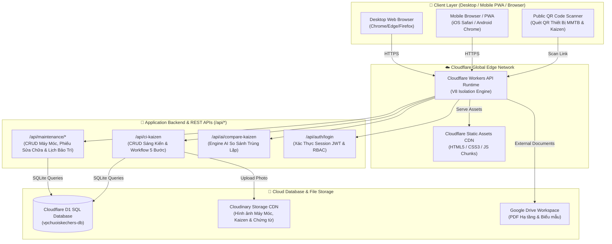
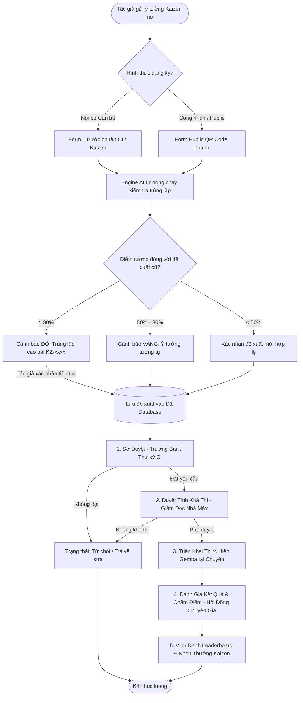
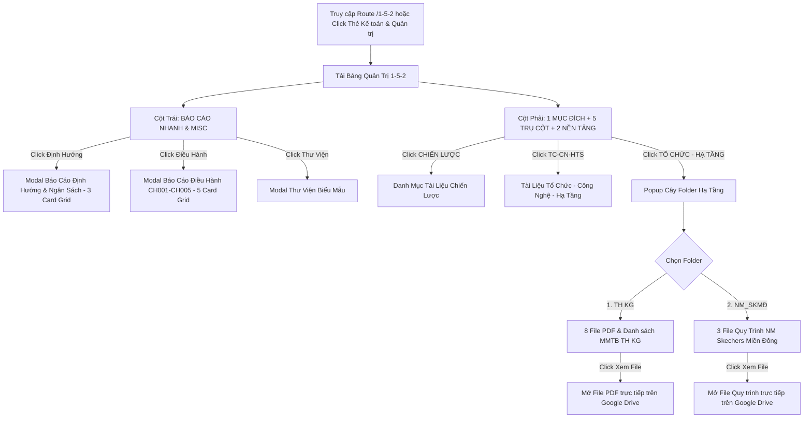
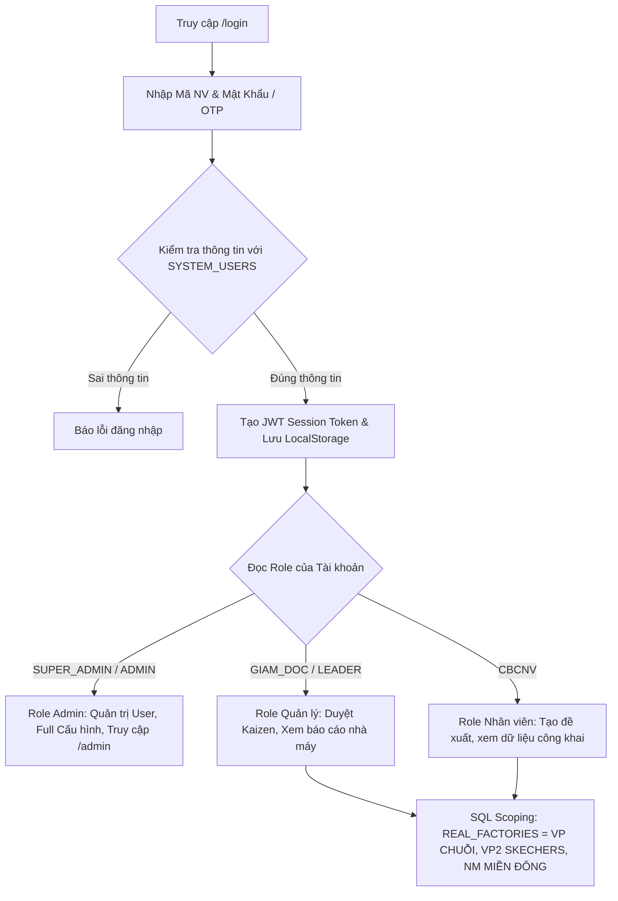
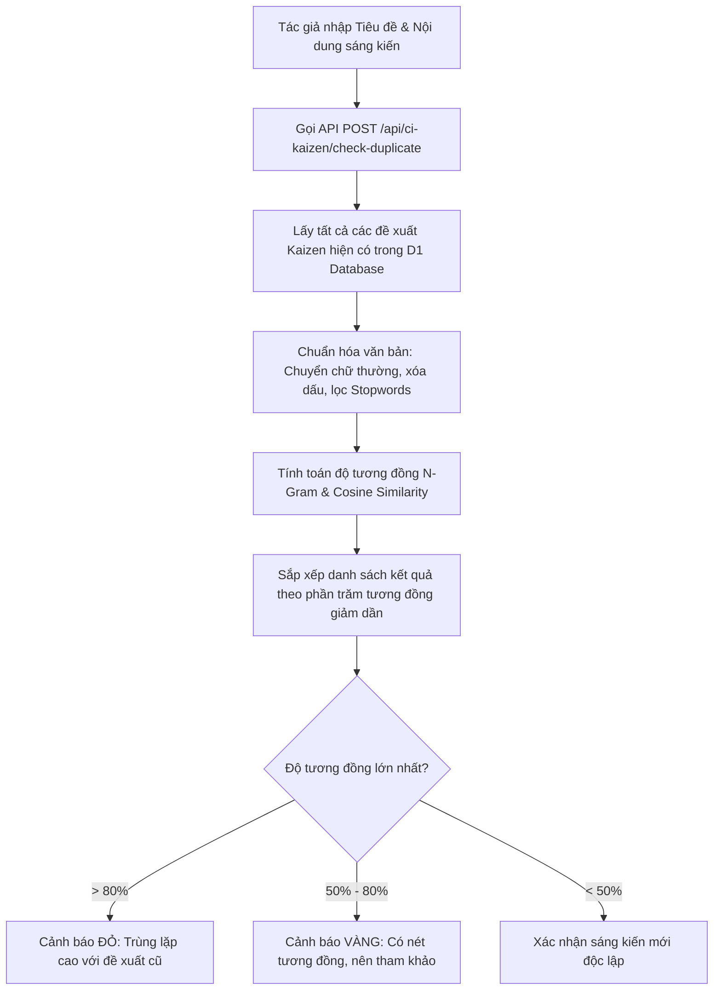
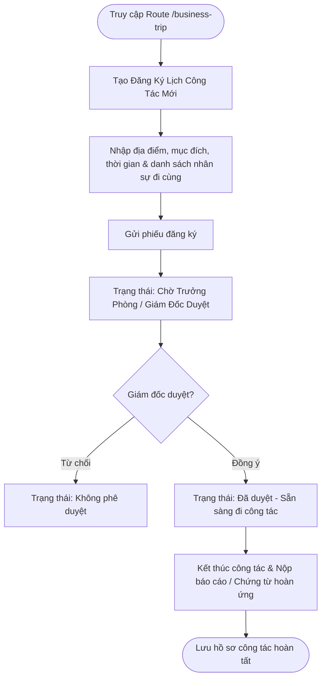
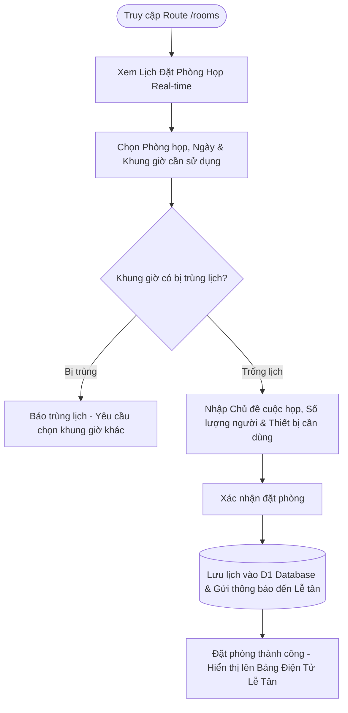
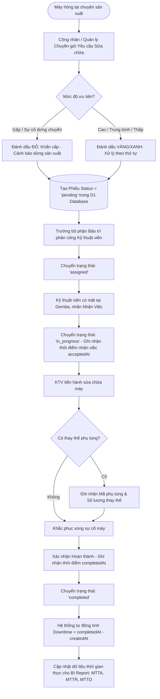

# 🏬 HỆ THỐNG QUẢN TRỊ VẬN HÀNH CHUỖI CUNG ỨNG & SẢN XUẤT SKECHERS — TBS GROUP

> **Văn Phòng Chuỗi SKECHERS - TBS Group (Zone II)**  
> 🏆 Cổng Điều Hành Vận Hành Tập Trung, Số Hóa Quy Trình Gemba Walk, Cải Tiến Liên Tục (CI/Kaizen 4.0), Quản Lý Máy Móc Thiết Bị (MMTB), Quản Trị Chiến Lược 1-5-2, HR & Kế Toán Quản Trị  
> 🌐 **Production Domain**: [https://vpchuoiskechers.tbsgroup2026.workers.dev](https://vpchuoiskechers.tbsgroup2026.workers.dev)  
> 📦 **GitHub Repository**: [https://github.com/tbsgroup2026/vpchuoiskechers](https://github.com/tbsgroup2026/vpchuoiskechers)

---

## 📋 MỤC LỤC TỔNG QUAN
1. [Giới Thiệu Hệ Thống & Sứ Mệnh](#-1-giới-thiệu-hệ-thống--sứ-mệnh)
2. [Khung Quản Trị Chiến Lược 1-5-2 Chi Tiết](#-2-khung-quản-trị-chiến-lược-1-5-2-chi-tiết)
3. [Sơ Đồ Kiến Trúc Tổng Thể Hệ Thống (System Architecture)](#-3-sơ-đồ-kiến-trúc-tổng-thể-hệ-thống-system-architecture)
4. [Tổng Hợp Sơ Đồ Luồng Hoạt Động (Comprehensive Flowcharts)](#-4-tổng-hợp-sơ-đồ-luồng-hoạt-động-comprehensive-flowcharts)
   - [4.1. Luồng 5 Bước Đề Xuất & Phê Duyệt Sáng Kiến Kaizen (CI/Kaizen Engine)](#41-luồng-5-bước-đề-xuất--phê-duyệt-sáng-kiến-kaizen-cikaizen-engine)
   - [4.2. Luồng Bảng Điều Hành Quản Trị Chiến Lược 1-5-2 & Báo Cáo Nhanh](#42-luồng-bảng-điều-hành-quản-trị-chiến-lược-1-5-2--báo-cáo-nhanh)
   - [4.3. Luồng Xác Thực JWT, Phân Quyền RBAC & Scoping Dữ Liệu Nhà Máy](#43-luồng-xác-thực-jwt-phân-quyền-rbac--scoping-dữ-liệu-nhà-máy)
   - [4.4. Luồng Thuật Toán AI Kiểm Tra & So Sánh Trùng Lặp Sáng Kiến](#44-luồng-thuật-toán-ai-kiểm-tra--so-sánh-trùng-lặp-sáng-kiến)
   - [4.5. Luồng Nghiệp Vụ Đăng Ký & Phê Duyệt Công Tác (Business Trip)](#45-luồng-nghiệp-vụ-đăng-ký--phê-duyệt-công-tác-business-trip)
   - [4.6. Luồng Quản Lý & Đặt Phòng Họp Thông Minh (Room Booking)](#46-luồng-quản-lý--đặt-phòng-họp-thông-minh-room-booking)
   - [4.7. Luồng Chi Tiết Phân Hệ Quản Lý Máy Móc Thiết Bị (MMTB Operations Flowcharts)](#47-luồng-chi-tiết-phân-hệ-quản-lý-máy-móc-thiết-bị-mmtb-operations-flowcharts)
     - [4.7.1. Sơ đồ Luồng Đăng Ký, Quản Lý & Tra Cứu QR Code Thiết Bị MMTB](#471-sơ-đồ-luồng-đăng-ký-quản-lý--tra-cứu-qr-code-thiết-bị-mmtb)
     - [4.7.2. Sơ đồ Luồng Xử Lý Nhu Cầu & Phiếu Sửa Chữa Khẩn Cấp MMTB](#472-sơ-đồ-luồng-xử-lý-nhu-cầu--phiếu-sửa-chữa-khẩn-cấp-mmtb)
     - [4.7.3. Sơ đồ Luồng Lập Kế Hoạch & Bảo Dưỡng Định Kỳ MMTB](#473-sơ-đồ-luồng-lập-kế-hoạch--bảo-dưỡng-định-kỳ-mmtb)
     - [4.7.4. Sơ đồ Luồng Phân Tích Chỉ Số BI & Trực Quan Sơ Đồ Nhà Máy](#474-sơ-đồ-luồng-phân-tích-chỉ-số-bi--trực-quan-sơ-đồ-nhà-máy)
5. [Cơ Sở Dữ Liệu Cloudflare D1 & Schema SQL](#-5-cơ-sở-dữ-liệu-cloudflare-d1--schema-sql)
6. [Danh Mục RESTful API Endpoints Chi Tiết](#-6-danh-mục-restful-api-endpoints-chi-tiết)
7. [Các Phân Hệ Chức Năng Chi Tiết](#-7-các-phân-hệ-chức-năng-chi-tiết)
8. [Công Nghệ & Kiến Trúc Kỹ Thuật (Tech Stack)](#-8-công-nghệ--kiến-trúc-kỹ-thuật-tech-stack)
9. [Cấu Trúc Thư Mục Dự Án Chi Tiết (Project Structure)](#-9-cấu-trúc-thư-mục-dự-án-chi-tiết-project-structure)
10. [Hướng Dẫn Cài Đặt, Phát Triển & Triển Khai (Setup & Deployment Guide)](#-10-hướng-dẫn-cài-đặt-phát-triển--triển-khai-setup--deployment-guide)

---

## 📌 1. GIỚI THIỆU HỆ THỐNG & SỨ MỆNH

**Hệ Thống Quản Trị Vận Hành Chuỗi Cung Ứng & Sản Xuất SKECHERS - TBS Group** được xây dựng nhằm phục vụ công tác chuyển đổi số toàn diện cho **Văn Phòng Chuỗi SKECHERS (Khu vực Zone II)** thuộc Tập đoàn Da Giày TBS (TBS Group).

### ✨ Các Mục Tiêu Cốt Lõi:
- **Số hóa Gemba Walk & Cải tiến CI/Kaizen 4.0**: Chuyển đổi toàn bộ quy trình đề xuất cải tiến từ thủ công/giấy sang hệ thống số hóa tự động với sự hỗ trợ của thuật toán AI so sánh trùng lặp.
- **Quản lý Máy Móc Thiết Bị (MMTB / Maintenance)**: Phân hệ native số hóa 100% hồ sơ kỹ thuật máy móc, quản lý phiếu sửa chữa khẩn cấp, lập lịch bảo trì định kỳ, xuất nhập Excel hàng loạt và quét mã QR payload trên di động.
- **Trực quan hóa Khung Quản trị 1-5-2**: Giúp Ban Giám Đốc và các Trưởng bộ phận theo dõi chỉ số mục đích xuyên suốt, 5 trụ cột vận hành và 2 nền tảng quản trị real-time.
- **Tối ưu hóa quản lý nguồn lực**: Tích hợp các phân hệ Đặt phòng họp, Đăng ký công tác, Quản trị nhân sự và Kế toán quản trị trong một không gian làm việc tập trung (App Hub).
- **Hạ tầng Edge Computing**: Triển khai trên mạng lưới toàn cầu của **Cloudflare Workers** giúp tốc độ phản hồi cực nhanh (< 20ms) và tính sẵn sàng cao 99.99%.

---

## 🎯 2. KHUNG QUẢN TRỊ CHIẾN LƯỢC 1-5-2 CHI TIẾT

Hệ thống điều hành theo khung quản trị chiến lược **1-5-2**:

```
                                ┌───────────────────────────────────────────────────────────┐
                                │                   1. MỤC ĐÍCH XUYÊN SUỐT                 │
                                │   Xây dựng TBS Group là một ĐỐI TÁC KHÔNG THỂ THAY THẾ   │
                                │   trong chuỗi giá trị toàn cầu, tự vận hành & bền vững   │
                                └─────────────────────────────┬─────────────────────────────┘
                                                              │
               ┌──────────────────┬──────────────────┬───────┴──────────┬──────────────────┐
               │                  │                  │                  │                  │
        ┌──────┴──────┐    ┌──────┴──────┐    ┌──────┴──────┐    ┌──────┴──────┐    ┌──────┴──────┐
        │1.CHIẾN LƯỢC │    │2. TC-CN-HTS │    │  3. KH & CC │    │ 4. TH & NM  │    │  5. VHDN    │
        └─────────────┘    └─────────────┘    └─────────────┘    └─────────────┘    └─────────────┘
               │                  │                  │                  │                  │
               └──────────────────┴──────────────────┼──────────────────┴──────────────────┘
                                                              │
                                ┌─────────────────────────────┴─────────────────────────────┐
                                │                   2. NỀN TẢNG QUẢN TRỊ                    │
                                ├─────────────────────────────┬─────────────────────────────┤
                                │    1. TỔ CHỨC - HẠ TẦNG     │   2. DỮ LIỆU SỐ (BI 24/7)   │
                                │   (1. TH KG & 2. NM_SKMĐ)   │  (Báo cáo điều hành số hóa) │
                                └─────────────────────────────┴─────────────────────────────┘
```

---

## 🏗️ 3. SƠ ĐỒ KIẾN TRÚC TỔNG THỂ HỆ THỐNG (SYSTEM ARCHITECTURE)



---

## 🔄 4. TỔNG HỢP SƠ ĐỒ LUỒNG HOẠT ĐỘNG (COMPREHENSIVE FLOWCHARTS)

### 4.1. Luồng 5 Bước Đề Xuất & Phê Duyệt Sáng Kiến Kaizen (CI/Kaizen Engine)


---

### 4.2. Luồng Bảng Điều Hành Quản Trị Chiến Lược 1-5-2 & Báo Cáo Nhanh


---

### 4.3. Luồng Xác Thực JWT, Phân Quyền RBAC & Scoping Dữ Liệu Nhà Máy


---

### 4.4. Luồng Thuật Toán AI Kiểm Tra & So Sánh Trùng Lặp Sáng Kiến


---

### 4.5. Luồng Nghiệp Vụ Đăng Ký & Phê Duyệt Công Tác (Business Trip)


---

### 4.6. Luồng Quản Lý & Đặt Phòng Họp Thông Minh (Room Booking)


---

### 4.7. Luồng Chi Tiết Phân Hệ Quản Lý Máy Móc Thiết Bị (MMTB Operations Flowcharts)

#### 4.7.1. Sơ đồ Luồng Đăng Ký, Quản Lý & Tra Cứu QR Code Thiết Bị MMTB
```mermaid
flowchart TD
    StartReg([Bắt đầu: Quản lý thiết bị MMTB]) --> MethodSelect{Phương thức nhập dữ liệu?}

    MethodSelect -->|Thêm thủ công| FormSingle[Nhập Form: Mã TS, Tên máy, Vị trí, Chuyền/Tổ, Loại máy]
    MethodSelect -->|Excel Hàng Loạt| UploadExcel[Tải file .xlsx theo Template chuẩn 10 cột]

    UploadExcel --> ProcessExcel[Hệ thống tự động tra cứu ID Nhà máy / Khu vực / Chuyền / Loại máy theo tên]
    ProcessExcel --> ValidateRow{Kiểm tra dữ liệu dòng?}
    ValidateRow -->|Hợp lệ| BulkSave[(Lưu vào D1 Database: maintenance_machines)]
    ValidateRow -->|Lỗi dòng| LogError[Báo lỗi dòng riêng - Tiếp tục các dòng khác]

    FormSingle --> SaveSingle[(Lưu thiết bị vào D1 Database)]

    BulkSave --> GenQR[Tạo Mã QR payload JSON thật: type='machine', code='MMTB-xxxx']
    SaveSingle --> GenQR

    GenQR --> PrintLabel[In Tem Mã QR dán lên thân máy thật]

    PrintLabel --> MobileAction[Kỹ thuật viên / Quản lý xưởng dùng Di Động quét mã]
    MobileAction --> ScanPayload[App/Web đọc payload {type:'machine', code}]
    ScanPayload --> OpenDrawer[Trực tiếp mở Slide-Over Technical Profile Drawer trên Web/App]
```

---

#### 4.7.2. Sơ đồ Luồng Xử Lý Nhu Cầu & Phiếu Sửa Chữa Khẩn Cấp MMTB


---

#### 4.7.3. Sơ đồ Luồng Lập Kế Hoạch & Bảo Dưỡng Định Kỳ MMTB
```mermaid
flowchart TD
    ScheduleStart([Hệ thống khởi chạy Quét Lịch Bảo Dưỡng]) --> FetchPeriod[Đọc chu kỳ bảo dưỡng: Tuần / 1 Tháng / 3 Tháng / 6 Tháng / 1 Năm]
    FetchPeriod --> CheckDueDate{So sánh Ngày hiện tại & Ngày đến hạn next_due_date?}

    CheckDueDate -->|Quá hạn | StatusOverdue[Đánh dấu 'overdue' - Hiển thị cảnh báo đỏ trên Dashboard]
    CheckDueDate -->|Sắp đến hạn (trong 7 ngày)| StatusUpcoming[Đánh dấu 'upcoming' - Đưa vào danh sách chờ bảo trì]
    CheckDueDate -->|Đã lên lịch| StatusScheduled[Đánh dấu 'scheduled']

    StatusOverdue --> PMWorkQueue[Đưa vào Hàng Chờ Công Việc Bảo Dưỡng]
    StatusUpcoming --> PMWorkQueue
    StatusScheduled --> PMWorkQueue

    PMWorkQueue --> AssignPM[Phân công Kỹ thuật viên phụ trách]
    AssignPM --> PerformPM[KTV thực hiện kiểm tra định kỳ Gemba tại chuyền]

    PerformPM --> Checklist{Đạt các hạng mục Kiểm tra / Tra dầu / Vệ sinh?}
    Checklist -->|Chưa đạt / Phát hiện hư hỏng| GenRepairTicket[Tự động tạo Phiếu Sửa Chữa MMTB khẩn cấp]
    Checklist -->|Đạt tiêu chuẩn| ApprovePM[Xác nhận nghiệm thu bảo trì]

    GenRepairTicket --> UpdateSchedule[Cập nhật Ngày bảo trì gần nhất last_maintenance_date]
    ApprovePM --> UpdateSchedule
    UpdateSchedule --> CalcNextDueDate[Tự động tính Ngày đến hạn tiếp theo next_due_date = Today + Chu Kỳ]
    CalcNextDueDate --> SaveScheduleD1[(Lưu cập nhật vào D1 Database)]
```

---

#### 4.7.4. Sơ đồ Luồng Phân Tích Chỉ Số BI & Trực Quan Sơ Đồ Nhà Máy
```mermaid
flowchart TD
    UserAccess([Người dùng mở Route /maintenance]) --> CheckData{Có dữ liệu sự cố trong khoảng thời gian chọn?}

    CheckData -->|Không có dữ liệu| CompactEmpty[Hiển thị Empty State gọn gàng 240px: Không có dữ liệu sự cố]
    CheckData -->|Có dữ liệu| RenderBI[Render Analytics Workspace]

    RenderBI --> CalcMTTA[1. MTTA = Avg(acceptedAt - createdAt) - Thời gian phản hồi]
    RenderBI --> CalcMTTR[2. MTTR = Avg(completedAt - acceptedAt) - Thời gian sửa chữa]
    RenderBI --> CalcMTTD[3. MTTD = Avg(completedAt - createdAt) - Thời gian phát hiện & xử lý]
    RenderBI --> CalcAvailability[4. Availability Rate = (Tổng TG Vận Hành - Downtime) / Tổng TG * 100%]

    CalcMTTA --> OperationsStrip[Hiển thị Operations Metric Strip dạng Monospace Tabular Numerals]
    CalcMTTR --> OperationsStrip
    CalcMTTD --> OperationsStrip
    CalcAvailability --> OperationsStrip

    RenderBI --> RenderPareto[Render Biểu đồ Pareto 80/20 Nguyên nhân sự cố hàng đầu]
    RenderBI --> RenderTrend[Render Biểu đồ Xu hướng Downtime theo Tuần]

    RenderBI --> RenderFloorPlan[Render Interactive Spatial Floor Plan Sơ Đồ Nhà Máy]
    RenderFloorPlan --> MapNodes[Hiển thị các Node Thiết bị theo Vị trí Chuyền/Khu vực]
    MapNodes --> NodeStatus{Trạng thái máy?}
    NodeStatus -->|Green Dot| StatusActive[● Đang hoạt động]
    NodeStatus -->|Yellow Dot| StatusMaint[● Đang bảo trì]
    NodeStatus -->|Red Dot| StatusBroken[● Sự cố dừng máy]

    StatusActive --> ClickNode[Click Marker -> Mở Hồ sơ chi tiết thiết bị MMTB Drawer]
    StatusMaint --> ClickNode
    StatusBroken --> ClickNode
```

---

## 📊 5. CƠ SỞ DỮ LIỆU CLOUDFLARE D1 & SCHEMA SQL

Hệ thống sử dụng cơ sở dữ liệu phân tán **Cloudflare D1 SQL Database** (`vpchuoiskechers-db`).

### 🗄️ 5.1. Bảng Sáng Kiến Kaizen (`ci_kaizen_proposals`)
```sql
CREATE TABLE IF NOT EXISTS ci_kaizen_proposals (
    id TEXT PRIMARY KEY,
    code TEXT UNIQUE NOT NULL,
    title TEXT NOT NULL,
    category TEXT DEFAULT 'Sản xuất',
    factory TEXT NOT NULL,
    region TEXT NOT NULL,
    proposer_name TEXT NOT NULL,
    proposer_code TEXT,
    department TEXT,
    current_state TEXT,
    solution TEXT,
    expected_benefit TEXT,
    image_before TEXT,
    image_after TEXT,
    status TEXT DEFAULT 'pending_preliminary',
    status_label TEXT DEFAULT 'Chờ sơ duyệt',
    preliminary_reviewer TEXT,
    preliminary_date TEXT,
    preliminary_note TEXT,
    feasibility_approver TEXT,
    feasibility_date TEXT,
    feasibility_note TEXT,
    evaluation_score REAL DEFAULT 0,
    created_at DATETIME DEFAULT CURRENT_TIMESTAMP,
    updated_at DATETIME DEFAULT CURRENT_TIMESTAMP
);
```

### 🗄️ 5.2. Bảng Danh Mục Máy Móc Thiết Bị MMTB (`maintenance_machines`)
```sql
CREATE TABLE IF NOT EXISTS maintenance_machines (
    id TEXT PRIMARY KEY,
    code TEXT UNIQUE NOT NULL,
    name TEXT NOT NULL,
    serial_number TEXT,
    factory_id TEXT NOT NULL,
    area_id TEXT NOT NULL,
    line_id TEXT,
    team_id TEXT,
    machine_type_id TEXT,
    status_id TEXT NOT NULL DEFAULT 'active',
    location TEXT,
    specifications TEXT,
    created_at DATETIME DEFAULT CURRENT_TIMESTAMP,
    updated_at DATETIME DEFAULT CURRENT_TIMESTAMP
);
```

### 🗄️ 5.3. Bảng Phiếu Sửa Chữa MMTB (`maintenance_tickets`)
```sql
CREATE TABLE IF NOT EXISTS maintenance_tickets (
    id TEXT PRIMARY KEY,
    code TEXT UNIQUE NOT NULL,
    machine_id TEXT NOT NULL,
    reporter_name TEXT NOT NULL,
    issue_description TEXT NOT NULL,
    priority TEXT DEFAULT 'normal', -- 'urgent', 'high', 'normal', 'low'
    assigned_employee_id TEXT,
    status TEXT DEFAULT 'pending', -- 'pending', 'assigned', 'in_progress', 'completed', 'cancelled'
    created_at DATETIME DEFAULT CURRENT_TIMESTAMP,
    accepted_at DATETIME,
    completed_at DATETIME,
    downtime_minutes REAL DEFAULT 0,
    FOREIGN KEY(machine_id) REFERENCES maintenance_machines(id)
);
```

### 🗄️ 5.4. Bảng Lịch Bảo Dưỡng Định Kỳ (`maintenance_schedule`)
```sql
CREATE TABLE IF NOT EXISTS maintenance_schedule (
    id TEXT PRIMARY KEY,
    machine_id TEXT NOT NULL,
    period_id TEXT NOT NULL,
    last_maintenance_date DATETIME,
    next_due_date DATETIME NOT NULL,
    status TEXT DEFAULT 'scheduled', -- 'unscheduled', 'scheduled', 'upcoming', 'overdue'
    assignee_id TEXT,
    notes TEXT,
    created_at DATETIME DEFAULT CURRENT_TIMESTAMP,
    FOREIGN KEY(machine_id) REFERENCES maintenance_machines(id)
);
```

---

## 🔌 6. DANH MỤC RESTFUL API ENDPOINTS CHI TIẾT

| HTTP Method | API Endpoint | Payload / Parameters | Mô Tả Chức Năng | Quyền (Auth) |
|---|---|---|---|---|
| `GET` | `/api/maintenance/machines` | `?factoryId=&areaId=&statusId=` | Lấy danh sách máy móc thiết bị nhà máy | Authorized |
| `POST` | `/api/maintenance/machines` | `{code, name, areaId, statusId...}` | Thêm mới hoặc Cập nhật thông tin máy móc MMTB | Authorized |
| `GET` | `/api/maintenance/tickets` | `?machineId=&status=&priority=` | Lấy danh sách phiếu sửa chữa & nhu cầu bảo trì | Authorized |
| `POST` | `/api/maintenance/tickets` | `{machineId, issueDescription, priority}` | Tạo phiếu báo hỏng khẩn cấp hoặc cập nhật tiến độ | Authorized |
| `GET` | `/api/maintenance/schedule` | `?status=&assigneeId=` | Danh sách lịch bảo dưỡng định kỳ MMTB | Authorized |
| `GET` | `/api/maintenance/categories` | `?type=FACTORY/AREA/LINE/PARTS` | Tra cứu danh mục khu vực, chuyền tổ, phụ tùng | Authorized |
| `GET` | `/api/maintenance/overview-report`| `?dateFrom=&dateTo=&factoryId=` | Báo cáo phân tích chỉ số MTTA, MTTR, MTTD & Downtime | Authorized |
| `GET` | `/api/ci-kaizen` | `?factory=&status=&search=` | Lấy danh sách đề xuất sáng kiến Kaizen | Public / Authorized |
| `POST` | `/api/ci-kaizen` | `{title, category, solution...}` | Đăng ký sáng kiến Kaizen (Form 5 bước / Public QR) | Public / Authorized |
| `POST` | `/api/ai/compare-kaizen` | `{title, solution}` | Chạy engine AI kiểm tra trùng lặp sáng kiến | Public / Authorized |
| `POST` | `/api/auth/login` | `{msnv, password}` | Xác thực đăng nhập MSNV, cấp JWT Session Token | Public |

---

## 🛠️ 7. CÁC PHÂN HỆ CHỨC NĂNG CHI TIẾT

```
                                ┌────────────────────────────────────────┐
                                │ VĂN PHÒNG CHUỖI SKECHERS - TBS GROUP  │
                                └──────────────────┬─────────────────────┘
                                                   │
     ┌───────────────┬──────────────┬──────────────┼──────────────┬──────────────┬──────────────┐
     │               │              │              │              │              │              │
┌────┴───┐      ┌────┴───┐     ┌────┴───┐     ┌────┴───┐     ┌────┴───┐     ┌────┴───┐     ┌────┴───┐
│ 1-5-2  │      │ MMTB   │     │ CN-CI  │     │ TRIP   │     │ ROOMS  │     │FINANCE │     │  HR    │
│ Strategic     │ Machine│     │ Kaizen │     │ Business     │ Meeting│     │ Finance│     │ Human  │
│ Dash   │      │ Maint  │     │ 4.0    │     │ Trip   │     │ Rooms  │     │ & Acc  │     │ Resource
└────────┘      └────────┘     └────────┘     └────────┘     └────────┘     └────────┘     └────────┘
```

1. **Khung Quản Trị Chiến Lược 1-5-2 (`/1-5-2`)**: Bảng tổng quan điều hành 1 mục đích xuyên suốt, 5 trụ cột vận hành và 2 nền tảng quản trị. Tích hợp popup xem file hạ tầng Google Drive trực tiếp.
2. **Quản Lý Máy Móc Thiết Bị MMTB (`/maintenance`)**: Phân hệ vận hành công nghiệp flat, dense, human-designed. Gồm tổng quan status strip, quản lý danh sách máy, phiếu sửa chữa khẩn cấp, bảo trì định kỳ, sơ đồ nhà máy và báo cáo BI.
3. **Sáng Kiến Kaizen 4.0 (`/work/kaizen`)**: Đề xuất cải tiến 5 bước, form public QR code cho công nhân tại chuyền, thuật toán AI so sánh trùng lặp và vinh danh leaderboard.
4. **Theo Dõi Gemba Walk (`/work/gemba`)**: Nhật ký đi Gemba của lãnh đạo, phát hiện bất thường tại xưởng và giao việc khắc phục tức thì.
5. **Đăng Ký Công Tác (`/business-trip`)**: Quy trình đăng ký lịch đi công tác, phê duyệt trực tuyến và quản lý chứng từ hoàn ứng.
6. **Đặt Phòng Họp Thông Minh (`/rooms`)**: Lịch phòng họp real-time, kiểm tra trùng khung giờ tự động và bảng hiển thị lễ tân.
7. **Kế Toán Quản Trị & Tài Chính (`/finance`)**: Quản lý thu chi, ngân sách, công nợ, khấu hao tài sản, hóa đơn và vật tư kho.
8. **Quản Trị Nhân Sự (`/hr`)**: Hồ sơ cán bộ công nhân viên, cơ cấu tổ chức sơ đồ cây phòng ban.
9. **Cổng Quản Trị Hệ Thống (`/admin`)**: Quản lý tài khoản người dùng, phân quyền RBAC, danh mục nhà máy và dòng sản phẩm Skechers.

---

## 💻 8. CÔNG NGHỆ & KIẾN TRÚC KỸ THUẬT (TECH STACK)

- **Frontend Core Framework**: Next.js 14 (App Router Architecture), React 18, TypeScript.
- **Static Export Mode**: Build ra file tĩnh chuẩn (`out/`) tương thích 100% với Cloudflare Assets.
- **Design System Tokens**: Modern Industrial Operations Workspace palette (Forest Green `#006838`, Industrial Dark Emerald `#071612`, Tabular Monospace Numerals, Border Radius clamped 6-8px).
- **Serverless Edge Computing Engine**: Cloudflare Workers Runtime Engine (V8 Isolated Architecture).
- **Distributed Database**: Cloudflare D1 SQL (Distributed SQLite Database Engine at Global Edge).
- **Asset Storage & CDN**: Cloudinary Storage API (Hình ảnh Kaizen & MMTB), Google Drive API Integration.
- **Deployment Tools**: Cloudflare Wrangler CLI v4.x.

---

## 📂 9. CẤU TRÚC THƯ MỤC DỰ ÁN CHI TIẾT (PROJECT STRUCTURE)

```
vpchuoiskechers/
├── README.md                                  # Tài liệu kiến trúc & hướng dẫn vận hành chi tiết
├── package.json                               # Khai báo Dependencies & Build Scripts
├── wrangler.jsonc                             # Cấu hình triển khai Cloudflare Workers & D1 Binding
├── web/                                       # Nguồn ứng dụng Next.js chính
│   ├── README.md                              # Tài liệu mô tả module Web
│   ├── package.json                           # Configuration gói NPM web
│   ├── next.config.mjs                        # Cấu hình Next.js (export mode, images loader)
│   ├── tailwind.config.js                     # Custom Tailwind Theme Tokens & Palette
│   └── src/
│       ├── app/                               # Next.js App Router Structure
│       │   ├── page.tsx                       # Trang chủ ứng dụng
│       │   ├── layout.tsx                     # Global Root Layout
│       │   ├── maintenance/                   # Phân Hệ Quản Lý Máy Móc Thiết Bị (MMTB)
│       │   │   ├── page.tsx                   # Dashboard Tổng quan MMTB
│       │   │   ├── machines/                  # Danh sách MMTB & Technical Profile Drawer
│       │   │   ├── tickets/                   # Nhu cầu & Phiếu sửa chữa MMTB Khẩn cấp
│       │   │   ├── schedule/                  # Bảo dưỡng & Lịch định kỳ MMTB
│       │   │   ├── employees/                 # Quản lý nhân sự bảo trì
│       │   │   ├── categories/                # Danh mục Khu vực, Chuyền tổ, Loại máy, Phụ tùng
│       │   │   ├── failure-categories/        # Danh mục phân loại hư hỏng MMTB
│       │   │   ├── floor-plan/                # Interactive Spatial Sơ đồ nhà máy
│       │   │   ├── response-time/             # Phân tích Thời gian phản hồi MTTA/MTTR
│       │   │   ├── proposals/                 # Đề xuất cải tiến thiết bị MMTB
│       │   │   └── announcements/             # Thông báo vận hành nhà máy MMTB
│       │   ├── 1-5-2/                         # Trang Bảng điều khiển Quản trị 1-5-2
│       │   ├── work/                          # Trang Dashboard điều hành chung
│       │   │   ├── kaizen/                    # Module Cải tiến liên tục Kaizen 4.0
│       │   │   ├── gemba/                     # Module Nhật ký Gemba Walk
│       │   │   └── ci/                        # Module Trung tâm CI
│       │   ├── business-trip/                 # Module Quản lý Đăng ký Công tác
│       │   ├── rooms/                         # Module Đặt phòng họp thông minh
│       │   ├── finance/                       # Module Kế toán & Quản trị Tài chính
│       │   ├── hr/                            # Module Quản trị Nhân sự Tập đoàn
│       │   └── admin/                         # Cổng Quản trị Hệ thống (Admin Portal)
│       ├── components/                        # Shared React UI Components
│       │   ├── MaintenanceShell.tsx           # Layout Shell riêng cho Phân hệ MMTB
│       │   ├── CategoriesManager.tsx          # Component quản lý danh mục MMTB chung
│       │   ├── DateRangeFilter.tsx            # Component lọc khoảng thời gian
│       │   ├── FilterSelect.tsx               # Component Select ô lọc chuẩn công nghiệp
│       │   ├── Header.tsx                     # Thanh Top Navigation Header
│       │   └── UserAvatar.tsx                 # Avatar hiển thị tức thì
│       └── lib/                               # Core Libraries & Data Stores
│           ├── mmtbNav.ts                     # Cấu hình Navigation Sidebar MMTB Operations
│           ├── mmtbMockOverview.ts            # Dữ liệu mẫu phân tích BI MMTB
│           ├── userProfiles.ts                # Khai báo User Profiles & RBAC Functions
│           └── security.ts                    # Mã hóa JWT Token & Security Check
```

---

## 🚀 10. HƯỚNG DẪN CÀI ĐẶT, PHÁT TRIỂN & TRIỂN KHAI (SETUP & DEPLOYMENT GUIDE)

### 10.1. Yêu Cầu Môi Trường (Prerequisites)
- **Node.js**: `>= 18.17.0` (Khuyên dùng Node 20 LTS)
- **npm**: `>= 9.0.0`
- **Wrangler CLI**: `npm install -g wrangler`

---

### 10.2. Chạy Ứng Dụng Cục Bộ (Local Development)

```bash
# 1. Di chuyển vào thư mục web
cd web

# 2. Cài đặt các thư viện phụ thuộc
npm install

# 3. Khởi chạy dev server cục bộ
npm run dev
```

---

### 10.3. Quy Trình Build & Deploy Sản Phẩm (Production Deployment)

```bash
# 1. Di chuyển vào thư mục ứng dụng web
cd web

# 2. Biên dịch Tailwind CSS & Next.js Static Bundle
npm run build

# 3. Triển khai lên Cloudflare Workers Global Edge Network
npx wrangler deploy
```

Trang web sẽ tự động cập nhật bản mới nhất tại domain chính thức:  
👉 **[https://vpchuoiskechers.tbsgroup2026.workers.dev](https://vpchuoiskechers.tbsgroup2026.workers.dev)**

---

### 📜 Bản Quyền & Phát Triển (Copyright & Credits)
**Văn Phòng Chuỗi SKECHERS — TBS Group © 2026**. All Rights Reserved.  
Được thiết kế, phát triển và vận hành bởi **Team Chuyển Đổi Số (IT Digital Transformation) - TBS Group**.
