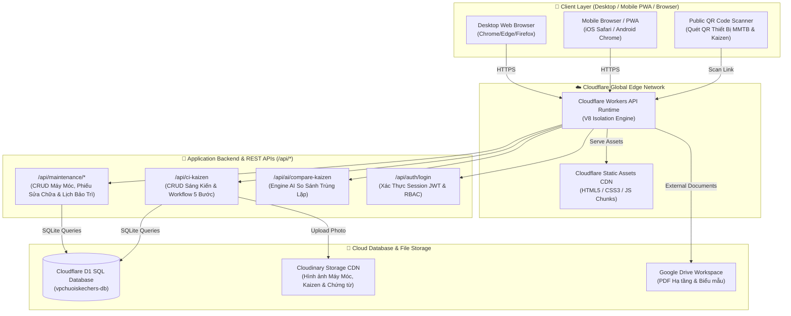

# 🏬 HỆ THỐNG QUẢN TRỊ VẬN HÀNH CHUỖI CUNG ỨNG & SẢN XUẤT SKECHERS — TBS GROUP

> **Văn Phòng Chuỗi SKECHERS - TBS Group (Zone II)**  
> 🏆 Cổng Điều Hành Vận Hành Tập Trung, Số Hóa Quy Trình Gemba Walk, Cải Tiến Liên Tục (CI/Kaizen 4.0), Quản Lý Máy Móc Thiết Bị (MMTB), Quản Trị Chiến Lược 1-5-2, HR & Kế Toán Quản Trị  
> 🌐 **Production Domain**: [https://vpchuoiskechers.tbsgroup2026.workers.dev](https://vpchuoiskechers.tbsgroup2026.workers.dev)  
> 📦 **GitHub Repository**: [https://github.com/tbsgroup2026/vpchuoiskechers](https://github.com/tbsgroup2026/vpchuoiskechers)

---

## 📋 MỤC LỤC TỔNG QUAN
1. [Giới Thiệu Hệ Thống & Sứ Mệnh](#-1-giới-thiệu-hệ-thống--sứ-mệnh)
2. [Khung Quản Trị Chiến Lược 1-5-2 Chi Tiết](#-2-khung-quản-trị-chiến-lược-1-5-2-chi-tiết)
3. [Sơ Đồ Kiến Trúc Tổng Thể Hệ Thống (System Architecture)](#-3-sơ-đồ-kiến-trúc-tổng-thể-hệ-thống-system-architecture)
4. [Tổng Hợp Sơ Đồ Luồng Hoạt Động (Comprehensive Flowcharts)](#-4-tổng-hợp-sơ-đồ-luồng-hoạt-động-comprehensive-flowcharts)
   - [4.1. Luồng 5 Bước Đề Xuất & Phê Duyệt Sáng Kiến Kaizen (CI/Kaizen Engine)](#41-luồng-5-bước-đề-xuất--phê-duyệt-sáng-kiến-kaizen-cikaizen-engine)
   - [4.2. Luồng Bảng Điều Hành Quản Trị Chiến Lược 1-5-2 & Báo Cáo Nhanh](#42-luồng-bảng-điều-hành-quản-trị-chiến-lược-1-5-2--báo-cáo-nhanh)
   - [4.3. Luồng Xác Thực JWT, Phân Quyền RBAC & Scoping Dữ Liệu Nhà Máy](#43-luồng-xác-thực-jwt-phân-quyền-rbac--scoping-dữ-liệu-nhà-máy)
   - [4.4. Luồng Thuật Toán AI Kiểm Tra & So Sánh Trùng Lặp Sáng Kiến](#44-luồng-thuật-toán-ai-kiểm-tra--so-sánh-trùng-lặp-sáng-kiến)
   - [4.5. Luồng Nghiệp Vụ Đăng Ký & Phê Duyệt Công Tác (Business Trip)](#45-luồng-nghiệp-vụ-đăng-ký--phê-duyệt-công-tác-business-trip)
   - [4.6. Luồng Quản Lý & Đặt Phòng Họp Thông Minh (Room Booking)](#46-luồng-quản-lý--đặt-phòng-họp-thông-minh-room-booking)
   - [4.7. Luồng Quản Lý Máy Móc Thiết Bị (MMTB / Maintenance Operations)](#47-luồng-quản-lý-máy-móc-thiết-bị-mmtb--maintenance-operations)
5. [Cơ Sở Dữ Liệu Cloudflare D1 & Schema SQL](#-5-cơ-sở-dữ-liệu-cloudflare-d1--schema-sql)
6. [Danh Mục RESTful API Endpoints](#-6-danh-mục-restful-api-endpoints)
7. [Các Phân Hệ Chức Năng Chi Tiết](#-7-các-phân-hệ-chức-năng-chi-tiết)
8. [Công Nghệ & Kiến Trúc Kỹ Thuật (Tech Stack)](#-8-công-nghệ--kiến-trúc-kỹ-thuật-tech-stack)
9. [Cấu Trúc Thư Mục Dự Án Chi Tiết (Project Structure)](#-9-cấu-trúc-thư-mục-dự-án-chi-tiết-project-structure)
10. [Hướng Dẫn Cài Đặt, Phát Triển & Triển Khai (Setup & Deployment Guide)](#-10-hướng-dẫn-cài-đặt-phát-triển--triển-khai-setup--deployment-guide)

---

## 📌 1. GIỚI THIỆU HỆ THỐNG & SỨ MỆNH

**Hệ Thống Quản Trị Vận Hành Chuỗi Cung Ứng & Sản Xuất SKECHERS - TBS Group** được xây dựng nhằm phục vụ công tác chuyển đổi số toàn diện cho **Văn Phòng Chuỗi SKECHERS (Khu vực Zone II)** thuộc Tập đoàn Da Giày TBS (TBS Group).

### ✨ Các Mục Tiêu Cốt Lõi:
- **Số hóa Gemba Walk & Cải tiến CI/Kaizen 4.0**: Chuyển đổi toàn bộ quy trình đề xuất cải tiến từ thủ công/giấy sang hệ thống số hóa tự động với sự hỗ trợ của thuật toán AI so sánh trùng lặp.
- **Quản lý Máy Móc Thiết Bị (MMTB / Maintenance)**: Số hóa toàn bộ hồ sơ thiết bị nhà máy, quản lý phiếu sửa chữa khẩn cấp, lập kế hoạch bảo dưỡng định kỳ và quét QR Code tra cứu trên di động.
- **Trực quan hóa Khung Quản trị 1-5-2**: Giúp Ban Giám Đốc và các Trưởng bộ phận theo dõi chỉ số mục đích xuyên suốt, 5 trụ cột vận hành và 2 nền tảng quản trị real-time.
- **Tối ưu hóa quản lý nguồn lực**: Tích hợp các phân hệ Đặt phòng họp, Đăng ký công tác, Quản trị nhân sự và Kế toán quản trị trong một không gian làm việc tập trung (App Hub).
- **Hạ tầng Edge Computing**: Triển khai trên mạng lưới toàn cầu của **Cloudflare Workers** giúp tốc độ phản hồi cực nhanh (< 20ms) và tính sẵn sàng cao 99.99%.

---

## 🎯 2. KHUNG QUẢN TRỊ CHIẾN LƯỢC 1-5-2 CHI TIẾT

Hệ thống điều hành theo khung quản trị chiến lược **1-5-2**:

```
                                ┌───────────────────────────────────────────────────────────┐
                                │                   1. MỤC ĐÍCH XUYÊN SUỐT                 │
                                │   Xây dựng TBS Group là một ĐỐI TÁC KHÔNG THỂ THAY THẾ   │
                                │   trong chuỗi giá trị toàn cầu, tự vận hành & bền vững   │
                                └─────────────────────────────┬─────────────────────────────┘
                                                              │
               ┌──────────────────┬──────────────────┬───────┴──────────┬──────────────────┐
               │                  │                  │                  │                  │
        ┌──────┴──────┐    ┌──────┴──────┐    ┌──────┴──────┐    ┌──────┴──────┐    ┌──────┴──────┐
        │1.CHIẾN LƯỢC │    │2. TC-CN-HTS │    │  3. KH & CC │    │ 4. TH & NM  │    │  5. VHDN    │
        └─────────────┘    └─────────────┘    └─────────────┘    └─────────────┘    └─────────────┘
               │                  │                  │                  │                  │
               └──────────────────┴──────────────────┼──────────────────┴──────────────────┘
                                                              │
                                ┌─────────────────────────────┴─────────────────────────────┐
                                │                   2. NỀN TẢNG QUẢN TRỊ                    │
                                ├─────────────────────────────┬─────────────────────────────┤
                                │    1. TỔ CHỨC - HẠ TẦNG     │   2. DỮ LIỆU SỐ (BI 24/7)   │
                                │   (1. TH KG & 2. NM_SKMĐ)   │  (Báo cáo điều hành số hóa) │
                                └─────────────────────────────┴─────────────────────────────┘
```

---

## 🏗️ 3. SƠ ĐỒ KIẾN TRÚC TỔNG THỂ HỆ THỐNG (SYSTEM ARCHITECTURE)



---

## 🔄 4. TỔNG HỢP SƠ ĐỒ LUỒNG HOẠT ĐỘNG (COMPREHENSIVE FLOWCHARTS)

### 4.7. Luồng Quản Lý Máy Móc Thiết Bị (MMTB / Maintenance Operations)

```mermaid
flowchart TD
    StartMMTB([Mở Phân Hệ /maintenance]) --> CheckAuth{Đã đăng nhập session?}
    CheckAuth -->|Chưa| LoginRedirect[Chuyển hướng /login]
    CheckAuth -->|Đã xác thực| LoadOverview[Tải Dashboard Tổng Quan MMTB]

    LoadOverview --> OperationalStrip[Live Status Strip: Đang chạy | Bảo trì | Sự cố | Quá hạn]
    LoadOverview --> EquipmentTable[Bảng Đăng Ký Thiết Bị Reliability HERO Table]

    EquipmentTable --> SelectAction{Thao tác người dùng}
    SelectAction -->|Click Thiết bị| OpenDrawer[Mở Slide-Over Technical Profile Drawer]
    SelectAction -->|Quét QR Code| MobileScan[Tải payload JSON {type:'machine', code}]
    SelectAction -->|Tạo Phiếu Sửa| CreateTicket[Tạo Nhu Cầu / Phiếu Sửa Chữa MMTB]
    SelectAction -->|Bảo Trì Định Kỳ| ScheduleView[Xem & Cập Nhật Lịch Bảo Dưỡng]

    CreateTicket --> SaveTicketD1[(Lưu phiếu vào D1 Database & Thông báo Kỹ thuật viên)]
    OpenDrawer --> ViewHistory[Xem lịch sử sự cố & phụ tùng đã thay thế]
```

---

## 📊 5. CƠ SỞ DỮ LIỆU CLOUDFLARE D1 & SCHEMA SQL

Hệ thống sử dụng cơ sở dữ liệu phân tán **Cloudflare D1 SQL Database** (`vpchuoiskechers-db`).

---

## 🔌 6. DANH MỤC RESTFUL API ENDPOINTS

| HTTP Method | API Endpoint | Mô Tả Chức Năng | Quyền Truy Cập (Auth) |
|---|---|---|---|
| `GET` | `/api/maintenance/machines` | Lấy danh sách máy móc thiết bị nhà máy | Authorized |
| `POST` | `/api/maintenance/machines` | Thêm / Sửa thông tin thiết bị MMTB | Authorized |
| `GET` | `/api/maintenance/tickets` | Danh sách phiếu sửa chữa & nhu cầu bảo trì | Authorized |
| `POST` | `/api/maintenance/tickets` | Tạo mới hoặc cập nhật trạng thái phiếu sửa chữa | Authorized |
| `GET` | `/api/maintenance/schedule` | Lịch bảo dưỡng định kỳ thiết bị | Authorized |
| `GET` | `/api/maintenance/categories` | Danh mục Khu vực, Chuyền tổ, Phụ tùng, Trạng thái | Authorized |
| `GET` | `/api/maintenance/overview-report` | Báo cáo chỉ số MTTA, MTTR, MTTD & Downtime | Authorized |
| `GET` | `/api/ci-kaizen` | Lấy danh sách đề xuất Kaizen | Public / Authorized |
| `POST` | `/api/ci-kaizen` | Tạo đề xuất Kaizen mới (hỗ trợ Form 5 bước & Public QR) | Public / Authorized |
| `POST` | `/api/auth/login` | Xác thực đăng nhập MSNV, cấp JWT Session Token | Public |

---

## 🛠️ 7. CÁC PHÂN HỆ CHỨC NĂNG CHI TIẾT

```
                                ┌────────────────────────────────────────┐
                                │ VĂN PHÒNG CHUỖI SKECHERS - TBS GROUP  │
                                └──────────────────┬─────────────────────┘
                                                   │
     ┌───────────────┬──────────────┬──────────────┼──────────────┬──────────────┬──────────────┐
     │               │              │              │              │              │              │
┌────┴───┐      ┌────┴───┐     ┌────┴───┐     ┌────┴───┐     ┌────┴───┐     ┌────┴───┐     ┌────┴───┐
│ 1-5-2  │      │ MMTB   │     │ CN-CI  │     │ TRIP   │     │ ROOMS  │     │FINANCE │     │  HR    │
│ Strategic     │ Machine│     │ Kaizen │     │ Business     │ Meeting│     │ Finance│     │ Human  │
│ Dash   │      │ Maint  │     │ 4.0    │     │ Trip   │     │ Rooms  │     │ & Acc  │     │ Resource
└────────┘      └────────┘     └────────┘     └────────┘     └────────┘     └────────┘     └────────┘
```

---

## 💻 8. CÔNG NGHỆ & KIẾN TRÚC KỸ THUẬT (TECH STACK)

- **Frontend Core Framework**: Next.js 14 (App Router Architecture), React 18, TypeScript.
- **Static Export Mode**: Build ra file tĩnh chuẩn (`out/`) tương thích 100% với Cloudflare Assets.
- **Design System Tokens**: Custom Tailored Design System (Forest Green `#006838`, Dark Emerald `#071612`, Modern Industrial Operations Workspace layout).
- **Serverless Edge Computing Engine**: Cloudflare Workers Runtime Engine (V8 Isolated Architecture).
- **Distributed Database**: Cloudflare D1 SQL (Distributed SQLite Database Engine at Global Edge).
- **Asset Storage & CDN**: Cloudinary Storage API (Hình ảnh Kaizen & MMTB), Google Drive API Integration.
- **Deployment Tools**: Cloudflare Wrangler CLI v4.x.

---

## 📂 9. CẤU TRÚC THƯ MỤC DỰ ÁN CHI TIẾT (PROJECT STRUCTURE)

```
vpchuoiskechers/
├── README.md                                  # Tài liệu kiến trúc & hướng dẫn vận hành chi tiết
├── package.json                               # Khai báo Dependencies & Build Scripts
├── wrangler.jsonc                             # Cấu hình triển khai Cloudflare Workers & D1 Binding
├── web/                                       # Nguồn ứng dụng Next.js chính
│   ├── README.md                              # Tài liệu mô tả module Web
│   ├── package.json                           # Configuration gói NPM web
│   ├── next.config.mjs                        # Cấu hình Next.js (export mode, images loader)
│   ├── tailwind.config.js                     # Custom Tailwind Theme Tokens & Palette
│   └── src/
│       ├── app/                               # Next.js App Router Structure
│       │   ├── page.tsx                       # Trang chủ ứng dụng
│       │   ├── layout.tsx                     # Global Root Layout
│       │   ├── maintenance/                   # Phân Hệ Quản Lý Máy Móc Thiết Bị (MMTB)
│       │   │   ├── page.tsx                   # Dashboard Tổng quan MMTB
│       │   │   ├── machines/                  # Danh sách MMTB & Profile Drawer
│       │   │   ├── tickets/                   # Nhu cầu & Phiếu sửa chữa MMTB
│       │   │   ├── schedule/                  # Bảo dưỡng & Lịch định kỳ MMTB
│       │   │   ├── employees/                 # Quản lý nhân sự bảo trì
│       │   │   ├── categories/                # Danh mục Khu vực, Chuyền tổ, Loại máy, Phụ tùng
│       │   │   └── floor-plan/                # Sơ đồ nhà máy MMTB
│       │   ├── 1-5-2/                         # Trang Bảng điều khiển Quản trị 1-5-2
│       │   ├── work/                          # Trang Dashboard điều hành chung
│       │   ├── business-trip/                 # Module Quản lý Đăng ký Công tác
│       │   ├── rooms/                         # Module Đặt phòng họp thông minh
│       │   ├── finance/                       # Module Kế toán & Quản trị Tài chính
│       │   └── hr/                            # Module Quản trị Nhân sự Tập đoàn
│       └── components/                        # Shared React UI Components
│           ├── MaintenanceShell.tsx           # Layout Shell riêng cho Phân hệ MMTB
│           ├── Header.tsx                     # Thanh Top Navigation Header
│           └── UserAvatar.tsx                 # Avatar hiển thị tức thì
```

---

## 🚀 10. HƯỚNG DẪN CÀI ĐẶT, PHÁT TRIỂN & TRIỂN KHAI (SETUP & DEPLOYMENT GUIDE)

### 10.1. Yêu Cầu Môi Trường (Prerequisites)
- **Node.js**: `>= 18.17.0` (Khuyên dùng Node 20 LTS)
- **npm**: `>= 9.0.0`
- **Wrangler CLI**: `npm install -g wrangler`

---

### 10.2. Chạy Ứng Dụng Cục Bộ (Local Development)

```bash
# 1. Di chuyển vào thư mục web
cd web

# 2. Cài đặt các thư viện phụ thuộc
npm install

# 3. Khởi chạy dev server cục bộ
npm run dev
```

---

### 10.3. Quy Trình Build & Deploy Sản Phẩm (Production Deployment)

```bash
# 1. Di chuyển vào thư mục ứng dụng web
cd web

# 2. Biên dịch Tailwind CSS & Next.js Static Bundle
npm run build

# 3. Triển khai lên Cloudflare Workers Global Edge Network
npx wrangler deploy
```

Trang web sẽ tự động cập nhật bản mới nhất tại domain chính thức:  
👉 **[https://vpchuoiskechers.tbsgroup2026.workers.dev](https://vpchuoiskechers.tbsgroup2026.workers.dev)**

---

### 📜 Bản Quyền & Phát Triển (Copyright & Credits)
**Văn Phòng Chuỗi SKECHERS — TBS Group © 2026**. All Rights Reserved.  
Được thiết kế, phát triển và vận hành bởi **Team Chuyển Đổi Số (IT Digital Transformation) - TBS Group**.
